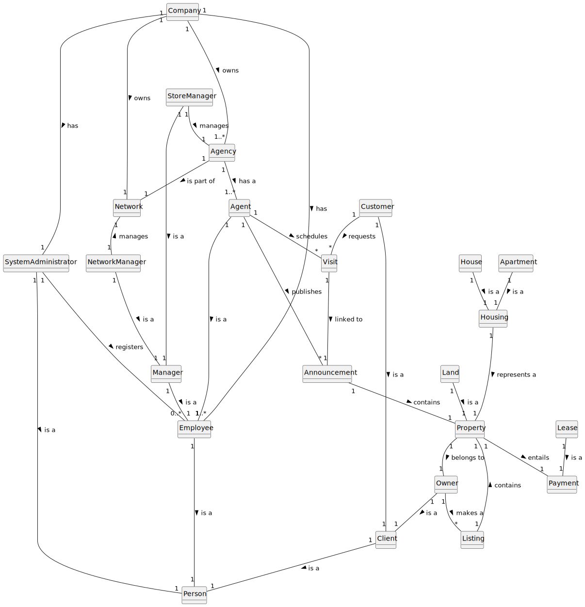

# Analysis

The construction process of the domain model is based on the client specifications, especially the nouns (for
_concepts_) and verbs (for _relations_) used.

## Rationale to identify domain conceptual classes ##

To identify domain conceptual classes, start by making a list of candidate conceptual classes inspired by the list of
categories suggested in the book "Applying UML and Patterns: An Introduction to Object-Oriented Analysis and Design and
Iterative Development".

### _Conceptual Class Category List_ ###

**Business Transactions**

* Sale
* Lease

---

**Transaction Line Items**

* Property

---

**Product/Service related to a Transaction or Transaction Line Item**

* Visit
* Land
* House
* Apartment
* Announcement
* Listing

---

**Roles of People or Organizations**

* Agent
* System Administrator
* Employee
* Customer
* Owner
* Unregistered User
* Store Manager
* Network Manager

---

**Places**

* Agency

---

**Noteworthy Events**

* Announcement
* Visit
* Listing

---

**Physical Objects**

* YET TO BE COMPLETED
* Property (?)

---

**Descriptions of Things**

* Type of Property
* Type of Listing
* Type of Commission
* Type of Business

---

**Containers**

* Network

---

**Elements of Containers**

* Store

---

**Organizations**

* Company/Organization

---

**Documents mentioned/used to perform some work/**

* Visit Report

---

### **Rationale to identify associations between conceptual classes** ###

An association is a relationship between instances of objects that indicates a relevant connection and that is worth of
remembering, or it is derivable from the List of Common Associations:

+ **_A_** is physically or logically part of **_B_**
+ **_A_** is physically or logically contained in/on **_B_**
+ **_A_** is a description for **_B_**
+ **_A_** known/logged/recorded/reported/captured in **_B_**
+ **_A_** uses or manages or owns **_B_**
+ **_A_** is related with a transaction (item) of **_B_**
+ etc.

|     Concept (A)     |   Association    |     Concept (B)     |
|:-------------------:|:----------------:|:-------------------:|
|       Agency        |   is a part of   |       Network       |
|        Agent        |     accepts      |       Listing       |
|                     |       is a       |      Employee       |
|                     |    publishes     |    Announcement     |
|                     |    registers     |     VisitReport     |
|                     |    schedules     |        Visit        |
|                     |    works for     |       Agency        |
|    Announcement     |     contains     |      Property       |
|                     | is associated to |        Lease        |
|                     | is associated to |        Sale         |
|                     |   is based on    |       Listing       |
|      Apartment      |       is a       |       Housing       |
|       Company       |      knows       | SystemAdministrator |
|                     |       owns       |       Agency        |
|                     |       owns       |       Network       |
|      Criteria       |     filters      |    Announcement     |
|      Customer       |       is a       |       Person        |
|                     |     requests     |        Visit        |
|      Employee       |       is a       |       Person        |
|                     |    works for     |       Company       |
|        House        |       is a       |      Residence      |
|        Land         |       is a       |      Property       |
|       Listing       |     contains     |      Property       |
|                     | is associated to |        Lease        |
|                     | is associated to |        Sale         |
|   NetworkManager    |       is a       |      Employee       |
|                     |     manages      |       Network       |
|        Owner        |       is a       |       Person        |
|                     |     makes a      |       Listing       |
|      Property       |    belongs to    |        Owner        |
|      Residence      |   represents a   |      Property       |
|                     |     entails      |       Payment       |
|    StoreManager     |       is a       |      Employee       |
|                     |     manages      |       Agency        |
| SystemAdministrator |       is a       |       Person        |
|                     |    registers     |      Employee       |
|                     |    registers     |       Agency        |
|  Unregistered user  |     chooses      |      Criteria       |
|                     |     display      |    Announcement     |
|        Visit        |  associated to   |    Announcement     |
|     VisitReport     | associated with  |        Visit        |

## Domain Model

**Do NOT forget to identify concepts atributes too.**

**Insert below the Domain Model Diagram in a SVG format**

