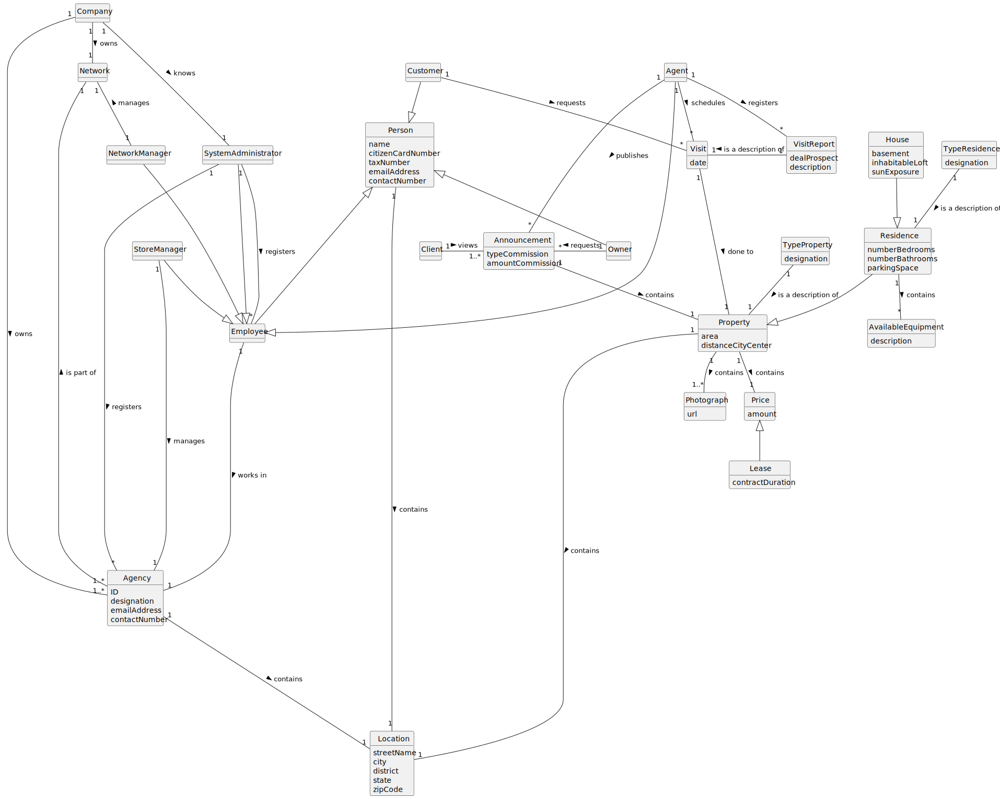

# Analysis

The construction process of the domain model is based on the client specifications, especially the nouns (for _concepts_) and verbs (for _relations_) used. 

## Rationale to identify domain conceptual classes ##
To identify domain conceptual classes, start by making a list of candidate conceptual classes inspired by the list of categories suggested in the book "Applying UML and Patterns: An Introduction to Object-Oriented Analysis and Design and Iterative Development". 

### _Conceptual Class Category List_ ###

**Business Transactions**

* Sale
* Lease

---

**Transaction Line Items**
* Property

---

**Product/Service related to a Transaction or Transaction Line Item**

* Visit
* Land
* House
* Apartment

---

**Transaction Records**

 
* YET TO BE COMPLETED

---  

**Roles of People or Organizations**

* Agent
* System Administrator
* Employee
* Buyer
* Owner
* Unregistered User
* Local Manager
* Store Network Manager

---

**Places**

* Agency

---

**Noteworthy Events**

* Announcement
* Visit
* Listing

---

**Physical Objects**

* YET TO BE COMPLETED
---

**Descriptions of Things**

* Type of Property
* Type of Listing
* Type of Commission

---

**Catalogs**

*  PropertyCatalog

---

**Containers**

* Store 

---

**Elements of Containers**

* Agent 

---

**Organizations**

*  Company/Organization

---

**Other External/Collaborating Systems**

*  YET TO BE DEFINED

---

**Records of finance, work, contracts, legal matters**

* TO BE ANSWERED

---

**Financial Instruments**

* YET TO BE DEFINED

---

**Documents mentioned/used to perform some work/**

* Visit schedule 
* YET TO BE COMPLETED

---

### **Rationale to identify associations between conceptual classes** ###

An association is a relationship between instances of objects that indicates a relevant connection and that is worth of remembering, or it is derivable from the List of Common Associations: 

+ **_A_** is physically or logically part of **_B_**
+ **_A_** is physically or logically contained in/on **_B_**
+ **_A_** is a description for **_B_**
+ **_A_** known/logged/recorded/reported/captured in **_B_**
+ **_A_** uses or manages or owns **_B_**
+ **_A_** is related with a transaction (item) of **_B_**
+ etc.

|      Concept (A)      | Association |        Concept (B)         |
|:---------------------:|:-----------:|:--------------------------:|
|        Agency         |   has an    |           agent            |
|         Agent         |   accepts   |          request           |
|                       |    is a     |          employee          |
|                       |   rejects   |          request           |
|                       |   publish   |        announcement        |
|       Apartment       |   type of   |          property          |
|         Buyer         |     ??      |             ??             |
|       Client ??       |     buy     |          property          |
|                       |    rent     |          property          |
|                       |    sends    |          request           |
|         House         |   type of   |          property          |
|         Land          |   type of   |          property          |
|     Local Manager     |   manage    |          store ??          |
|         Owner         |  submits a  |          request           |
| Store Network Manager |   manage    |         stores ??          |
| System Administrator  |  register   |          employee          |
|                       |  register   |           store            |
|   Unregistered user   |   display   | advertisement / properties |

## Domain Model

**Do NOT forget to identify concepts atributes too.**

**Insert below the Domain Model Diagram in a SVG format**

