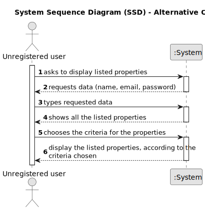
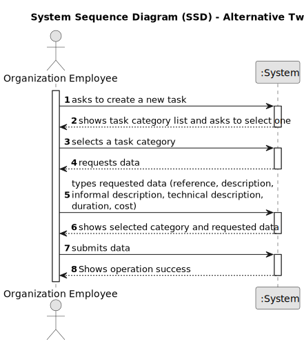

# US 001 - To display listed properties 

## 1. Requirements Engineering

### 1.1. User Story Description

As an unregistered user, I want to display listed properties.

### 1.2. Customer Specifications and Clarifications 

**From the specifications document:**

>   The user can see all the information about the properties, except for the agency commission.

>	The properties can be consulted by type, number of rooms and sort them by criteria such as price or the parish where the property is located.

**From the client clarifications:**

> **Question:** Can users who aren't authenticated display listed properties?
>  
> **Answer:** *Waiting for an answer*

> **Question:** The properties can be in sale and lease at the same time?
>  
> **Answer:** *Waiting for an answer*
 

> **Question:** The properties have always a sale price, even if they are at lease?
>
> **Answer:** *Waiting for an answer*

> **Question:** Is the client able to sort properties by only these 4 criteria or is he able to sort properties by any of the properties' characteristics?
>
> **Answer:** *Waiting for an answer*

> **Question:** An unregistered user can only see sale announcements, or he is able to contact the agency agents to make a purchase request?
>
> **Answer:** *Waiting for an answer*

> **Question:** Can the user select more than one criterion at once for displaying the listed properties?
>
> **Answer:** *Waiting for an answer*

### 1.3. Acceptance Criteria

* **AC1:** The unregistered user must register on the application before being able to see the listed properties.

### 1.4. Found out Dependencies

* The isn't any dependencies.

### 1.5 Input and Output Data

**Input Data:**

* Typed data:
	* Authentication information: password (??)
  
	
* Selected data:
	* Type of property
    * Number of rooms
    * Price
    * The parish where the property is located

**Output Data:**

* List of existing properties
* Display the information about each property

### 1.6. System Sequence Diagram (SSD)

**Other alternatives might exist.**

#### Alternative One

#### Alternative Two

### 1.7 Other Relevant Remarks

* The user can access all the information about a property except for the agency commission. (??)