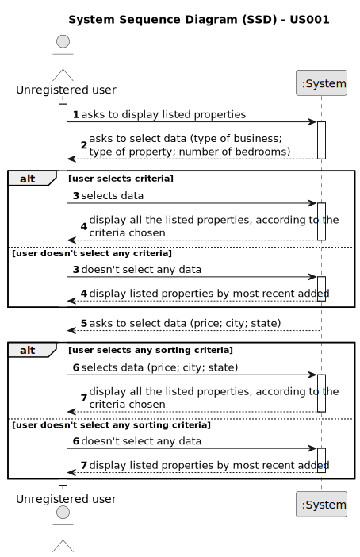

# US 001 - To display listed properties 

## 1. Requirements Engineering

### 1.1. User Story Description

As an unregistered user, I want to display listed properties.

### 1.2. Customer Specifications and Clarifications 

**From the specifications document:**

>   The user can see all the information about the properties, except for the agency commission.

>	The properties can be consulted by type, number of rooms and sort them by criteria such as price or the parish where the property is located.

**From the client clarifications:**

> **Question:** Can users who aren't authenticated display listed properties?
>  
> **Answer:** Non-authenticated users can only list properties.

> **Question:** The properties can be in sale and lease at the same time?
>  
> **Answer:** No.
 

> **Question:** The properties have always a sale price, even if they are at lease?
>
> **Answer:** *Waiting for an answer*

> **Question:** In the project description it is stated that "the client is, then, responsible for being able to consult the properties by type, number of rooms, and sort by criteria such as price or the parish where the property is located.". Is the client able to sort properties by only these 4 criteria or is he able to sort properties by any of the properties' characteristics?
>
> **Answer:** The client should be able to select the type of business (renting or buying), the type of property and the number of rooms. Then, the client should be able to sort properties by price or by parish where the property is located.
If the client does not select the type of business, the type of property and the number of rooms, the application should allow the client to sort all properties that are on sale or on renting.

> **Question:** An unregistered user can only see sale announcements, or he is able to contact the agency agents to make a purchase request?
>
> **Answer:** From the project description: "As an unregistered user, I want to display listed properties". For now this is the only functionality of the system that the non-registered user can use.

> **Question:** When an unregistered user opens the application, are there already properties being listed? 
> 
>If the answer is "YES": then by default, by which criteria are the properties listed?
>
>If the answer is "NO": is it mandatory for the user to choose an option (type, number of rooms) or can he/her simple request to view a list of properties that will be automatically ordered, for example, by "most recent"?
>
>
> **Answer:** I already clarified what the unregistered user will see and what he can do within the application. If the system does not contain any properties, the system should show an empty list of properties.

### 1.3. Acceptance Criteria

* **AC1** The user should be able to display the properties, accordingly to the criteria chosen by them. 

### 1.4. Found out Dependencies

The isn't any dependencies.

### 1.5 Input and Output Data

**Input Data:**
	
* Selected data:
	* Type of property
    * Number of rooms
    * Price
    * The parish where the property is located

**Output Data:**

* List of existing properties
* Display the information about each property

### 1.6. System Sequence Diagram (SSD)

**Other alternatives might exist.**

#### Alternative One

### 1.7 Other Relevant Remarks

* The user can access all the information about a property except for the agency commission. (??)