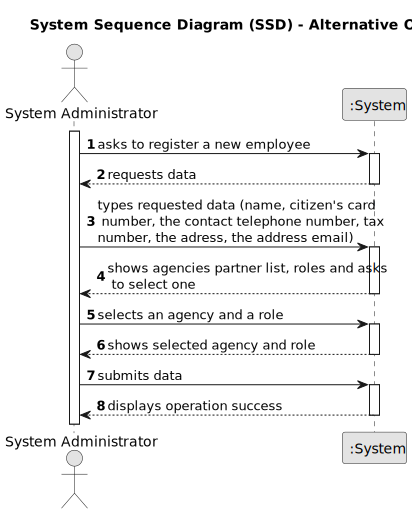

# US 003 - To create a Task 

## 1. Requirements Engineering

### 1.1. User Story Description

As a system administrator, I want to register a new employee.

### 1.2. Customer Specifications and Clarifications 

**From the specifications document:**

>	The company's systems administrator will be responsible for registering all employees (specifying the name, the citizen's card number, the tax number, the address, the email address, the contact telephone number and the agency to wich it is assigned).

>	The company's systems administrator will be responsible for the branches of the network (specifying the designation, location and local manager) as well as preparing the system in order to facilitate the insertion of advertisements and facilitate the use of the application.

**From the client clarifications:**

> **Question:** In case it is on an agency, must the agent be assigned automatically by the system?
>  
> **Answer:** The agent that registers the information in the system can choose to assign any agent.

> **Question:** Can an employee be registered to more than one agency?
>
> **Answer:** No.

> **Question:** The system administrator cannot add an agent that already exists, the agent has two unique numbers that identify him (Tax number and Citizen's card number) which one should be used to identify the agent?
>
> **Answer:** The tax number.

> **Question:** Must the Tax number and Citizen's card number follow any convention? If so, which?
>
> **Answer:** You should use the tax identification number used for tax purposes in the US.

> **Question:** Does the system administrator select the agency to which the employee is assigned and his role from a list? Or does he just type that data?
>
> **Answer:** The System Administrator should select.

> **Question:** The administrator when registering a new employee will also have to specify the category/office that he will perform? (for example agent, store manager, store network manager).
> 
> **Answer:** The administrator has to specify the role of the employee.

> **Question:**  If the new employee to be registered is a store network manager, he will be assigned to a specific agency/store?
> 
> **Answer:** The administrator has to specify the role of the employee.
 
 
 
> **Question:**  There is only one manager for each store and only ONE system administrator?
>
> **Answer:** Yes.
 
 
 
> **Question:**  When registering a new employee, will the administrator set the respective employee password?
> 
> **Answer:** The password should have eight characters in length and should be generated automatically. The password is sent to the employee by e-mail.

> **Question:** Does the agency have any commission (fixed or percentage) on top of the one that the agent sets, or the agent must set a commission that already includes the company's?
>
> **Answer:** The commission value includes the agent and the company commission.

> **Question:** How many digits does the tax number for the employee need to have?
>
> **Answer:** _No response yet._

> **Question:** How many digits does the citizen's card number employee need to have?
>
> **Answer:** _No response yet._

> **Question:** How many digits does the contact telephone number for the employee need to have?
>
> **Answer:** _No response yet._

### 1.3. Acceptance Criteria

* **AC1:** All information must be completed.
 

### 1.4. Found out Dependencies

* There is no dependencies in this US.

### 1.5 Input and Output Data

**Input Data:**

* Typed data:
	* a name, 
	* a citizen's card number,
	* a tax number,
	* an email adress,
	* a contact telephone number,
    * an address
* Selected data:
	* Agency to wich is assigned
    * Role (agent, store manager, store network, manager)

**Output Data:**

* List of partner agencies
* (In)Success of the operation

### 1.6. System Sequence Diagram (SSD)

**Other alternatives might exist.**

### 1.7 Other Relevant Remarks

* There's no one relevant remarks.