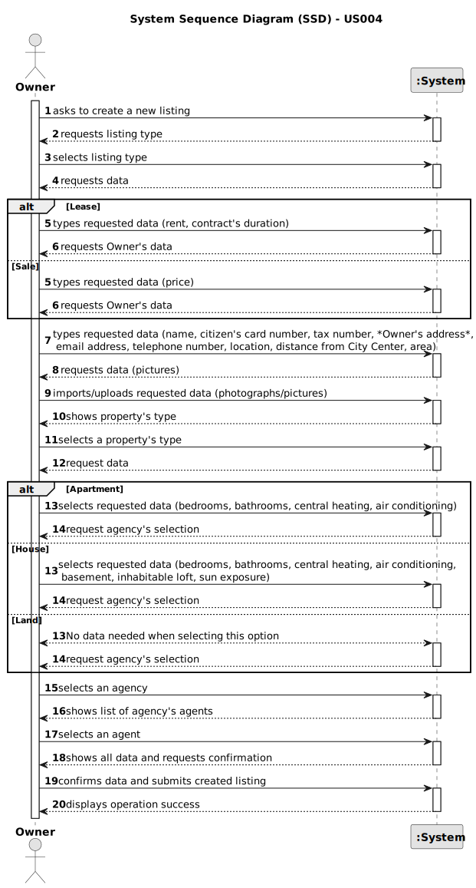

# US 004 - To create a Task

## 1. Requirements Engineering

### 1.1. User Story Description

As an owner, I intend to submit a request for listing a property sale or rent,
choosing the responsible agent.

### 1.2. Customer Specifications and Clarifications

**From the specifications document:**

Each request lists a property for sale or/and rent, and it is assigned to an agent.

The request for sale's standard information is the property's price/rent, the renting contract's duration, area (m2), location, distance from City
Center, and one or more photographs.

The request for sale's additional information is based on the property's type. As seen in the table below.

|     Information     |            House            | Apartment |
|:-------------------:|:---------------------------:|:---------:|
| Number of Bedrooms  |           0 or +            |  0 or +   |
| Number of Bathrooms |           0 or +            |  0 or +   |
|   Central Heating   |          Yes / No           | Yes / No  |
|  Air Conditioning   |          Yes / No           | Yes / No  |
|      Basement       |          Yes / No           |     -     |
|  Inhabitable Loft   |          Yes / No           |     -     |
|    Sun Exposure     | North / South / West / East |     -     |

As long as it is not announced, access to the request is exclusive to the owner and respectively assigned agent.

**From the client clarifications:**

> **Question:** If the owner does not choose an agent, will the application/agency randomly assign an agent to the property?
>
> **Answer:**  The actor that registers the information in the system can choose to assign any agent.

> **Question:** Are there any restrictions on the choice of an agent?
>
> **Answer:**  No, the owner can choose any agent.

> **Question:** CAN OWNER SUMMIT REQUEST FOR LAND RENTING?
>
> **Answer:**  YET TO BE ANSWERED.

> **Question:** Can an Agent work in more than 1 store (Multiple stores)?
>
> **Answer:** No.

> **Question:** In the Project description, there are only specifications for a Sale. What are the required characteristics of a rental?
>
> **Answer:** The characteristics of a rental are the same as the ones for the sale of a property. The rent value is per month. Additionally, we have to define the contract duration.

> **Question:** Does each request have unique reference?
>
> **Answer:** YET TO BE ANSWERED.

> **Question:** Can the property's owner summit requests to both sale and rental listings?
>
> **Answer:** No.

> **Question:** Is it possible to submit multiple listing for the same property and type of listing?
>
> **Answer:** No.

> **Question:** Does the owner have a limit of request they can do?
>
> **Answer:** YET TO BE ANSWERED.

> **Question:** Can the seller choose the agency/branch/store independently of the location of the property?
>
> **Answer:** Yes.

> **Question:** Can the seller choose the agency/branch/store independently of the location of the property?
>
> **Answer:** Yes.

> **Question:** DOES THE REQUEST HAVE A DESCRIPTION? IF SO, DOES THE DESCRIPTION HAVE ANY LIMITATION?
>
> **Answer:** YET TO BE ANSWERED.

> **Question:**> IS THE AGENT ESSENTIAL FOR THE SUBMISSION OF A REQUEST? IF THE OWNER DOES NOT CHOOSE ANY AGENT, WILL THE PLATFORM RANDOMLY ASSIGN A RESPECTIVE AGENT???
>
> **Answer:** YET TO BE ANSWERED.

### 1.3. Acceptance Criteria

* **AC1:** All required information slots must be filled in.
* **AC2:** Request reference must have at least *n* alphanumeric chars. ????
* **AC3:** When creating a request with an already existing reference/name, the system must reject such operation and the owner
  must have to change the new request.
* **AC4:** The request is dependent on the existence of an agent. ????
* **AC5:** To summit a request, the owner must be a registered user in the platform.

### 1.4. Found out Dependencies

* There is no dependency to US004.

### 1.5 Input and Output Data

**Input Data:**

* Typed data:
    * a reference ???
    * a designation / name
    * price (Sale and/or Rent)
    * area ( m2 )
    * location
    * a description ???
    * distance from city center
    * number of Bedrooms
    * number of Bathrooms.

* Selected data:
    * property's type
    * central heating
    * air conditioning
    * basement
    * inhabitable loft
    * sun exposure
    * agent

* Imported/Uploaded data:
     * photographs
   

**Output Data:**

* List of existing/available agents
* (In)Success of the operation

### 1.6. System Sequence Diagram (SSD)

**Other alternatives might exist.**

### 1.7 Other Relevant Remarks

* The created request stays in a "not published" state in order to distinguish from "published" requests. ????