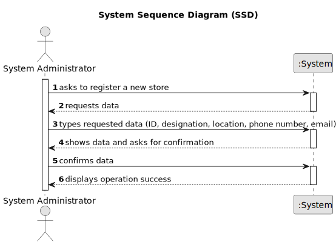

# US 005 - Register a Store 

## 1. Requirements Engineering

### 1.1. User Story Description

As a system administrator, I want to register a store.

### 1.2. Customer Specifications and Clarifications 

**From the specifications document:**

>	Each store has ID, designation, location, local manager, phone number and email.

 

**From the client clarifications:**

> **Question:** Does a store designation have to be detailed? If so, will the system administrator have to register the name, email, phone number or anything else? Does the location of a store have to be detailed as well? If yes, will the system administrator have to record the address, postcode or something else? To register the store manager, does the system administrator only register the manager's name? If not, will the system administrator have to register the manager as if he were an employee (except the agent he is assigned to)? Do registered stores have to be in alphabetical order?
>  
> **Answer:** When registering a store, the System Administrator should introduce the following information: an ID, a designation/name, a location, a local manager, a phone number and an e-mail address. The ID is an integer number. An example of the store location is: 71 ST. NICHOLAS DRIVE, NORTH POLE, FAIRBANKS NORTH STAR, AK, 99705. An example phone number is (907) 488-6419.

> **Question:** Could you please share how will the designation of new stores be made, is there a pattern perhaps?
>  
> **Answer:** There is no pattern. The System Administrator can introduce any designation/name. The designation/name should have at most forty characters.

> **Question:** Will the System Administrator be able to choose a location from a list of available locations (defined elsewhere in the application) or will he be able to submit any location he wants?
>
> **Answer:** The System Administrator can submit any location.
 

> **Question:** Are the local managers restricted to their initial location or can they be re-registered/reassigned to other locations?
>
> **Answer:** For now this is not a problem.

### 1.3. Acceptance Criteria

* **AC1:** All required data must be filled in.
* **AC2:** The designation should have at most forty characters

### 1.4. Found out Dependencies

* There is no dependencies to US005.

### 1.5 Input and Output Data

**Input Data:**

* Typed data:
    * ID 
    * designation
    * location
    * local manager
    * phone number
    * email address
    

**Output Data:**

* All typed data
* (In)Success of the operation

### 1.6. System Sequence Diagram (SSD)

**Other alternatives might exist.**

### 1.7 Other Relevant Remarks

* There's no one relevant remarks.