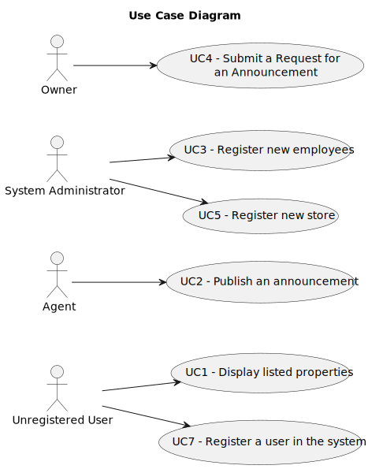

# Use Case Diagram (UCD)

**In the scope of this project, there is a direct relationship of _1 to 1_ between Use Cases (UC) and User Stories (US).
**

However, be aware, this is a pedagogical simplification. On further projects and curricular units might also exist _1 to
N **and/or** N to 1 relationship between US and UC.

**For each UC/US, it must be provided evidences of applying main activities of the software development process (
requirements, analysis, design, tests and code). Gather those evidences on a separate file for each UC/US and set up a
link as suggested below.**

# Use Cases / User Stories

| UC/US  | Description                                                 |                   
|:-------|:------------------------------------------------------------|
| US 001 | [Display listed properties](docs/sprintB/us001/Readme.md)   |
| US 002 | [Publish an announcement](docs/sprintB/us002/Readme.md)     |
| US 003 | [Register new employees](docs/sprintB/us003/Readme.md)      |
| US 004 | [Submit a request](docs/sprintB/us004/Readme.md)            |
| US 005 | [Register new store](docs/sprintB/us005/Readme.md)          |
| US 007 | [Register user in the system](docs/sprintB/us007/Readme.md) |
