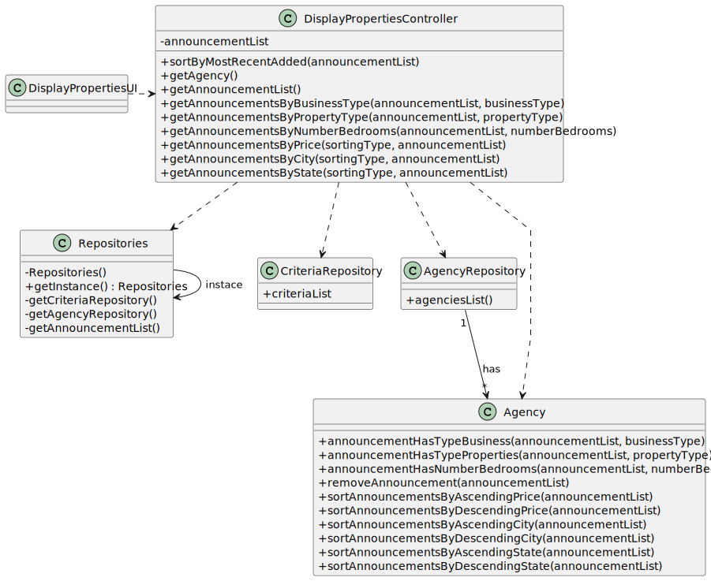

# US 001 - To display listed properties 

## 3. Design - User Story Realization 

### 3.1. Rationale

| Interaction ID                                                                | Question: Which class is responsible for...        | Answer                      | Justification (with patterns)                                                                                                       |
|:------------------------------------------------------------------------------|:---------------------------------------------------|:----------------------------|:------------------------------------------------------------------------------------------------------------------------------------|
| Step 1 : asks to display listed properties                                    | 	... interacting with the actor?                   | DisplayPropertiesUI         | Pure Fabrication: there is no reason to assign this responsibility to any existing class in the Domain Model.                       |
| 	                                                                             | 	... coordinating the US?                          | DisplayPropertiesController | Controller                                                                                                                          |
| 	                                                                             | 	... obtaining listed properties?                  | Agency                      | Creator (Rule 1): in the DM Agency has Announcement.                                                                                |
|                                                                               | ... obtaining criteria?                            | CriteriaRepository          | IE / Pure Fabrication: there is no reason to assign this responsibility to any existing class in the Domain Model. It has the data. |
| Step 2 : display listed properties by most recent added and shows criteria    | 	...display listed properties?                     | DisplayPropertiesUI         | Pure Fabrication: there is no reason to assign this responsibility to any existing class in the Domain Model.                       |
|                                                                               | ...display the UI for the actor to input data?     | DisplayPropertiesUI         | Pure Fabrication: there is no reason to assign this responsibility to any existing class in the Domain Model.                       |
| Step 3 : asks to select type of business                                      | ...validating selected data?                       | DisplayPropertiesUI         | Pure Fabrication: there is no reason to assign this responsibility to any existing class in the Domain Model.                       |
| Step 4 : shows types of business and request data                             | ...display the UI for the actor to input data?     | DisplayPropertiesUI         | Pure Fabrication: there is no reason to assign this responsibility to any existing class in the Domain Model.                       |
| Step 5 : selects data (BusinessType)                                          | 	...validating selected data?                      | DisplayPropertiesUI         | Pure Fabrication: there is no reason to assign this responsibility to any existing class in the Domain Model.                       |
| Step 6 : display all the listed properties, according to the criteria chosen  | ...display listed properties?                      | DisplayPropertiesUI         | Pure Fabrication: there is no reason to assign this responsibility to any existing class in the Domain Model.                       |
|                                                                               | ...display the UI for the actor to input data?     | DisplayPropertiesUI         | Pure Fabrication: there is no reason to assign this responsibility to any existing class in the Domain Model.                       |
| Step 7 : asks to select type of property                                      | ...validating selected data?                       | DisplayPropertiesUI         | Pure Fabrication: there is no reason to assign this responsibility to any existing class in the Domain Model.                       |
| Step 8 : shows types of properties and request data                           | ...display the UI for the actor to input data?     | DisplayPropertiesUI         | Pure Fabrication: there is no reason to assign this responsibility to any existing class in the Domain Model.                       |
| Step 9 : selects data (PropertyType)                                          | 	...validating selected data?                      | DisplayPropertiesUI         | Pure Fabrication: there is no reason to assign this responsibility to any existing class in the Domain Model.                       |
| Step 10 : display all the listed properties, according to the criteria chosen | ...display listed properties?                      | DisplayPropertiesUI         | Pure Fabrication: there is no reason to assign this responsibility to any existing class in the Domain Model.                       |
|                                                                               | ...display the UI for the actor to input data?     | DisplayPropertiesUI         | Pure Fabrication: there is no reason to assign this responsibility to any existing class in the Domain Model.                       |
| Step 11 : asks to select number of bedrooms                                   | ...validating selected data?                       | DisplayPropertiesUI         | Pure Fabrication: there is no reason to assign this responsibility to any existing class in the Domain Model.                       |
| Step 12 : shows options for number of bedrooms and request data               | 	...display the UI for the actor to input data?    | DisplayPropertiesUI         | Pure Fabrication: there is no reason to assign this responsibility to any existing class in the Domain Model.                       |
| Step 13 : selects data (numberBedrooms)                                       | 	...validating selected data?                      | DisplayPropertiesUI         | Pure Fabrication: there is no reason to assign this responsibility to any existing class in the Domain Model.                       |              
| Step 14 : display all the listed properties, according to the criteria chosen | 	...display listed properties?                     | DisplayPropertiesUI         | Pure Fabrication: there is no reason to assign this responsibility to any existing class in the Domain Model.                       | 
| 	                                                                             | 	   ...display the UI for the actor to input data? | DisplayPropertiesUI         | Pure Fabrication: there is no reason to assign this responsibility to any existing class in the Domain Model.                       | 
| Step 15 : asks to sort announcements by price                                 | ...validating selected data?                       | DisplayPropertiesUI         | Pure Fabrication: there is no reason to assign this responsibility to any existing class in the Domain Model.                       |
| Step 16 : shows options for sort announcements by price and request data      | ...display the UI for the actor to input data?     | DisplayPropertiesUI         | Pure Fabrication: there is no reason to assign this responsibility to any existing class in the Domain Model.                       |
| Step 17 : selects data (sortingType)   	                                      | ...validating selected data?                       | DisplayPropertiesUI         | Pure Fabrication: there is no reason to assign this responsibility to any existing class in the Domain Model.                       | 
| Step 18 : display all the listed properties, according to the criteria chosen | ...display listed properties?                      | DisplayPropertiesUI         | Pure Fabrication: there is no reason to assign this responsibility to any existing class in the Domain Model.                       |
|                                                                               | ...display the UI for the actor to input data?     | DisplayPropertiesUI         | Pure Fabrication: there is no reason to assign this responsibility to any existing class in the Domain Model.                       |
| Step 19 : asks to sort announcements by city                                  | ...validating selected data?                       | DisplayPropertiesUI         | Pure Fabrication: there is no reason to assign this responsibility to any existing class in the Domain Model.                       |
| Step 20 : shows options for sort announcements by price and request data      | ...display the UI for the actor to input data?     | DisplayPropertiesUI         | Pure Fabrication: there is no reason to assign this responsibility to any existing class in the Domain Model.                       |
| Step 21 : selects data (sortingType)                                          | ...validating selected data?                       | DisplayPropertiesUI         | Pure Fabrication: there is no reason to assign this responsibility to any existing class in the Domain Model.                       |
| Step 22 : display all the listed properties, according to the criteria chosen | ...display listed properties?                      | DisplayPropertiesUI         | Pure Fabrication: there is no reason to assign this responsibility to any existing class in the Domain Model.                       |
|                                                                               | ...display the UI for the actor to input data?     | DisplayPropertiesUI         | Pure Fabrication: there is no reason to assign this responsibility to any existing class in the Domain Model.                       |
| Step 23 : asks to sort announcements by state                                 | ...validating selected data?                       | DisplayPropertiesUI         | Pure Fabrication: there is no reason to assign this responsibility to any existing class in the Domain Model.                       |
| Step 24 : shows options for sort announcements by price and request data      | ...display the UI for the actor to input data?     | DisplayPropertiesUI         | Pure Fabrication: there is no reason to assign this responsibility to any existing class in the Domain Model.                       |
| Step 25 : selects data (sortingType)                                          | ...validating selected data?                       | DisplayPropertiesUI         | Pure Fabrication: there is no reason to assign this responsibility to any existing class in the Domain Model.                       |
| Step 26 : display all the listed properties, according to the criteria chosen | ...display listed properties?                      | DisplayPropertiesUI         | Pure Fabrication: there is no reason to assign this responsibility to any existing class in the Domain Model.                       |

### Systematization ##

According to the taken rationale, the conceptual classes promoted to software classes are: 

 * Agency

Other software classes (i.e. Pure Fabrication) identified: 

 * DisplayPropertiesUI  
 * DisplayPropertiesController
 * CriteriaRepository
 * AgencyRepository

## 3.2. Sequence Diagram (SD)

### Alternative 1 - Full Diagram

This diagram shows the full sequence of interactions between the classes involved in the realization of this user story.

### Alternative 2 - Split Diagram

This diagram shows the same sequence of interactions between the classes involved in the realization of this user story, but it is split in partial diagrams to better illustrate the interactions between the classes.

It uses interaction ocurrence.

## 3.3. Class Diagram (CD)

