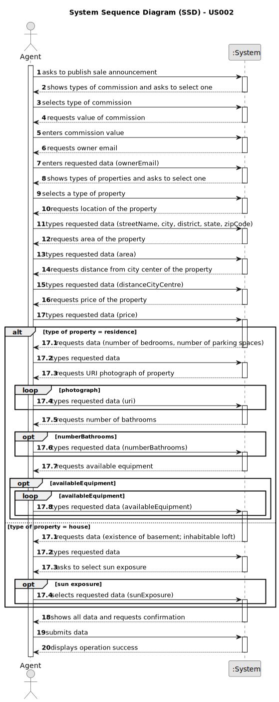

# US 002 - Publish an announcement

## 1. Requirements Engineering

### 1.1. User Story Description

As an agent, I can publish any sale announcement on the system, for
example received through a phone call.

### 1.2. Customer Specifications and Clarifications

**From the specifications document:**

> Each announcement must have the property characteristics and price. Depending on the type of property there will be
> more or less attributes to be mentioned.

> The information required in any kind of sale is: type of property, area, location, DCC, price and one or more
> photographs. If the property is an apartment or house then the number of bedrooms, bathrooms and parking spaces, as
> well
> as the available equipment should be included. Lastly, if it's a house the existence of a basement, inhabitable loft
> and
> sun exposure must also be mentioned.

**From the client clarifications:**

> **Question:** How is the sun exposure evaluated?
>
> **Answer:** Sun exposure will take the following values: North, South, East, or West.

> **Question:** Is the phone call the only way the agent can receive the sale announcement?
>
> **Answer:** For now this is the only way.

> **Question:** Are all the criteria for publishing the sale of a property in the system mandatory, or is there any data
> that the owner can choose not to give?
>
> **Answer:** The number of bathrooms, the available equipment and the sun exposure are not mandatory. At least one photograph is required.

> **Question:** Is it required that the owner identifies themselves in the announcement?
>
> **Answer:** Information about the owner is not published.

> **Question:** Must the agent who reviews and publishes an advertisement request be the same agent who accepts or
> rejects the purchase/lease request for that listing?
>
> **Answer:** The agent that receives the request is the one that posts the announcement.

> **Question:** How does the agent determine whether it is a fixed commission or a percentage commission?
>
> **Answer:** The agent should choose the type of commission and enter the value.

> **Question:** How can the owner send the photograph for the announcement? 
> 
> **Answer:** The owner can send the photograph by e-mail or any other means. The owner can even deliver the photograph to the store.

> **Question:** Is it possible to have multiple announcements for the same property?
>
> **Answer:** No.

> **Question:** Is it mandatory for the agent to input the commission value before publishing an announcement?
>
>  **Answer:** Yes.

> **Question:**  Are there only 2 types of commission or can the Administrator define more types of commission?
>
> **Answer:** For now we only have two types of commissions.

> **Question:** Is it necessary to publish the owner attributes on the sale announcement?
>
> **Answer:** No.

> **Question:**  What are the limit values/percentage of the commission? 
>
> **Answer:** There is no maximum and the minimum is 0. 

> **Question:** If it's a property for lease is the commission value adjusted for the monthly value and contract duration? 
>
> **Answer:** The commission is one value/percentage paid when the transaction is made.

> **Question:** Does the agent actually have two ways of publishing the sales announcement?
> 
> **Answer:** In US2 we get "As an agent, I can publish any sale announcement on the system, for example received through a phone call". This will be a feature/functionality of the system. The agent may receive the information by any means.

> **Question:** When the request arrives at the agent, are all the essential characteristics of the property in question already present?
> 
> **Answer:** Yes.

>**Question:** Does the agency have any commission (fixed or percentage) on top of the one that the agent sets, or the agent must set a commission that already includes the company's?
> 
> **Answer:** The commission value includes the agent and the company commission.

>**Question:** When the agent receives the phone call is it the agent who registers the order in the system?
> 
> **Answer:** The agent registers the order in the system.

### 1.3. Acceptance Criteria

* **AC1:** The type of property must be specified.
* **AC2:** All the information, except number of bathrooms, available equipment and sun exposure, describing a property has to be submitted.
* **AC3:** The area of the property needs to be expressed in m2.
* **AC4:** The minimum value of the commission is 0 and there is no maximum.
* **AC5:** At least one photograph is required.

### 1.4. Found out Dependencies

* There are no dependencies.

### 1.5 Input and Output Data

**Input Data:**

* Typed data:
    * Commission value
    * Area of the property
    * Location
    * DCC
    * Price of the property
    * One or more photographs
    * Number of bedrooms
    * Number of bathrooms
    * Number of parking spaces
    * Available equipment
    * Existence of basement
    * Inhabitable loft
    * Sun exposure

* Selected data:
    * Type of property
    * Type of commission

**Output Data:**

* List of types of properties
* (In)Success of the operation

### 1.6. System Sequence Diagram (SSD)

**Other alternatives might exist.**

### 1.7 Other Relevant Remarks

* All registered information, except the agent commission, can be accessed by the client who intends to
  buy or rent the property.