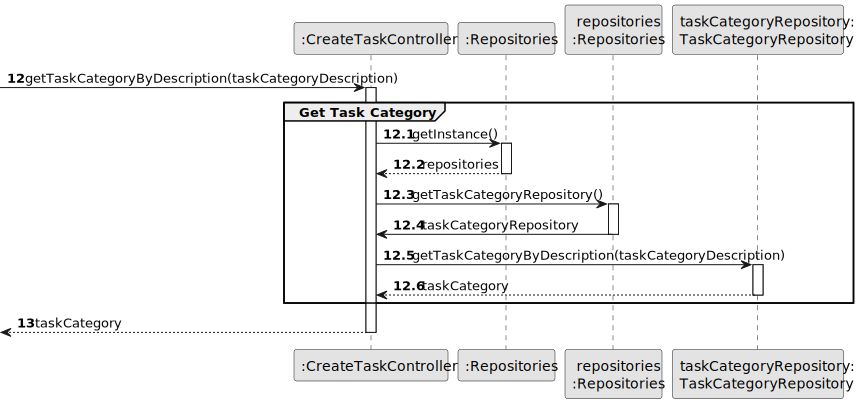

# US 002 - To publish an announcement

## 3. Design - User Story Realization

### 3.1. Rationale

**SSD - Alternative 1 is adopted.**

| Interaction ID                                    | Question: Which class is responsible for...                            | Answer                        | Justification (with patterns)                                                                                 |
|:--------------------------------------------------|:-----------------------------------------------------------------------|:------------------------------|:--------------------------------------------------------------------------------------------------------------|
| Step 1: asks to publish announcement              | ... interacting with the actor?                                        | PublishAnnouncementUI         | Pure Fabrication: there is no reason to assign this responsibility to any existing class in the Domain Model. |
|                                                   | ... coordinating the US?                                               | PublishAnnouncementController |                                                                                                               |
|                                                   | .. obtaining the announcement list?                                    |                               |                                                                                                               |
| Step 2: shows types of commission                 | ... displaying the types of commission? 	                              | PublishAnnouncementUI         | Pure Fabrication: there is no reason to assign this responsibility to any existing class in the Domain Model. |
| Step 3: selects type of commission                | ... validating selected data?                                          | PublishAnnouncementUI         | Pure Fabrication: there is no reason to assign this responsibility to any existing class in the Domain Model. |
|                                                   | ... temporarily keeping the selected type of commission?               | PublishAnnouncementUI         | Pure Fabrication: there is no reason to assign this responsibility to any existing class in the Domain Model. |
| Step 4: requests value of commission	             | ... displaying the UI for the actor to input data?                     | PublishAnnouncementUI         | Pure Fabrication: there is no reason to assign this responsibility to any existing class in the Domain Model. |
| Step 5: enters commission value                   | ... validating input data?                                             | PublishAnnouncementUI         | Pure Fabrication: there is no reason to assign this responsibility to any existing class in the Domain Model. |
|                                                   | ... temporarily keeping input data?                                    | PublishAnnouncementUI         | Pure Fabrication: there is no reason to assign this responsibility to any existing class in the Domain Model. |
| Step 6: shows types of properties                 | 	... displaying the types of properties?	                              | PublishAnnouncementUI         | Pure Fabrication: there is no reason to assign this responsibility to any existing class in the Domain Model. |
| Step 7: selects a type of property                | ... validating selected data?                                          | PublishAnnouncementUI         | Pure Fabrication: there is no reason to assign this responsibility to any existing class in the Domain Model. |
|                                                   | ... temporarily keeping the selected type of property?                 | PublishAnnouncementUI         | Pure Fabrication: there is no reason to assign this responsibility to any existing class in the Domain Model. |
| Step 8: requests data                             | ... displaying the UI for the actor to input data?                     | PublishAnnouncementUI         | Pure Fabrication: there is no reason to assign this responsibility to any existing class in the Domain Model. |
| Step 9: types requested data                      | ... validating input data?                                             | PublishAnnouncementUI         | Pure Fabrication: there is no reason to assign this responsibility to any existing class in the Domain Model. |
|                                                   | ... temporarily keeping input data?                                    | PublishAnnouncementUI         | Pure Fabrication: there is no reason to assign this responsibility to any existing class in the Domain Model. |
| Step 10: shows all data and requests confirmation | ... display all the information before submitting?                     | PublishAnnouncementUI         | Pure Fabrication: there is no reason to assign this responsibility to any existing class in the Domain Model. |
| Step 11: submits data                             | ... creating announcement object?                                      | Agent                         | Creator: (Rule 2) in the DM Agent is the one that publishes(records) an announcement.                         |
|                                                   | ... validating the data locally (mandatory data)?                      |                               |                                                                                                               |
|                                                   | ... adding to a collection and globally validating duplicated records? |                               |                                                                                                               |
| Step 12: displays operation success 	             | ... informing operation success?	                                      | PublishAnnouncementUI         | Pure Fabrication: there is no reason to assign this responsibility to any existing class in the Domain Model. |

[//]: # (Rationales:)

[//]: # (• B contains or aggregates instances of A)

[//]: # (• B records instances of A)

[//]: # (• B closely uses A)

[//]: # (• B has the data for initialising A)

### Systematization ##

According to the taken rationale, the conceptual classes promoted to software classes are:

* Organization
* Task

Other software classes (i.e. Pure Fabrication) identified:

* CreateTaskUI
* CreateTaskController

## 3.2. Sequence Diagram (SD)

### Alternative 1 - Full Diagram

This diagram shows the full sequence of interactions between the classes involved in the realization of this user story.

### Alternative 2 - Split Diagram

This diagram shows the same sequence of interactions between the classes involved in the realization of this user story,
but it is split in partial diagrams to better illustrate the interactions between the classes.

It uses interaction ocurrence.

**Get Task Category List Partial SD**

**Get Task Category Object**

**Get Employee**

**Create Task**

## 3.3. Class Diagram (CD)

