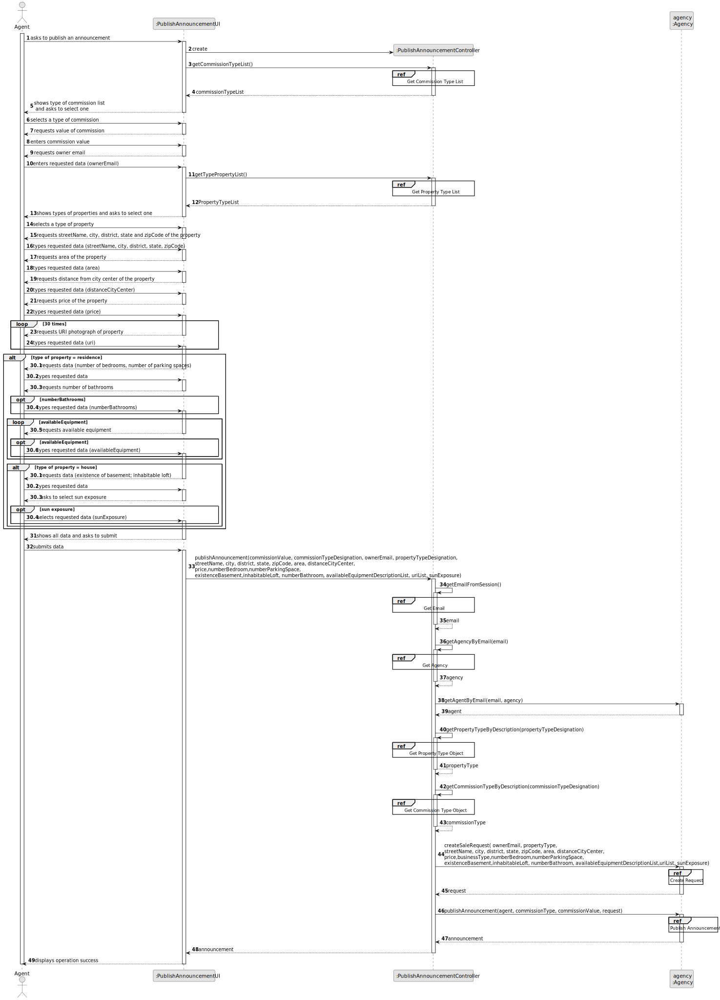
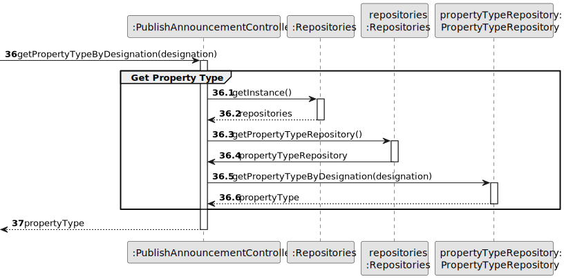
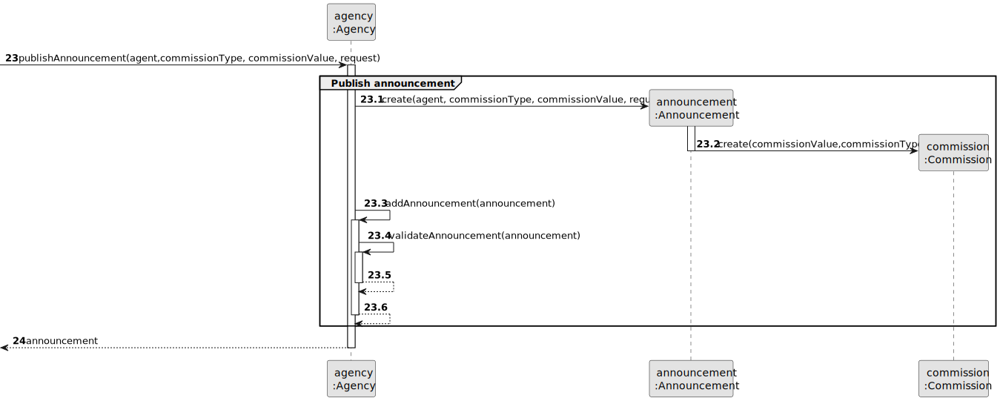
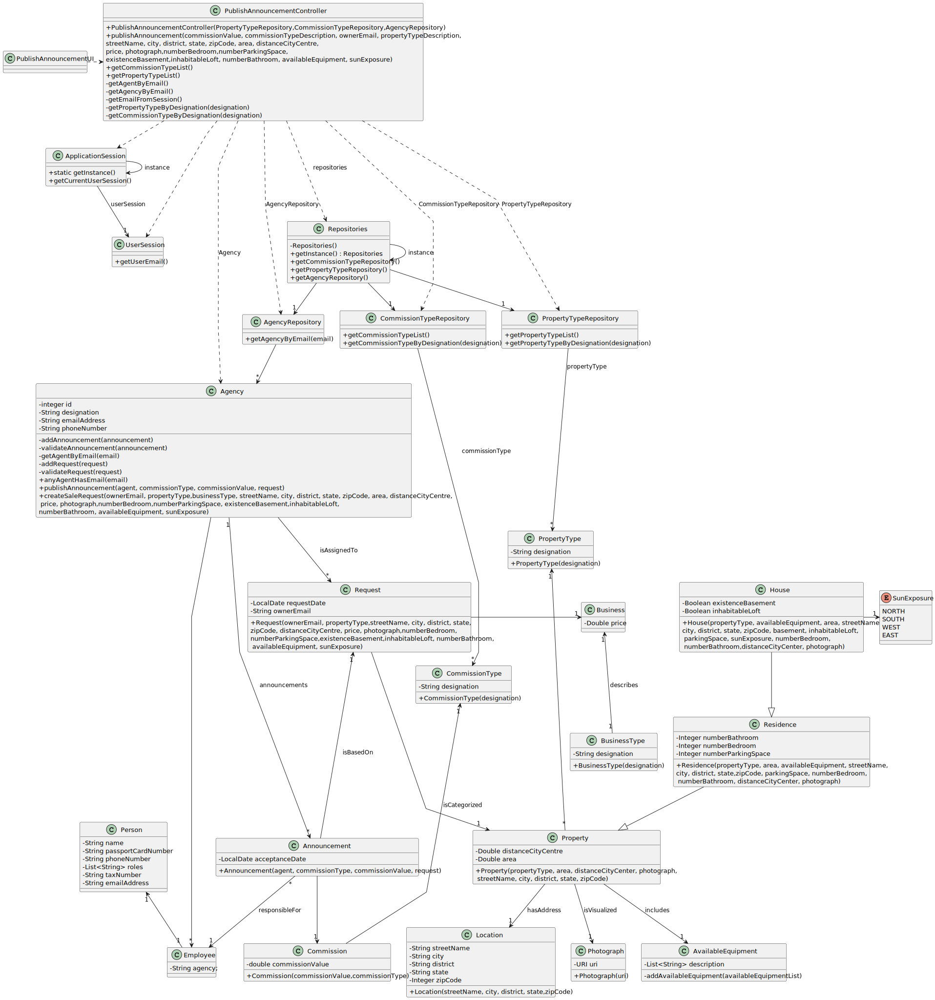

# US 002 - To publish an announcement

## 3. Design - User Story Realization

### 3.1. Rationale

**SSD - Alternative 1 is adopted.**

| Interaction ID                                    | Question: Which class is responsible for...              | Answer                        | Justification (with patterns)                                                                                 |
|:--------------------------------------------------|:---------------------------------------------------------|:------------------------------|:--------------------------------------------------------------------------------------------------------------|
| Step 1: asks to publish announcement              | ... interacting with the actor?                          | PublishAnnouncementUI         | Pure Fabrication: there is no reason to assign this responsibility to any existing class in the Domain Model. |
|                                                   | ... coordinating the US?                                 | PublishAnnouncementController | Controller                                                                                                    |
|                                                   | ... obtaining the type of commission list?               | CommissionTypeRepository      | Information Expert (the types of commission are the same for all the agents), Pure Fabrication                |
| Step 2: shows types of commission                 | ... displaying the types of commission? 	                | PublishAnnouncementUI         | Pure Fabrication: there is no reason to assign this responsibility to any existing class in the Domain Model. |
| Step 3: selects type of commission                | ... validating selected data?                            | PublishAnnouncementUI         | Pure Fabrication: there is no reason to assign this responsibility to any existing class in the Domain Model. |
|                                                   | ... temporarily keeping the selected type of commission? | PublishAnnouncementUI         | Pure Fabrication: there is no reason to assign this responsibility to any existing class in the Domain Model. |
| Step 4: requests value of commission	             | ... displaying the UI for the actor to input data?       | PublishAnnouncementUI         | Pure Fabrication: there is no reason to assign this responsibility to any existing class in the Domain Model. |
| Step 5: enters commission value                   | ... validating input data?                               | PublishAnnouncementUI         | Pure Fabrication: there is no reason to assign this responsibility to any existing class in the Domain Model. |
|                                                   | ... temporarily keeping input data?                      | PublishAnnouncementUI         | Pure Fabrication: there is no reason to assign this responsibility to any existing class in the Domain Model. |
|                                                   | ... obtaining the type of property list?                 | PropertyTypeRepository        | Information Expert (the types of properties are the same for all announcements/properties), Pure Fabrication  |
| Step 6: shows types of properties                 | 	... displaying the types of properties?	                | PublishAnnouncementUI         | Pure Fabrication: there is no reason to assign this responsibility to any existing class in the Domain Model. |
| Step 7: selects a type of property                | ... validating selected data?                            | PublishAnnouncementUI         | Pure Fabrication: there is no reason to assign this responsibility to any existing class in the Domain Model. |
|                                                   | ... temporarily keeping the selected type of property?   | PublishAnnouncementUI         | Pure Fabrication: there is no reason to assign this responsibility to any existing class in the Domain Model. |
| Step 8: requests data                             | ... displaying the UI for the actor to input data?       | PublishAnnouncementUI         | Pure Fabrication: there is no reason to assign this responsibility to any existing class in the Domain Model. |
| Step 9: types requested data                      | ... validating input data?                               | PublishAnnouncementUI         | Pure Fabrication: there is no reason to assign this responsibility to any existing class in the Domain Model. |
|                                                   | ... temporarily keeping input data?                      | PublishAnnouncementUI         | Pure Fabrication: there is no reason to assign this responsibility to any existing class in the Domain Model. |
| Step 10: shows all data and requests confirmation | ... display all the information before submitting?       | PublishAnnouncementUI         | Pure Fabrication: there is no reason to assign this responsibility to any existing class in the Domain Model. |
| Step 11: submits data                             | ... creating announcement object?                        | Agency                        | Creator: (Rule 1) in the Domain Model Agency owns Announcements.                                              |
|                                                   | ... validating all the mandatory data (local data)?      | Announcement                  | Information Expert: owns its data.                                                                            |
|                                                   | ... globally validating duplicated records?              | Agency                        | Information Expert: knows all announcements instances.                                                        |
|                                                   | ... instantiating a new request?                         | Agency                        | Creator: (Rule 1) in the Domain Model Agency is assigned (contains) Requests.                                 |
| Step 12: displays operation success 	             | ... informing operation success?	                        | PublishAnnouncementUI         | Pure Fabrication: there is no reason to assign this responsibility to any existing class in the Domain Model. |

### Systematization ##

According to the taken rationale, the conceptual classes promoted to software classes are:

* Agency
* Announcement
* Request

Other software classes (i.e. Pure Fabrication) identified:

* PublishAnnouncementUI
* PublishAnnouncementController
* PropertyTypeRepository
* CommissionTypeRepository

## 3.2. Sequence Diagram (SD)

### Alternative 1 - Split Diagram

This diagram shows the same sequence of interactions between the classes involved in the realization of this user story,
but it is split in partial diagrams to better illustrate the interactions between the classes.

It uses interaction occurrence.

**Get Commission Type List - Partial SD**

**Get Commission Type Object - Partial SD**

**Get Property Type List - Partial SD**

**Get Property Type Object - Partial SD**

**Get Agent - Partial SD**

**Create Request - Partial SD**

**Publish Announcement - Partial SD**

## 3.3. Class Diagram (CD)

