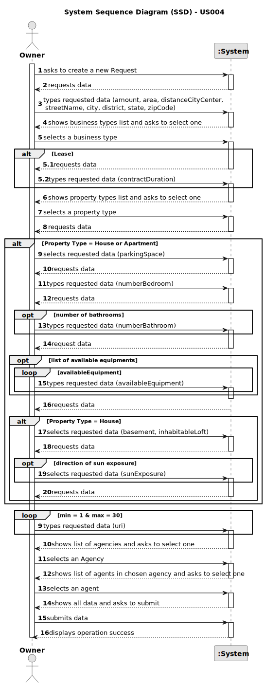

# US 004 - To submit a Request for an Announcement

## 1. Requirements Engineering

### 1.1. User Story Description

As an owner, I intend to submit a request for listing a property for sale or rent, choosing the responsible agent.

### 1.2. Customer Specifications and Clarifications

**From the specifications document:**

Each request lists a property for sale or/and rent, and it is assigned to an agent.

The sale's standard information is the property's listing, the amount (representing price or rent), the renting contract's duration (when
applicable),
area, location, distance from the City Center, and one or more photographs.

The request for sale's additional information is based on the property's type, as seen in the table below.

|     Information     |            House            | Apartment |
|:-------------------:|:---------------------------:|:---------:|
|   Parking Spaces    |           0 or +            |  0 or +   |
| Number of Bedrooms  |           0 or +            |  0 or +   |
| Number of Bathrooms |           0 or +            |  0 or +   |
|   Central Heating   |          Yes / No           | Yes / No  |
|  Air Conditioning   |          Yes / No           | Yes / No  |
|      Basement       |          Yes / No           |     -     |
|  Inhabitable Loft   |          Yes / No           |     -     |
|    Sun Exposure     | North / South / West / East |     -     |

The access to the request is exclusive to the owner and respectively assigned agent.

**From the client clarifications:**

> **Question:** What are the attributes of the Owner?
>
> **Answer:**  The Owner's attributes are: name, citizen's card number, tax number, address, email address, and
> telephone number.

> **Question:** What are the attributes of the Agent?
>
> **Answer:**  The Agent's attributes are: name, citizen's card number, tax number, email address, contact telephone
> number, and the agency to which they are assigned.

> **Question:** What are the attributes of the location?
>
> **Answer:**  The location's attributes are: street name, city, district, state and Zip Code.

> **Question:** Does an Owner need to be registered in the system to submit a request for a property listing?
>
> **Answer:**  No. When making the request to list a property, the owner should introduce his own data (attributes +
> property's data).

> **Question:** Is the Owner the only actor that can submit a request and assign an agent?
>
> **Answer:**  No. The agency's personnel that registers the information in the system can choose to assign any agent.

> **Question:** If the Owner does not choose an agent, will the application/agency randomly assign an agent to the
> property?
>
> **Answer:**  Yes.

> **Question:** Are there any restrictions on the choice of an agent?
>
> **Answer:**  No, the Owner can choose any agent.

> **Question:** Can an Agent work in more than one store?
>
> **Answer:** No.

> **Question:** Can the property's Owner submit requests to both sale and rental listings?
>
> **Answer:** No.

> **Question:** Is it possible to submit multiple listing for the same property and type of listing?
>
> **Answer:** No.

> **Question:** Does the Owner have a limit of request they can do?
>
> **Answer:** No.

> **Question:** Can the Owner choose the agency/branch/store independently of the location of the property?
>
> **Answer:** Yes.

> **Question:** Is the agent essential for the submission of a request? If the owner does not choose any agent, will the
> platform randomly assign a respective agent?
>
> **Answer:** Yes.

> **Question:** Must all the request's data slots be filled, according to the property's type and listing?
>
> **Answer:** Yes.

> **Question:** If the owner leaves the listing unfinished, can it be saved or stay as a sketch to be finished later?
>
> **Answer:** No.

### 1.3. Acceptance Criteria

* **AC1:** The currency used for the property's amount is US Dollars (USD - $)
* **AC2:** The property's area is measured in square meters (m2)

### 1.4. Found out Dependencies

* There is no dependencies to US004.

### 1.5 Input and Output Data

**Input Data:**

* Typed data:
    * name
    * amount
    * contractDuration
    * area
    * availableEquipment
    * parkingSpace
    * location
        * streetName
        * city
        * district
        * state
        * zipCode
    * distanceCityCenter
    * photograph
    * Owner's data
        * name
        * passportCardNumber
        * taxNumber
        * location
        * email
        * telephone number
    * numberBedrooms
    * numberBathrooms

* Selected data:
    * BusinessType
    * propertyType
    * basement
    * inhabitableLoft
    * sunExposure
    * agency
    * agent

**Output Data:**

* List of business types
* List of property types
* List of agencies
* List of agents
* (In)Success of the operation

### 1.6. System Sequence Diagram (SSD)

**Other alternatives might exist.**

### 1.7 Other Relevant Remarks

n/a