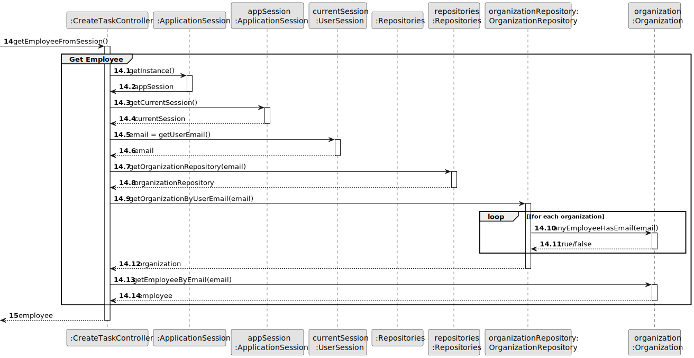

# US 006 - To create a Task

## 3. Design - User Story Realization

### 3.1. Rationale

**SSD - Alternative 1 is adopted.**

| Interaction ID                                     | Question: Which class is responsible for...                            | Answer                       | Justification (with patterns)                                                                                                                                                               |
|:---------------------------------------------------|:-----------------------------------------------------------------------|:-----------------------------|:--------------------------------------------------------------------------------------------------------------------------------------------------------------------------------------------|
| Step 1 : asks to create a new Announcement  	      | ... interacting with the actor?                                        | CreateAnnouncementUI         | Pure Fabrication: there is no reason to assign this responsibility to any existing class in the Domain Model.                                                                               |
| 			  		                                            | ... coordinating the US?                                               | CreateAnnouncementController | Controller                                                                                                                                                                                  |
| 			  		                                            | ... instantiating a new Announcement?                                  | Agency                       | Creator (Rule 1): in the DM, Agency has an Announcement.                                                                                                                                    |
| 			  		                                            | ... knowing the user using the system?                                 | UserSession                  | IE: cf. A&A component documentation.                                                                                                                                                        |
|                                                    | ... obtaining the transaction types?                                   | TransactionTypeRepository    | IE/Pure Fabrication: there is no reason to assign this responsibility to any existing class in the Domain Model. It has the most knowledge about how to manage and store the announcements. |
| Step 2 : shows transaction types 		                | ... displaying the transaction types?			                               | CreateAnnouncementUI         | Pure Fabrication: there is no reason to assign this responsibility to any existing class in the Domain Model.                                                                               |
|                                                    | ... knowing the transaction types to show?                             | System                       | I/E: Transaction types are defined by the System Administrators.                                                                                                                            |
| Step 3 : selects transaction type 		               | ... temporarily keeping input data?                                    | CreateAnnouncementUI         | Pure Fabrication: there is no reason to assign this responsibility to any existing class in the Domain Model.                                                                               |
|                                                    | ... validating input data?                                             | CreateAnnouncementUI         | Pure Fabrication: there is no reason to assign this responsibility to any existing class in the Domain Model.                                                                               |
| Step 4 : create a new property                     | ... interacting with the actor?                                        | CreateAnnouncementUI         | Pure Fabrication: there is no reason to assign this responsibility to any existing class in the Domain Model.                                                                               |
|                                                    | ... instantiating a new Property?                                      | Announcement                 | Creator (Rule 1): in the DM, Announcement has  Property.                                                                                                                                    |
|                                                    | ... obtaining the property types?                                      | PropertyTypeRepository       | Pure Fabrication / IE:  there is no reason to assign this responsibility to any existing class in the Domain Model. It has the most knowledge about how to manage and store the properties. |
| Step 5 : shows property types 		                   | ... displaying the property types?	                                    | CreateAnnouncementUI         | Pure Fabrication: there is no reason to assign this responsibility to any existing class in the Domain Model.                                                                               |
| 		                                                 | 	... knowing the property types to show?                               | System                       | I/E: Property types are defined by the System Administrators.                                                                                                                               |
| Step 6 : selects property types                    | ... temporarily keeping input data?                                    | CreateAnnouncementUI         | Pure Fabrication: there is no reason to assign this responsibility to any existing class in the Domain Model.                                                                               |
|                                                    | ... validating input data?                                             | CreateAnnouncementUI         | Pure Fabrication: there is no reason to assign this responsibility to any existing class in the Domain Model.                                                                               |
| Step 7 : requests data                             | 	... displaying the UI for the actor to input data?				                | CreateAnnouncementUI         | Pure Fabrication: there is no reason to assign this responsibility to any existing class in the Domain Model.                                                                               |
| Step 8 : types requested data                      | 	... validating all property's data (local validation)?                | Property                     | IE: owns its data.                                                                                                                                                                          | 
| 			  ??????????		                                  | 	... validating all data (global validation)?                          | ???? Agency                  | IE: knows all its annoucements instances.                                                                                                                                                   | 
| Step 9 : requests data	                            | ... displaying the UI for the actor to input data?                     | CreateAnnouncementUI         | Pure Fabrication: there is no reason to assign this responsibility to any existing class in the Domain Model.                                                                               | 
| ?????                                              | ... obtaining the selected data types?                                 | ????                         | ????                                                                                                                                                                                        |
| Step 10 : selects requested data                   | ... validating input data?                                             | CreateAnnouncementUI         | Pure Fabrication: there is no reason to assign this responsibility to any existing class in the Domain Model.                                                                               |
|                                                    | ... temporarily keeping input data?                                    | CreateAnnouncementUI         | Pure Fabrication: there is no reason to assign this responsibility to any existing class in the Domain Model.                                                                               |
| Step 11 : shows all data and requests confirmation | ... display all the information before submitting?                     | CreateAnnouncementUI         | Pure Fabrication: there is no reason to assign this responsibility to any existing class in the Domain Model.                                                                               |
| ???????????                                        | ... validating the data locally (mandatory data)?                      | Announcement                 | IE: owns its data                                                                                                                                                                           |
| Step 12 : submits data                             | ... creating the property object?                                      | Announcement                 | Creator (Rule 1) : in the DM, Announcement has a Property.                                                                                                                                  |
|                                                    | ... creating the announcement object?                                  | Agency                       | IE: knows all its Announcement instances.                                                                                                                                                   |
|                                                    | ... adding to a collection and globally validating duplicated records? | Agency                       | Creator (Rule 1) : in the DM, Agency has an Announcement.                                                                                                                                   |
| Step 13 : displays operation success               | ... informing operation success?                                       | CreateAnnouncementUI         | Pure Fabrication: there is no reason to assign this responsibility to any existing class in the Domain Model.                                                                               |

FALTA AINDA O REPOSITORIO DOS AGENTS e AGENCIES

### Systematization ##

According to the taken rationale, the conceptual classes promoted to software classes are:

* Organization
* Task

Other software classes (i.e. Pure Fabrication) identified:

* CreateTaskUI
* CreateTaskController

## 3.2. Sequence Diagram (SD)

### Alternative 1 - Full Diagram

This diagram shows the full sequence of interactions between the classes involved in the realization of this user story.

### Alternative 2 - Split Diagram

This diagram shows the same sequence of interactions between the classes involved in the realization of this user story,
but it is split in partial diagrams to better illustrate the interactions between the classes.

It uses interaction ocurrence.

**Get Task Category List Partial SD**

**Get Task Category Object**

**Get Employee**

**Create Task**

## 3.3. Class Diagram (CD)

