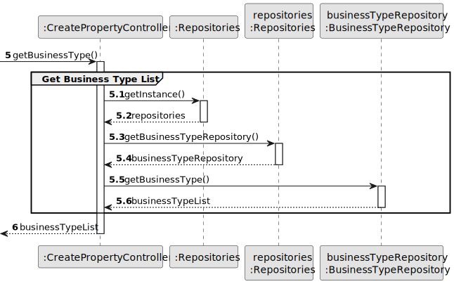
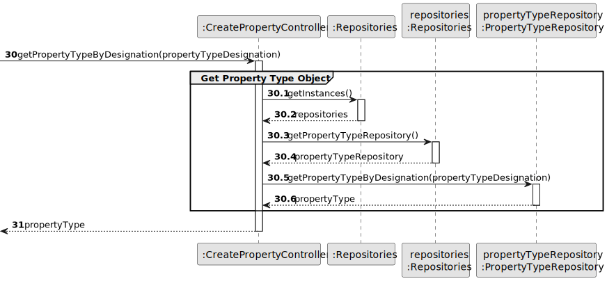
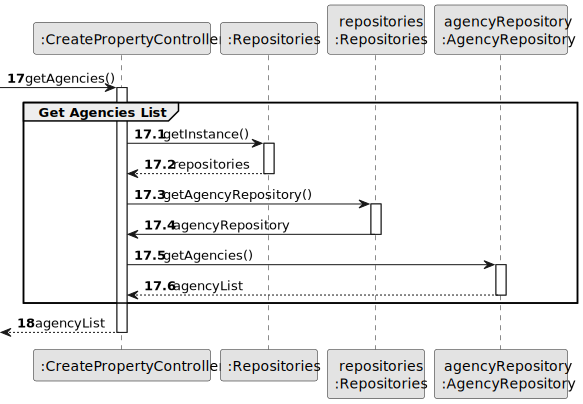
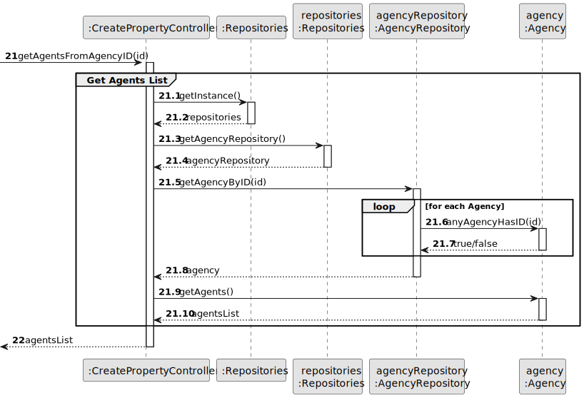
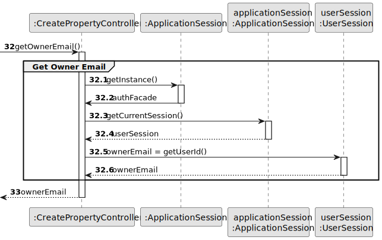
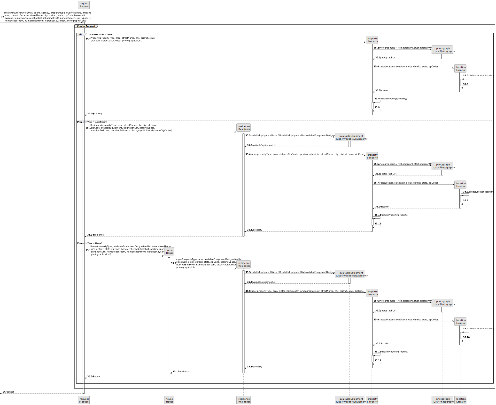
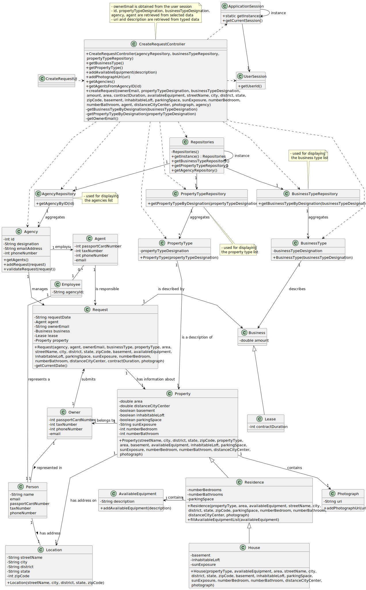

# US 004 - To submit a Request for an Announcement

## 3. Design - User Story Realization

### 3.1. Rationale

| Interaction ID                                     | Question: Which class is responsible for...                            | Answer                  | Justification (with patterns)                                                                                 |
|:---------------------------------------------------|:-----------------------------------------------------------------------|:------------------------|:--------------------------------------------------------------------------------------------------------------|
| Step 1 : asks to create a new Request  	           | ... interacting with the actor?                                        | CreateRequestUI         | Pure Fabrication: there is no reason to assign this responsibility to any existing class in the Domain Model. |
| 			  		                                            | ... coordinating the US?                                               | CreateRequestController | Controller.                                                                                                   |
| 			  		                                            | ... instantiating a new request?                                       | Announcement            | Creator (Rule 1): in the DM, Announcement has an Request.                                                     |
| 			  		                                            | ... knowing the user using the system?                                 | UserSession             | IE: cf. A&A component documentation.                                                                          |
|                                                    |                                                                        | Owner                   | IE: knows its own data (e.g. email).                                                                          |
|                                                    | ... obtaining the business types?                                      | BusinessTypeRepository  | IE: the types of business are the same for all requests; Pure Fabrication.                                    |
| Step 2 : shows business types 		                   | ... displaying the business types?			                                  | CreateRequestUI         | Pure Fabrication: there is no reason to assign this responsibility to any existing class in the Domain Model. |
| Step 3 : selects business type 		                  | ... temporarily keeping input data?                                    | CreateRequestUI         | IE: the types of property are the same for all requests; Pure Fabrication.                                    |
|                                                    | ... validating input data?                                             | CreateRequestUI         | Pure Fabrication: there is no reason to assign this responsibility to any existing class in the Domain Model. |
|                                                    | ... obtaining the property types?                                      | BusinessTypeRepository  | IE: the types of business are the same for all requests; Pure Fabrication.                                    |
| Step 4 : shows property types 		                   | ... displaying the property types?	                                    | PropertyTypeRepository  | Pure Fabrication: there is no reason to assign this responsibility to any existing class in the Domain Model. |
| Step 5 : selects property type 		                  | ... temporarily keeping input data?                                    | CreateRequestUI         | Pure Fabrication: there is no reason to assign this responsibility to any existing class in the Domain Model. |
|                                                    | ... validating input data?                                             | CreateRequestUI         | Pure Fabrication: there is no reason to assign this responsibility to any existing class in the Domain Model. |
| Step 6 : requests data                             | ... displaying the UI for the actor to input data?                     | CreateRequestUI         | Pure Fabrication: there is no reason to assign this responsibility to any existing class in the Domain Model. |
| Step 7 : types requested data                      | ... validating input data?                                             | CreateRequestUI         | Pure Fabrication: there is no reason to assign this responsibility to any existing class in the Domain Model. |
|                                                    | ... temporarily keeping input data?                                    | CreateRequestUI         | Pure Fabrication: there is no reason to assign this responsibility to any existing class in the Domain Model. |
| Step 8 : requests data                             | ... displaying the UI for the actor to input data?                     | CreateRequestUI         | Pure Fabrication: there is no reason to assign this responsibility to any existing class in the Domain Model. |
| Step 9 : selects requested data                    | ... validating input data?                                             | CreateRequestUI         | Pure Fabrication: there is no reason to assign this responsibility to any existing class in the Domain Model. |
|                                                    | ... temporarily keeping input data?                                    | CreateRequestUI         | Pure Fabrication: there is no reason to assign this responsibility to any existing class in the Domain Model. |
|                                                    | ... obtaining the agencies list?                                       | AgencyRepository        | IE: one of all agencies can be chosen for all requests; Pure Fabrication.                                     |
| Step 10 : shows agencies 		                        | ... displayingthe agencies list?	                                      | CreateRequestUI         | Pure Fabrication: there is no reason to assign this responsibility to any existing class in the Domain Model. |
| Step 11 : selects an agency 		                     | ... temporarily keeping input data?                                    | CreateRequestUI         | Pure Fabrication: there is no reason to assign this responsibility to any existing class in the Domain Model. |
|                                                    | ... validating input data?                                             | CreateRequestUI         | Pure Fabrication: there is no reason to assign this responsibility to any existing class in the Domain Model. |
|                                                    | ... obtaining the agents list?                                         | Agency                  | IE: knows all its agents.                                                                                     |
| Step 12 : shows agents list of choosen agency      | ... displaying the property types?	                                    | CreateRequestUI         | Pure Fabrication: there is no reason to assign this responsibility to any existing class in the Domain Model. |
| Step 13 : selects an agent 		                      | ... temporarily keeping input data?                                    | CreateRequestUI         | Pure Fabrication: there is no reason to assign this responsibility to any existing class in the Domain Model. |
| Step 14 : shows all data and requests confirmation | ... display all the information before submitting?                     | CreateRequestUI         | Pure Fabrication: there is no reason to assign this responsibility to any existing class in the Domain Model. |
| Step 15 : submits data                             | ... creating the Request object?                                       | Agency                  | Creator (Rule 1): in the DM, Agency has a Request.                                                            |
|                                                    | ... validating the data locally (mandatory data)?                      | Request                 | IE: owns its data.                                                                                            |
| Step 16 : create a new property                    | ... instantiating a new Property?                                      | Request                 | Creator (Rule 1): in the DM, Request has Property.                                                            |
|                                                    | ... validating local data?                                             | Property                | IE: owns its data.                                                                                            |
| Step 17 : create a new location                    | ... instantiating a new Location?                                      | Property                | Creator (Rule 1): in the DM, Request has Property.                                                            |
|                                                    | ... validating local data?                                             | Location                | IE: owns its data.                                                                                            |
|                                                    | ... adding to a collection and globally validating duplicated records? | Agency                  | Creator (Rule 3): in the DM, Property closely uses Location.                                                  |
| Step 18 : displays operation success               | ... informing operation success?                                       | CreateRequestUI         | Pure Fabrication: there is no reason to assign this responsibility to any existing class in the Domain Model. |

### Systematization ##

According to the taken rationale, the conceptual classes promoted to software classes are:

* Request
* Agency
* Property
* Location

Other software classes (i.e. Pure Fabrication) identified:

* CreateRequestUI
* CreateRequestController

## 3.2. Sequence Diagram (SD)

### Split Diagram

This diagram shows the sequence of interactions between the classes involved in the realization of this user story. It
is split in partial diagrams to better illustrate the interactions between the classes.

It uses interaction ocurrence.

**Get Business Type List - Partial SD**

**Get Business Type Object - Partial SD**

**Get Property Type List - Partial SD**

**Get Property Type Object - Partial SD**

**Add Available Equipment Description - Partial SD** 

**Add Photograph Uri - Partial SD**

 

**Get Agencies List - Partial SD**

**Get Agents List - Partial SD**

**Get Owner Email - Partial SD**

**Create Request - Partial SD**

## 3.3. Class Diagram (CD)

