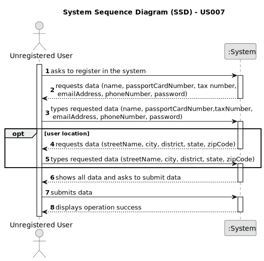

# US 007 - To register user in the system

## 1. Requirements Engineering

### 1.1. User Story Description

As an unregistered user, I want to register in the system to buy, sell or rent properties.

### 1.2. Customer Specifications and Clarifications

**From the specifications document:**

> All those who wish to use the application must be authenticated with a password of seven alphanumeric characters, including three capital letters and two digits. The application must support the English language.

> ???

**From the client clarifications:**

> **Question:** Does the user also receive the password via email or can he choose a password when registering?
>
> **Answer:** The owner can choose a password when registering.

> **Question:** When an unregistered user wants to register a new account in the system, the set of parameters that are asked are the following: name, citizen card number, tax number, email, phone number, and password. Do you want any extra parameters/requirements to be asked or just the ones specified above? If so, which ones are mandatory?
>
> **Answer:** The Owner attributes are: the name, the passport's card number, the tax number, the location, the email
> address and the contact telephone number. The location of the owner is not mandatory.

> **Question:** When registering a user, should the application ask if they are registering as a client or an Owner?
>
> **Answer:** YET TO BE ANSWERED

### 1.3. Acceptance Criteria

* **AC1:** Passwords have seven alphanumeric characters in length, including three capital letters and two digits.
* **AC2:** All the information about the client, except the location, must be registered.

### 1.4. Found out Dependencies

* There is a dependency to "US003 Create a task category" since at least a task category must exist to classify the task
  being created.

### 1.5 Input and Output Data

**Input Data:**

* Typed data:
    * name
    * passport's card number
    * tax number
    * location
    * email address
    * telephone number
    * password

**Output Data:**

* (In)Success of the operation

### 1.6. System Sequence Diagram (SSD)

**Other alternatives might exist.**

### 1.7 Other Relevant Remarks

* The created task stays in a "not published" state in order to distinguish from "published" tasks.