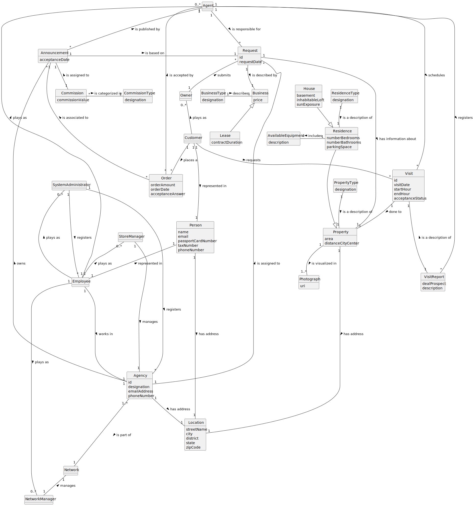

# Analysis

The construction process of the domain model is based on the client specifications, especially the nouns (for
_concepts_) and verbs (for _relations_) used.

## Rationale to identify domain conceptual classes ##

To identify domain conceptual classes, start by making a list of candidate conceptual classes inspired by the list of
categories suggested in the book "Applying UML and Patterns: An Introduction to Object-Oriented Analysis and Design and
Iterative Development".

### _Conceptual Class Category List_ ###

**Business Transactions**

* Sale
* Lease

---

**Transaction Line Items**

* Property

---

**Product/Service related to a Transaction or Transaction Line Item**

* Visit
* Land
* House
* Apartment
* Announcement
* Listing

---

**Roles of People or Organizations**

* Agent
* System Administrator
* Employee
* Customer
* Owner
* Client
* Store Manager
* Network Manager

---

**Places**

* Agency

---

**Noteworthy Events**

* Announcement
* Visit
* Listing

---

**Physical Objects**

* Property

---

**Descriptions of Things**

* Type of Property
* Type of Residence

---

**Containers**

* Network

---

**Elements of Containers**

* Store

---

**Organizations**

* Company

---

**Documents mentioned/used to perform some work/**

* Visit Report

---

### **Rationale to identify associations between conceptual classes** ###

An association is a relationship between instances of objects that indicates a relevant connection and that is worth of
remembering, or it is derivable from the List of Common Associations:

+ **_A_** is physically or logically part of **_B_**
+ **_A_** is physically or logically contained in/on **_B_**
+ **_A_** is a description for **_B_**
+ **_A_** known/logged/recorded/reported/captured in **_B_**
+ **_A_** uses or manages or owns **_B_**
+ **_A_** is related with a transaction (item) of **_B_**
+ etc.

|     Concept (A)     |     Association     |     Concept (B)     |
|:-------------------:|:-------------------:|:-------------------:|
|       Agency        |      contains       |      Location       |
|                     |    is a part of     |       Network       |
|        Agent        |        is a         |      Employee       |
|                     |      publishes      |    Announcement     |
|                     |      registers      |     VisitReport     |
|                     |      schedules      |        Visit        |
|    Announcement     |      contains       |      Property       |
|       Company       |        knows        | SystemAdministrator |
|                     |        owns         |       Agency        |
|                     |        owns         |       Network       |
|       Client        |        views        |    Announcement     |
|      Customer       |        is a         |       Person        |
|                     |      requests       |        Visit        |
|      Employee       |        is a         |       Person        |
|                     |      works in       |       Agency        |
|        House        |        is a         |      Residence      |
|        Lease        |        is a         |        Price        |
|   NetworkManager    |        is a         |      Employee       |
|                     |       manages       |       Network       |
|        Owner        |        is a         |       Person        |
|                     |      requests       |       Listing       |
|       Person        |      contains       |      Location       |
|      Property       |      contains       |        Owner        |
|                     |      contains       |     Photograph      |
|                     |      contains       |        Price        |
|      Residence      |      contains       | AvailableEquipment  |
|                     |        is a         |      Property       |
|    StoreManager     |        is a         |      Employee       |
|                     |       manages       |       Agency        |
| SystemAdministrator |        is a         |       Person        |
|                     |      registers      |       Agency        |
|                     |      registers      |      Employee       |
|    TypeProperty     | is a description of |      Property       |
|    TypeResidence    | is a description of |      Residence      |
|        Visit        |       done to       |      Property       |
|     VisitReport     | is a description of |        Visit        |

## Domain Model

**Do NOT forget to identify concepts attributes too.**

**Insert below the Domain Model Diagram in a SVG format**

