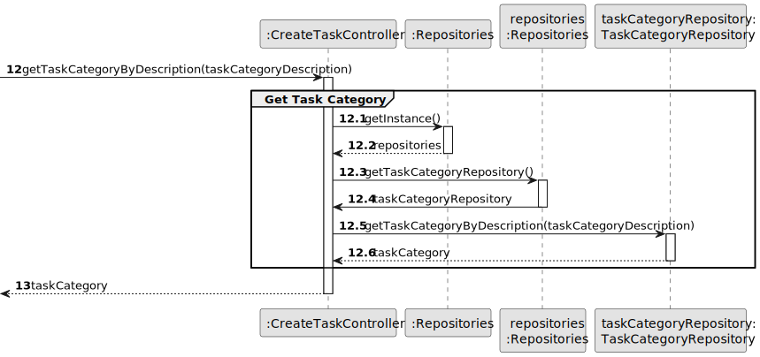
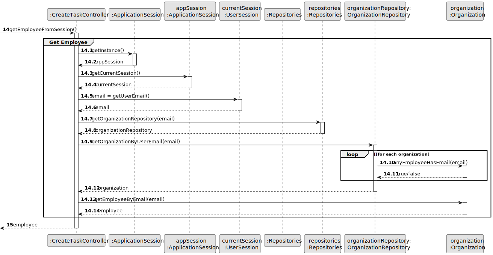

# US 003 - To register a new employee 

## 3. Design - User Story Realization 

### 3.1. Rationale

**SSD - Alternative 1 is adopted.**

| Interaction ID                                  | Question: Which class is responsible for...                            | Answer                     | Justification (with patterns)                                                                                                   |
|:------------------------------------------------|:-----------------------------------------------------------------------|:---------------------------|:--------------------------------------------------------------------------------------------------------------------------------|
| ask to register a new employee  	               | ... interacting with the actor?                                        | RegisterEmployeeUI         | Pure Fabrication: there is no reason to assign this responsibility to any existing class in the Domain Model.                   |
| 			  		                                         | ... coordinating the US?                                               | RegisterEmployeeController | Controller                                                                                                                      |
| 	   	                                           | ... obtaining agencies list?                                           | AgencyRepository           | IE: has its own data, Pure Fabrication                                                                                          |
| 			  		                                         | ... obtaining roles list?                                              | RoleRepository             | IE: has its own data, Pure Fabrication                                                                                          |
| request data 			  		                            | ... displaying the UI for the actor to input data?                     | ResgisterEmployeeUI        | Pure Fabrication: there is no reason to assign this responsibility to any existing class in the Domain Model.                   |
| type requested data	                            | ... validating input data?						                                       | RegisterEmployeeUI         | Pure Fabrication: there is no reason to assign this responsibility to any existing class in the Domain Model.                   |
| 		                                              | ... temporaly keeping input data?                                      | RegisterEmployeeUI         | Pure Fabrication: there is no reason to assign this responsibility to any existing class in the Domain Model.                   |
| show agencies list  		                          | ... displaying agencies list?                                          | RegisterEmployeeUI         | Pure Fabrication: there is no reason to assign this responsibility to any existing class in the Domain Model.                   |
| selects agency 		                               | ... validating selected data?                                          | RegisterEmployeeUI         | Pure Fabrication: there is no reason to assign this responsibility to any existing class in the Domain Model.                   |
| 		                                              | ... temporaly keeping the selected agency?	 	                          | RegisterEmployeeUI         | Pure Fabrication: there is no reason to assign this responsibility to any existing class in the Domain Model.                   |
| show role list		                                | ... displaying role list?                                              | RegisterEmployeeUI         | Pure Fabrication: there is no reason to assign this responsibility to any existing class in the Domain Model.                   | 
| selects role		  		                              | ... validating selected data?                                          | RegisterEmployeeUI         | Pure Fabrication: there is no reason to assign this responsibility to any existing class in the Domain Model.                   | 
| 			  		                                         | ... temporaly keeping the selected role?                               | RegisterEmployeeUI         | Pure Fabrication: there is no reason to assign this responsibility to any existing class in the Domain Model.                   | 
| show selected agency, role and requested data 	 | ... display all the information before submitting?                     | RegisterEmployeeUI         | Pure Fabrication: there is no reason to assign this responsibility to any existing class in the Domain Model.                   | 
 | submits data                                    | ... register the Employee Object?                                      | Agency                     | Creator R: 1                                                                                                                    |
|                                                 | ... vallidating the data locally (mandatory data)?                     | Data                       | IE: the objects created has it own data                                                                                         |
|                                                 | ... adding to a collection and globally validating duplicated records? | Data                       | IE: knows all its Data instances.                                                                                               |
| show operation success                          | ... informing operation success?                                       | RegisterEmployeeUI         | Pure Fabrication: Pure Fabrication: there is no reason to assign this responsibility to any existing class in the Domain Model. |
### Systematization ##

According to the taken rationale, the conceptual classes promoted to software classes are: 

 * Agency
 * Data

Other software classes (i.e. Pure Fabrication) identified: 

 * RegisterEmployeeUI  
 * RegisterEmployeeController

## 3.2. Sequence Diagram (SD)

### Alternative 1 - Full Diagram

This diagram shows the full sequence of interactions between the classes involved in the realization of this user story.

### Alternative 2 - Split Diagram

This diagram shows the same sequence of interactions between the classes involved in the realization of this user story, but it is split in partial diagrams to better illustrate the interactions between the classes.

It uses interaction ocurrence.

**Get Task Category List Partial SD**

**Get Task Category Object**

**Get Employee**

**Create Task**

## 3.3. Class Diagram (CD)

