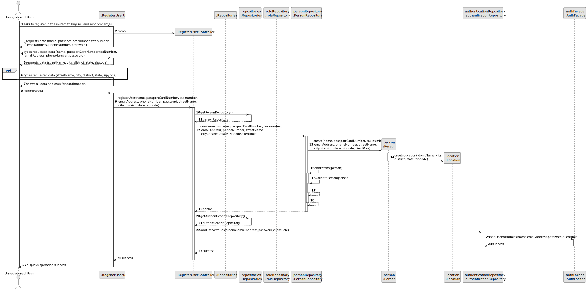
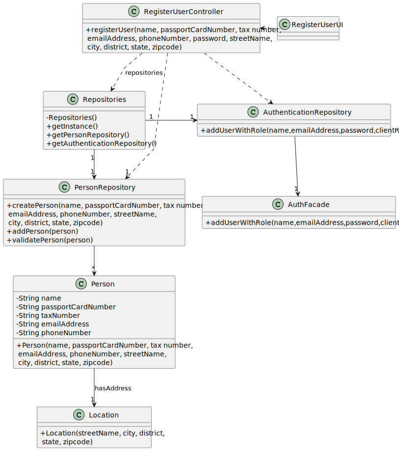

# US 006 - To create a Task

## 3. Design - User Story Realization

### 3.1. Rationale

**SSD - Alternative 1 is adopted.**

| Interaction ID                                     | Question: Which class is responsible for...         | Answer                   | Justification (with patterns)                                                                                 |
|:---------------------------------------------------|:----------------------------------------------------|:-------------------------|:--------------------------------------------------------------------------------------------------------------|
| Step 1 : asks to register in the system            | ... interacting with the actor?                     | RegisterUserUI           | Pure Fabrication: there is no reason to assign this responsibility to any existing class in the Domain Model. |
| 	                                                  | ... coordinating the US?                            | RegisterUserController   | Controller                                                                                                    |
| Step 2 : requests data                             | ... displaying the UI for the actor to input data?  | RegisterUserUI           | Pure Fabrication.                                                                                             |
| Step 3 : types requested data                      | ... validating input data?                          | RegisterUserUI           | Pure Fabrication.                                                                                             |
|                                                    | ... temporarily keeping input data?                 | RegisterUserUI           | Pure Fabrication.                                                                                             |
| Step 4 : requests data for the location            | ... displaying the UI for the actor to input data?  | RegisterUserUI           | Pure Fabrication.                                                                                             |
| Step 5 : types requested data                      | ... validating input data?                          | RegisterUserUI           | Pure Fabrication.                                                                                             |
|                                                    | ... temporarily keeping input data?                 | RegisterUserUI           | Pure Fabrication.                                                                                             |
| Step 6 : shows all data and asks for confirmation. | ... display all the information before submitting?  | RegisterUserUI           | Pure Fabrication.                                                                                             |              
| Step 7 : submits data.                             | ... instantiating a new Person?                     | PersonRepository         | Information Expert: knows/has Person instances.                                                               | 
| 	                                                  | ... adding a User to the system?                    | AuthenticationRepository | Information Expert: knows/has .                                                                               |
|                                                    | ... globally validating Person duplicated records?  | PersonRepository         | Information Expert: knows all person instances.                                                               |
| 	                                                  | ... validating all the mandatory data (local data)? | Person                   | Information Expert: knows/owns its data.                                                                      |  
| Step 8 : displays operation success.               | ... informing operation success?                    | RegisterUserUI           | Pure Fabrication.                                                                                             | 

### Systematization ##

According to the taken rationale, the conceptual classes promoted to software classes are:

* Organization
* Task

Other software classes (i.e. Pure Fabrication) identified:

* CreateTaskUI
* CreateTaskController

## 3.2. Sequence Diagram (SD)

### Alternative 1 - Full Diagram

This diagram shows the full sequence of interactions between the classes involved in the realization of this user story.

## 3.3. Class Diagram (CD)

