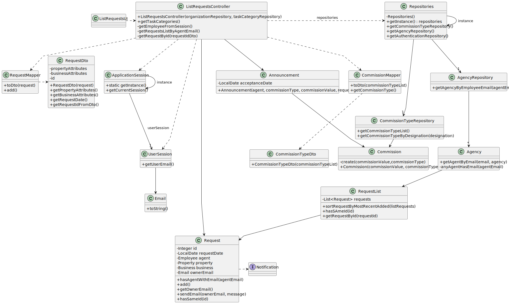

# US 008 - To list property announcement requests
 
## 3. Design - User Story Realization 

### 3.1. Rationale

| Interaction ID                                                    | Question: Which class is responsible for...                                | Answer                   | Justification (with patterns)                                                                                                                                                                |
|:------------------------------------------------------------------|:---------------------------------------------------------------------------|:-------------------------|:---------------------------------------------------------------------------------------------------------------------------------------------------------------------------------------------|
| Step 1 : asks to display the requests made to himself             | ... interacting with the actor?                                            | ListRequestsUI           | Pure Fabrication: there is no reason to assign this responsibility to any existing class in the Domain Model.                                                                                |
|                                                                   | ... coordinating the US?                                                   | ListRequestsController   | Controller                                                                                                                                                                                   |
|                                                                   | ... obtaining the agent email?                                             | User Session             | Information Expert: cf. User Authentication & Authorization component documentation.                                                                                                         |
|                                                                   | ... obtaining the agency that has the agent with retrieved email?          | AgencyRepository         | Information Expert: contains all the agencies; Pure Fabrication.                                                                                                                             |
|                                                                   | ... evaluating if an agency has an agent with the retrieved email?         | Agency                   | Information Expert: an agency knows all its agents (employees).                                                                                                                              |
|                                                                   | ... fetching the requests of the agent that has the specified email?       | RequestList              | Low Coupling/High Cohesion/Delegation/Pure Fabrication   or   Information Expert: knows all of the announcements of an agency.                                                       |
|                                                                   | ... verifying if the requests is from the specified email's agent.         | Request                  | Information Expert : knows their responsible agent.                                                                                                                                          |
|                                                                   | ... adding to a list the requests that belong to the agent?                | RequestList              | Information Expert: knows/contains all the announcements.                                                                                                                                    |
|                                                                   | ... sorting the orders by most recent added?                               | RequestList              | Information Expert:  knows all of the announcements of an agency.   or   Delegation/Pure Fabrication: promoting collection to specific class to ensure Low Coupling & High Cohesion. |
|                                                                   | ... fetching the necessary data to create an RequestDto?                   | RequestMapper            | Delegation/Pure Fabrication: promoting Request to specific class to ensure Low Coupling & High Cohesion.                                                                                     |
|                                                                   | ... converting the original data of a request to the DTO?                  | RequestMapper            | Delegation/Pure Fabrication: promoting Request to specific class to ensure Low Coupling & High Cohesion.                                                                                     |
| Step 2 : shows the list of requests                               | ... displaying the requests?                                               | ListRequestsUI           | Pure Fabrication: there is no reason to assign this responsibility to any existing class in the Domain Model.                                                                                |
|                                                                   | ... displaying the UI for the actor to select data?                        | ListRequestsUI           | Pure Fabrication: there is no reason to assign this responsibility to any existing class in the Domain Model.                                                                                |
| Step 3 : selects a request                                        | ... validating selected data?                                              | ListRequestsUI           | Pure Fabrication: there is no reason to assign this responsibility to any existing class in the Domain Model.                                                                                |
| Step 4 : shows the request and asks data (option)                 | ... obtaining the request ID from the requestDto?                          | RequestDto               | Information Expert: knows the id of the announcement.   or   DTO pattern                                                                                                             |
|                                                                   | ... verifying if the agency has a request with the id?                     | RequestList              | Information Expert: knows all of the requests of an agency.    or   Delegation/Pure Fabrication: promoting collection to specific class to ensure Low Coupling & High Cohesion.      |
|                                                                   | ... getting the request instance that has the specified id.                | Request                  | Information Expert: knows its own information.                                                                                                                                               |
|                                                                   | ... displaying the request?                                                | ListRequestsUI           | Pure Fabrication: there is no reason to assign this responsibility to any existing class in the Domain Model.                                                                                |
|                                                                   | ... displaying the UI for the actor to select data?                        | ListRequestsUI           | Pure Fabrication: there is no reason to assign this responsibility to any existing class in the Domain Model.                                                                                |
| Step 5 : submits data (option)                                    | ... obtaining the type of properties?                                      | PropertyTypeRepository   | Information Expert: the types of properties are the same for all announcements/properties   or   Pure Fabrication.                                                                   |
| Step 6 : shows types of commission and asks to select one         | ... displaying the UI for the actor to input data?                         | ListRequestsUI           | Pure Fabrication: there is no reason to assign this responsibility to any existing class in the Domain Model.                                                                                |
| Step 7 : selects type of commission                               | ... validating selected data?                                              | ListRequestsUI           | Pure Fabrication: there is no reason to assign this responsibility to any existing class in the Domain Model.                                                                                |
| Step 8 : requests value of commission                             | ... displaying the UI for the actor to input data?                         | ListRequestsUI           | Pure Fabrication: there is no reason to assign this responsibility to any existing class in the Domain Model.                                                                                |
| Step 9 : enters commission value                                  |                                                                            |                          |                                                                                                                                                                                              |
| Step 10 : shows all data and asks to submits                      |                                                                            |                          |                                                                                                                                                                                              |
| Step 11 : submits data                                            | ... validating selected data?                                              | ListRequestsUI           | Pure Fabrication: there is no reason to assign this responsibility to any existing class in the Domain Model.                                                                                |
|                                                                   | ... getting a commission type object by designation                        | CommissionTypeRepository | Information Expert: knows the commission types and has its descriptions and Pure Fabrication.                                                                                                |
|                                                                   | ... publishing an announcement?                                            | Agency                   | Information Expert: owns all its announcements.                                                                                                                                              |
|                                                                   | ... instantiating a new announcement?                                      | Agency                   | Creator (Rule 1): in the Domain Model Agency owns Announcements.                                                                                                                             |
|                                                                   | ... creating a commission instance?                                        | Announcement             | Creator (Rule 1): in the Domain Model Announcement contains Commission.                                                                                                                      |
|                                                                   | ... saving the created announcement?                                       | Agency                   | Agency: owns all its announcements.                                                                                                                                                          |
|                                                                   | ... globally validating duplicated announcements?                          | Agency                   | Information Expert: knows all announcements instances.                                                                                                                                       |
| Step 12 : asks for justification message                          | ... displaying the UI for the actor to input data?                         | ListRequestsUI           | Pure Fabrication: there is no reason to assign this responsibility to any existing class in the Domain Model.                                                                                |
| Step 13 : submits message                                         | ... obtaining the owner's email?                                           | Request                  | Information Expert: knows all the information about a request.                                                                                                                               |
|                                                                   | ... sending a notification to the agent informing about the visit request? | Notification             | **change**                                                                                                                                                                                   |
| Step 14 : shows operation success and shows the list of requests  | ... informing operation success?                                           | ListRequestsUI           | Pure Fabrication: there is no reason to assign this responsibility to any existing class in the Domain Model.                                                                                |
|                                                                   | **Change**                                                                 |                          |                                                                                                                                                                                              |

### Systematization ##

According to the taken rationale, the conceptual classes promoted to software classes are: 

 * Agency
 * Announcement
 * Commission
 * Request

Other software classes (i.e. Pure Fabrication) identified: 

 * ListRequestsUI  
 * ListRequestsController
 * CommissionTypeRepository
 * Application Session
 * User Session
 * RequestList
 * RequestMapper
 * RequestDto
 * CommissionTypeMapper
 * CommissionTypeDto

## 3.2. Sequence Diagram (SD)

### Split Diagram

This diagram shows the same sequence of interactions between the classes involved in the realization of this user story, but it is split in partial diagrams to better illustrate the interactions between the classes.

It uses interaction ocurrence.

**Get Agent Email Partial SD**

**Get Commission Type List**

**Get CommissionType**

**Publish Announcement**

## 3.3. Class Diagram (CD)

