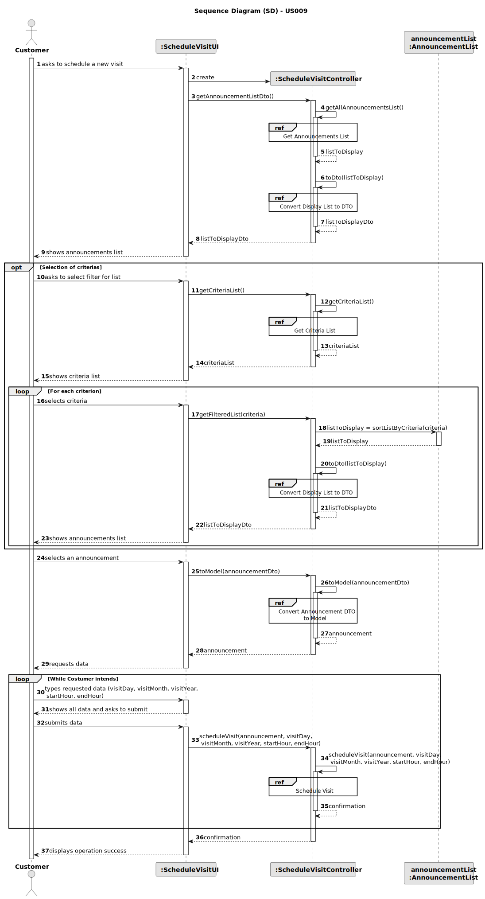
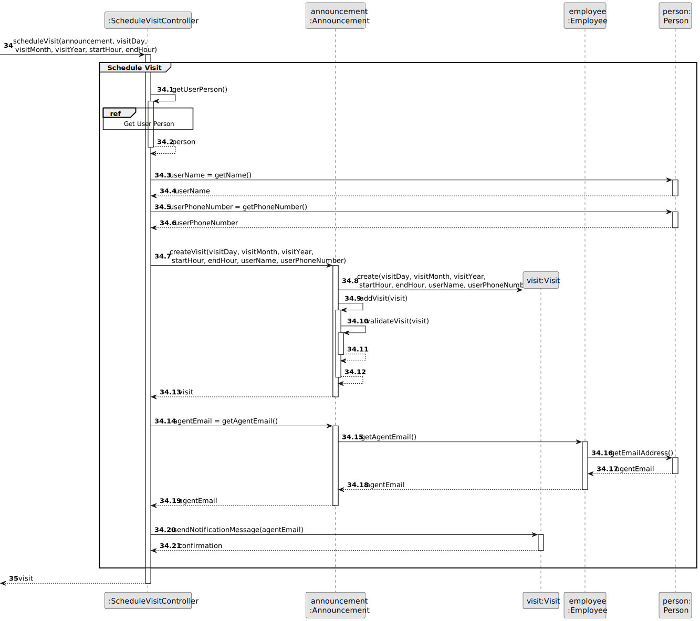
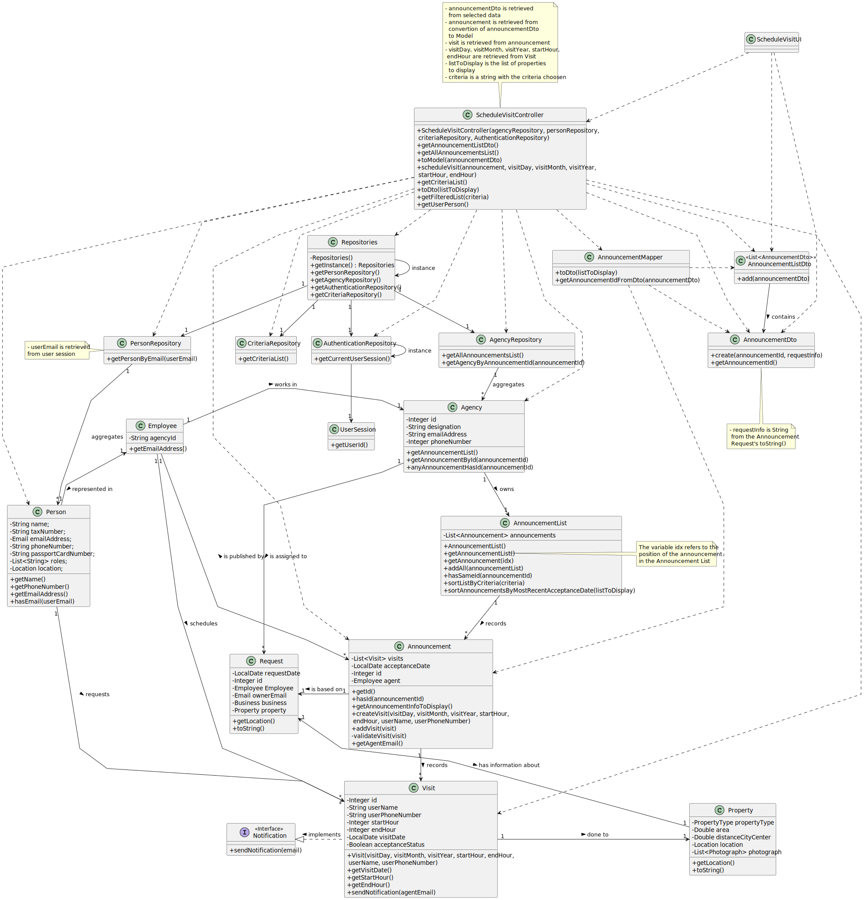

# US 009 - Schedule a visit to a property

## 3. Design - User Story Realization 

### 3.1. Rationale

| Interaction ID | Question: Which class is responsible for...   | Answer               | Justification (with patterns)                                                                                 |
|:---------------|:----------------------------------------------|:---------------------|:--------------------------------------------------------------------------------------------------------------|
| Step 1  		     | 	... interacting with the actor?              | CreateTaskUI         | Pure Fabrication: there is no reason to assign this responsibility to any existing class in the Domain Model. |
| 			  		        | 	... coordinating the US?                     | CreateTaskController | Controller                                                                                                    |
| 			  		        | 	... instantiating a new Task?                | Organization         | Creator (Rule 1): in the DM Organization has a Task.                                                          |
| 			  		        | ... knowing the user using the system?        | UserSession          | IE: cf. A&A component documentation.                                                                          |
| 			  		        | 							                                       | Organization         | IE: knows/has its own Employees                                                                               |
| 			  		        | 							                                       | Employee             | IE: knows its own data (e.g. email)                                                                           |
| Step 2  		     | 							                                       |                      |                                                                                                               |
| Step 3  		     | 	...saving the inputted data?                 | Task                 | IE: object created in step 1 has its own data.                                                                |
| Step 4  		     | 	...knowing the task categories to show?      | System               | IE: Task Categories are defined by the Administrators.                                                        |
| Step 5  		     | 	... saving the selected category?            | Task                 | IE: object created in step 1 is classified in one Category.                                                   |
| Step 6  		     | 							                                       |                      |                                                                                                               |              
| Step 7  		     | 	... validating all data (local validation)?  | Task                 | IE: owns its data.                                                                                            | 
| 			  		        | 	... validating all data (global validation)? | Organization         | IE: knows all its tasks.                                                                                      | 
| 			  		        | 	... saving the created task?                 | Organization         | IE: owns all its tasks.                                                                                       | 
| Step 8  		     | 	... informing operation success?             | CreateTaskUI         | IE: is responsible for user interactions.                                                                     | 

### Systematization ##

According to the taken rationale, the conceptual classes promoted to software classes are: 

 * Agency
 * Employee
 * Person
 * Announcement
 * AnnouncementList
 * Visit

Other software classes (i.e. Pure Fabrication) identified: 

 * ScheduleVisitUI  
 * ScheduleVisitController

## 3.2. Sequence Diagram (SD)

### Split Diagram

This diagram shows a sequence of interactions between the classes involved in the realization of this user story, but it is split in partial diagrams to better illustrate the interactions between the classes.

It uses interaction ocurrence.

**Get Announcements List DTO Partial SD**

**Get Agencies List Partial SD**

**Convert Display List to DTO Partial SD**

**Convert Announcement DTO to Model Partial SD**

**Schedule Visit Partial SD**

**Send Notification Message Partial SD**

**Get User Person Partial SD**

## 3.3. Class Diagram (CD)

