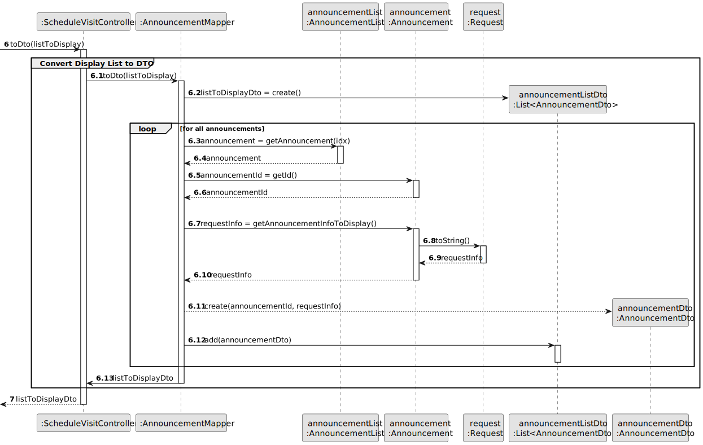
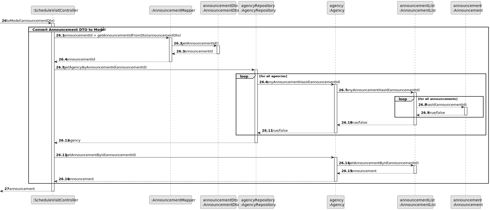

# US 009 - Schedule a visit to a property

## 3. Design - User Story Realization 

### 3.1. Rationale

| Interaction ID                                    | Question: Which class is responsible for...                                | Answer                  | Justification (with patterns)                                                                                                            |
|:--------------------------------------------------|:---------------------------------------------------------------------------|:------------------------|:-----------------------------------------------------------------------------------------------------------------------------------------|
| Step 1: asks to schedule a new visit              | ... interacting with the actor?                                            | ScheduleVisitUI         | Pure Fabrication: there is no reason to assign this responsibility to any existing class in the Domain Model.                            |
|                                                   | ... coordinating the US?                                                   | ScheduleVisitController | Controller                                                                                                                               |
|                                                   | ... instantiating a new Announcement List?                                 | Agency	                 | Creator: The Agency class is responsible for creating new Announcement List objects.                                                     |     |
|                                                   | ... fetching the announcements to display?                                 | AnnouncementList        | Delegation/Pure Fabrication: promoting collection to specific class to ensure Low Coupling & High Cohesion.                              |
|                                                   | ... obtaining the announcement list instance?                              | Agency                  | Information Expert: knows its own Announcement List.                                                                                     |
|                                                   | ... saving (adding to a list) announcements?                               | AnnouncementList        | Delegation/Pure Fabrication: promoting collection to specific class to ensure Low Coupling & High Cohesion.                              |
|                                                   | ... sorting the announcements by most recent acceptance (publishing) date? | AnnouncementList        | Delegation/Pure Fabrication: promoting collection to specific class to ensure Low Coupling & High Cohesion.                              |
| Step 2: convert list to DTO                       | ... fetching the necessary data to create an AnnouncementDto?              | AnnouncementMapper      | DTO                                                                                                                                      |
|                                                   | ... converting the original data of an announcement  to the DTO?           | AnnouncementMapper      | DTO                                                                                                                                      |
|                                                   | ... fetching the necessary data to create an AnnouncementDto?              | AnnouncementMapper      | DTO                                                                                                                                      |
|                                                   | ... converting the original data of an announcement to the DTO?            | AnnouncementMapper      | DTO                                                                                                                                      |
| Step 3: display list                              | ... displaying the properties?                                             | ScheduleVisitUI         | Pure Fabrication: there is no reason to assign this responsibility to any existing class in the Domain Model.                            |
|                                                   | ... displaying the UI for the actor to select data?                        | ScheduleVisitUI         | Pure Fabrication: there is no reason to assign this responsibility to any existing class in the Domain Model.                            |
| Step 4: selects filters for the announcement list | ... sorting the orders by choosen filter?                                  | AnnouncementList        | Delegation/Pure Fabrication: promoting Collection to specific class to ensure Low Coupling & High Cohesion.                              |
|                                                   | ... displaying the properties?                                             | ScheduleVisitUI         | Pure Fabrication: there is no reason to assign this responsibility to any existing class in the Domain Model.                            |
| Step 5: convert filtered list to DTO              | ... fetching the necessary data to create an AnnouncementDto?              | AnnouncementMapper      | DTO                                                                                                                                      |
|                                                   | ... converting the original data of an announcement  to the DTO?           | AnnouncementMapper      | DTO                                                                                                                                      |
|                                                   | ... fetching the necessary data to create an AnnouncementDto?              | AnnouncementMapper      | DTO                                                                                                                                      |
| Step 6: convert Announcement (DTO) to Object      | ... converting the original data of an order to the DTO?                   | AnnouncementMapper      | DTO                                                                                                                                      |
|                                                   | ... retrieving the agency that owns the announcement?                      | AgencyRepository        | Information Expert: contains all the agencies; Pure Fabrication.                                                                         |
|                                                   | ... verifying if the agency has an announcement with the id?               | AnnouncementList        | Delegation/Pure Fabrication: promoting collection to specific class to ensure Low Coupling & High Cohesion.                              |
|                                                   | ... getting the announcement instance that has the specified id.           | AnnouncementList        | Delegation/Pure Fabrication: promoting collection to specific class to ensure Low Coupling & High Cohesion.                              |
| Step 7: requests data                             | ... displaying the UI for the actor to input data?                         | ScheduleVisitUI         | Pure Fabrication: there is no reason to assign this responsibility to any existing class in the Domain Model.                            |
| Step 8: types requested data                      | ... validating input data?                                                 | ScheduleVisitUI         | Pure Fabrication: there is no reason to assign this responsibility to any existing class in the Domain Model.                            |
|                                                   | ... temporarily keeping input data?                                        | ScheduleVisitUI         | Pure Fabrication: there is no reason to assign this responsibility to any existing class in the Domain Model.                            |
| Step 9: submits data                              | ... obtaining the announcement ID from the announcementDto?                | AnnouncementDto         | Information Expert: knows the id of the announcement. **OR** DTO pattern                                                                 |
|                                                   | ... verifying if the announcement has the specified id?                    | Announcement            | Information Expert: knows its own information.                                                                                           |
| Step 10: schedule visit                           | .. creating a new instance of visit?                                       | Announcement            | Creator: The Announcement class is responsible for creating new Visit objects.                                                           ||
| Step 11: send notification message                | ... obtaining the agent's email?                                           | Announcement            | Information Expert: knows its own information.                                                                                           |
|                                                   | ... retrieving the person that represents the user?                        | PersonRepository        | Information Expert: contains all the people; Pure Fabrication.                                                                           |
|                                                   | ... obtaining the user's data?                                             | Person                  | Information Expert: knows its own information.                                                                                           |
|                                                   | ... sending a notification to the agent informing about the visit request? | Visit                   | Information Expert: The Visit class, which implements the Notification interface, is responsible for sending notifications to the agent. |
| Step 12: displays operation success               | ... informing operation success?                                           | ScheduleVisitUI         | Pure Fabrication: there is no reason to assign this responsibility to any existing class in the Domain Model.                            |

### Systematization ##

According to the taken rationale, the conceptual classes promoted to software classes are: 

 * Agency
 * Employee
 * Person
 * Announcement
 * Visit

Other software classes (i.e. Pure Fabrication) identified: 

 * ScheduleVisitUI  
 * ScheduleVisitController
 * AnnouncementMapper
 * AnnouncementListDto
 * AnnouncementDto
 * AgencyRepository
 * PersonRepository
 * AnnouncementList
 * Application Session
 * User Session

## 3.2. Sequence Diagram (SD)

### Split Diagram

This diagram shows a sequence of interactions between the classes involved in the realization of this user story, but it is split in partial diagrams to better illustrate the interactions between the classes.

It uses interaction ocurrence.

**Get Announcements List DTO Partial SD**

**Get Agencies List Partial SD**

**Convert Display List to DTO Partial SD**

**Convert Announcement DTO to Model Partial SD**

**Schedule Visit Partial SD**

**Send Notification Message Partial SD**

**Get User Person Partial SD**

## 3.3. Class Diagram (CD)

