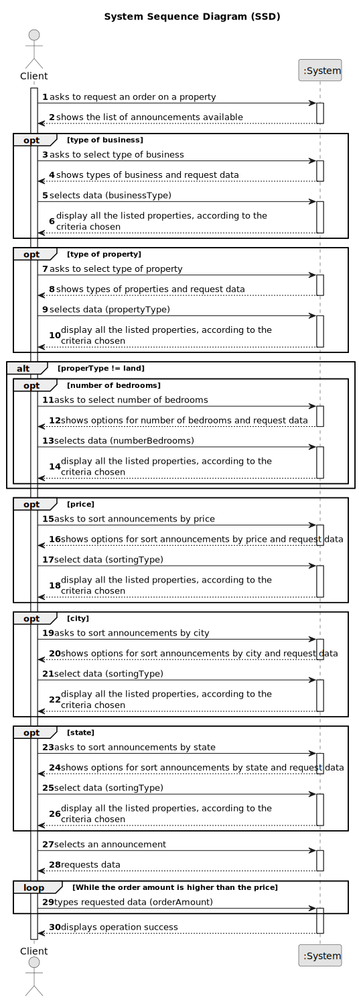

# US 010 - To submit a purchase order

## 1. Requirements Engineering

### 1.1. User Story Description

As a client, I place an order to purchase the property, submitting the order amount.

### 1.2. Customer Specifications and Clarifications 

**From the specifications document:**

>	When the client decides to buy/rent the property, he sends a request for the purchase/lease of the property to the agent. After being appreciated by the agent, he accepts or rejects the order. If the request is accepted, the offer will not be shown again to clients using the application.

**From the client clarifications:**

> **Question:** 
>  
> **Answer:** 

### 1.3. Acceptance Criteria

* **AC1:** The order amount submitted by the client must be equal to or lower than the price set by the owner for the property.
* **AC2:** The order amount submitted by the client must be equal to or lower than the price set by the owner for the property.
* **AC3:** A client can only submit a new order to purchase the same property after the previous one is declined.

### 1.4. Found out Dependencies

* In order to submit a purchase order, there must be some property announcement.

### 1.5 Input and Output Data

**Input Data:**

* Typed data:
	* Order amount

**Output Data:**

* (In)Success of the operation

### 1.6. System Sequence Diagram (SSD)

###

* 