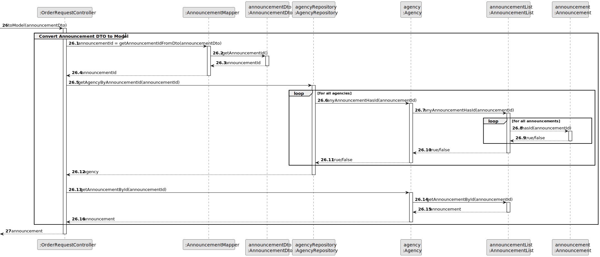

# US 010 - To submit an order to purchase the property

## 3. Design - User Story Realization 

### 3.1. Rationale

**SSD - Alternative 1 is adopted.**

| Interaction ID                                                        | Question: Which class is responsible for...                                | Answer                   | Justification (with patterns)                                                                                                            |
|:----------------------------------------------------------------------|:---------------------------------------------------------------------------|:-------------------------|:-----------------------------------------------------------------------------------------------------------------------------------------|
| Step 1: asks to initiate an order request for a property              | ... interacting with the actor?                                            | OrderRequestUI           | Pure Fabrication: there is no reason to assign this responsibility to any existing class in the Domain Model.                            |
|                                                                       | ... coordinating the US?                                                   | OrderRequesController    | Controller                                                                                                                               |
|                                                                       | ... instantiating a new Announcement List?                                 | Agency	                | Creator: The Agency class is responsible for creating new Announcement List objects.                                                   |
|                                                                       | ... retrieving the agencies that own the announcement's list?              | AgencyRepository         | Information Expert: contains all the agencies; Pure Fabrication.                                                                         |
|                                                                       | ... fetching the announcements to display?                                 | AnnouncementList         | Delegation/Pure Fabrication: promoting collection from Announcement to specific class to ensure Low Coupling & High Cohesion.            |
|                                                                       | ... obtaining the announcement list instance?                              | Agency                   | Information Expert: knows its own Announcement List.                                                                                     |
|                                                                       | ... saving (adding to a list) announcements?                               | AnnouncementList         | Delegation/Pure Fabrication: promoting collection from Announcement to specific class to ensure Low Coupling & High Cohesion.            |
|                                                                       | ... sorting the announcements by most recent acceptance (publishing) date? | AnnouncementList         | Delegation/Pure Fabrication: promoting collection from Announcement to specific class to ensure Low Coupling & High Cohesion.            |
| Step 2: convert list to DTO                                           | ... fetching the necessary data to create an AnnouncementDto?              | AnnouncementMapper       | DTO                                                                                                                                      |
|                                                                       | ... converting the original data of an announcement  to the DTO?           | AnnouncementMapper       | DTO                                                                                                                                      |
|                                                                       | ... fetching the necessary data to create an AnnouncementDto?              | AnnouncementMapper       | DTO                                                                                                                                      |
|                                                                       | ... converting the original data of an announcement to the DTO?            | AnnouncementMapper       | DTO                                                                                                                                      |
| Step 3: display list                                                  | ... displaying the properties?                                             | OrderRequestUI          | Pure Fabrication: there is no reason to assign this responsibility to any existing class in the Domain Model.                            |
|                                                                       | ... displaying the UI for the actor to select data?                        | OrderRequestUI          | Pure Fabrication: there is no reason to assign this responsibility to any existing class in the Domain Model.                            |
| Step 4: selects filters for the announcement list                     | ... getting the possible criteria to select?                               | CriteriaRepository       | Pure Fabrication: there is no reason to assign this responsibility to any existing class in the Domain Model.                            |
|                                                                       | ... sorting the announcements by choosen filter?                           | AnnouncementList         | Delegation/Pure Fabrication: promoting Collection from Announcement to specific class to ensure Low Coupling & High Cohesion.            |
|                                                                       | ... displaying the properties?                                             | OrderRequestUI          | Pure Fabrication: there is no reason to assign this responsibility to any existing class in the Domain Model.                            |
| Step 5: convert filtered list to DTO                                  | ... fetching the necessary data to create an AnnouncementDto?              | AnnouncementMapper       | DTO                                                                                                                                      |
|                                                                       | ... converting the original data of an announcement  to the DTO?           | AnnouncementMapper       | DTO                                                                                                                                      |
|                                                                       | ... fetching the necessary data to create an AnnouncementDto?              | AnnouncementMapper       | DTO                                                                                                                                      |
| Step 6: convert Announcement (DTO) to Object                          | ... converting the original data of an announcement to the DTO?            | AnnouncementMapper       | DTO                                                                                                                                      |
|                                                                       | ... retrieving the agency that owns the announcement?                      | AgencyRepository         | Information Expert: contains all the agencies; Pure Fabrication.                                                                         |
|                                                                       | ... verifying if the agency has an announcement with the id?               | AnnouncementList         | Delegation/Pure Fabrication: promoting collection from Announcement to specific class to ensure Low Coupling & High Cohesion.            |
|                                                                       | ... getting the announcement instance that has the specified id.           | AnnouncementList         | Delegation/Pure Fabrication: promoting collection from Announcement to specific class to ensure Low Coupling & High Cohesion.            |
| Step 7: requests data                                                 | ... displaying the UI for the actor to input data?                         | OrderRequestUI          | Pure Fabrication: there is no reason to assign this responsibility to any existing class in the Domain Model.                            |
| Step 8: types requested data                                          | ... validating input data?                                                 | OrderRequestUI          | Pure Fabrication: there is no reason to assign this responsibility to any existing class in the Domain Model.                            |
|                                                                       | ... temporarily keeping input data?                                        | OrderRequestUI          | Pure Fabrication: there is no reason to assign this responsibility to any existing class in the Domain Model.                            |
| Step 9: submits data                                                  | ... obtaining the announcement ID from the announcementDto?                | AnnouncementDto          | DTO                                                                                                                                      |
|                                                                       | ... verifying if the announcement has the specified id?                    | Announcement             | Information Expert: knows its own information.                    |              
| Step 7  		                                                        | 	... validating all data (local validation)?  | Task                 | IE: owns its data.                                                                                            | 
| 			  		                                                    | 	... validating all data (global validation)? | Organization         | IE: knows all its tasks.                                                                                      | 
| 			  		                                                    | 	... saving the created task?                 | Organization         | IE: owns all its tasks.                                                                                       | 
| Step 8  		                                                        | 	... informing operation success?             | CreateTaskUI         | IE: is responsible for user interactions.                                                                     | 

### Systematization ##

According to the taken rationale, the conceptual classes promoted to software classes are: 

 * Organization
 * Task

Other software classes (i.e. Pure Fabrication) identified: 

 * CreateTaskUI  
 * CreateTaskController

## 3.2. Sequence Diagram (SD)

### Alternative 1 - Full Diagram

This diagram shows the full sequence of interactions between the classes involved in the realization of this user story.

### Alternative 2 - Split Diagram

This diagram shows the same sequence of interactions between the classes involved in the realization of this user story, but it is split in partial diagrams to better illustrate the interactions between the classes.

It uses interaction ocurrence.

**Get Task Category List Partial SD**

**Get Task Category Object**

**Get Employee**

**Create Task**

## 3.3. Class Diagram (CD)

