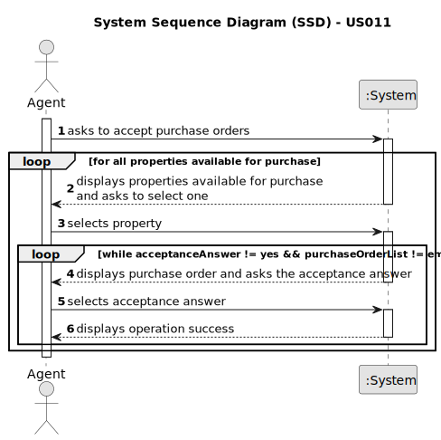

# US 011 - To accept purchase orders

## 1. Requirements Engineering

### 1.1. User Story Description

As an agent, I want to list real estate purchase orders to accept or decline a purchase order for a property. After
accepting or declining, an email notification should be sent to the customer.

### 1.2. Customer Specifications and Clarifications

**From the specifications document:**

> The agent acknowledges and considers any offers made by the client to purchase or lease the property, they can either
> accept or reject the order. If the request is accepted, the offer will not be shown again to clients using the
> application.

**From the client clarifications:**

> **Question:** When the agent declines an order, does it have to be removed from the list and system?
>
> **Answer:** The order should be removed from the list but not from the system.

> **Question:** When the agent wants to list real estate purchase orders, do they list all of them at once or
> can a property be chosen to list the purchase orders that are related to that specific property?
> 
> **Answer:** The properties should be sorted from the oldest to the most recent one. For each property, the
list of purchase orders should be sorted by the amount offered, the highest offer
must appear first.

> **Question:** Should we present all the offers together and ask the agent to choose only one,
> automatically declining the others?
> 
> **Answer:** _Yet to be answered_

> **Question:** Should we provide all the property characteristics to assist agents in choosing 
> the appropriate purchase order? If so, is it required to display the amount established by the property owner?
> 
> **Answer:** Yes. Yes.
 
> **Question:** Is it convenient to give the ability to filter the properties by their attributes when the agent is listing them?
> 
> **Answer:** _Yet to be answered_

> **Question:** The agent should first list all the properties without and accepted order and then select one to list the orders related to that property? Or the orders should appear at the start grouped by property?
>
> **Answer:** _Yet to be answered_

### 1.3. Acceptance Criteria

* **AC1:** The list of purchase orders should be grouped by property. The properties
  should be sorted from the oldest to the most recent one. For each property, the
  list of purchase orders should be sorted by the amount offered, the highest offer
  must appear first.
* **AC2:** For each offer, the agent must be able to accept or decline it. The action of
  accepting or declining an offer should trigger an email notification to the client.
* **AC3:** When a purchase order is accepted, all the other orders should be declined,
  and a message sent to the client.
* **AC4:** If a property does not contain any offers, the system should show an empty
  list of offers.

### 1.4. Found out Dependencies

* There is a dependency to "US010 To submit a purchase order" since at least an order has to 
be made so that the agent can accept or decline it.

### 1.5 Input and Output Data

**Input Data:**

* Selected data:
    * Property 
    * Acceptance answer 

**Output Data:**

* Operation (in)success

### 1.6. System Sequence Diagram (SSD)

**Other alternatives might exist.**

#### Alternative One

### 1.7 Other Relevant Remarks

* n/a
