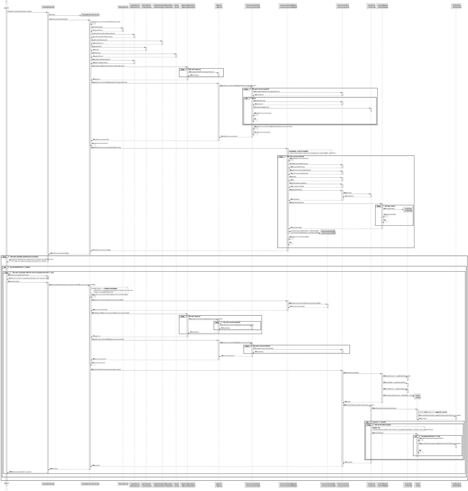
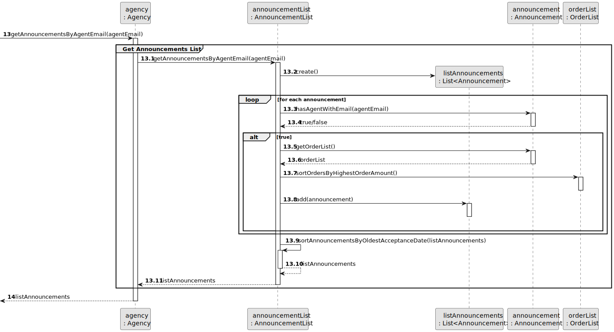
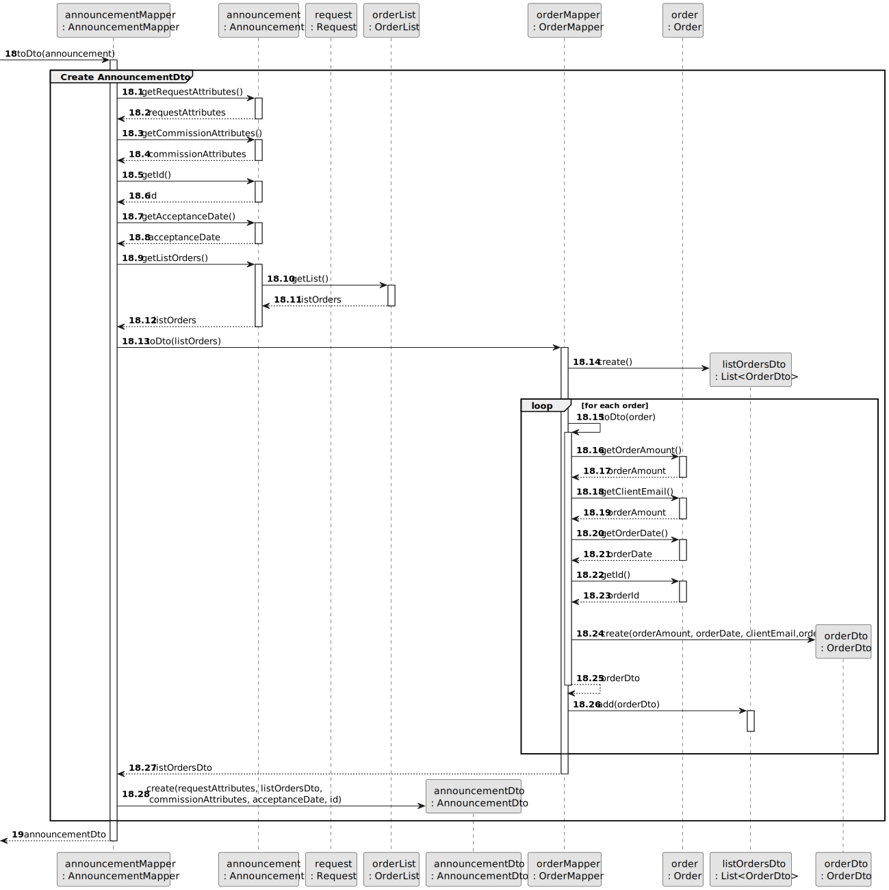
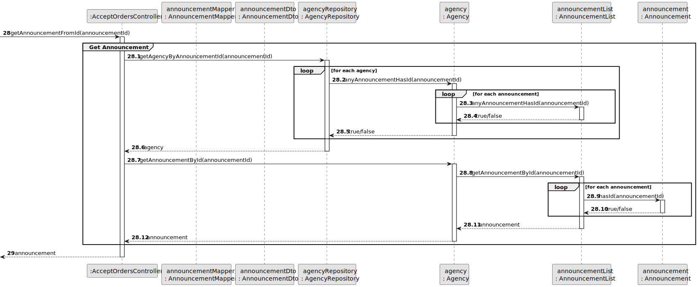
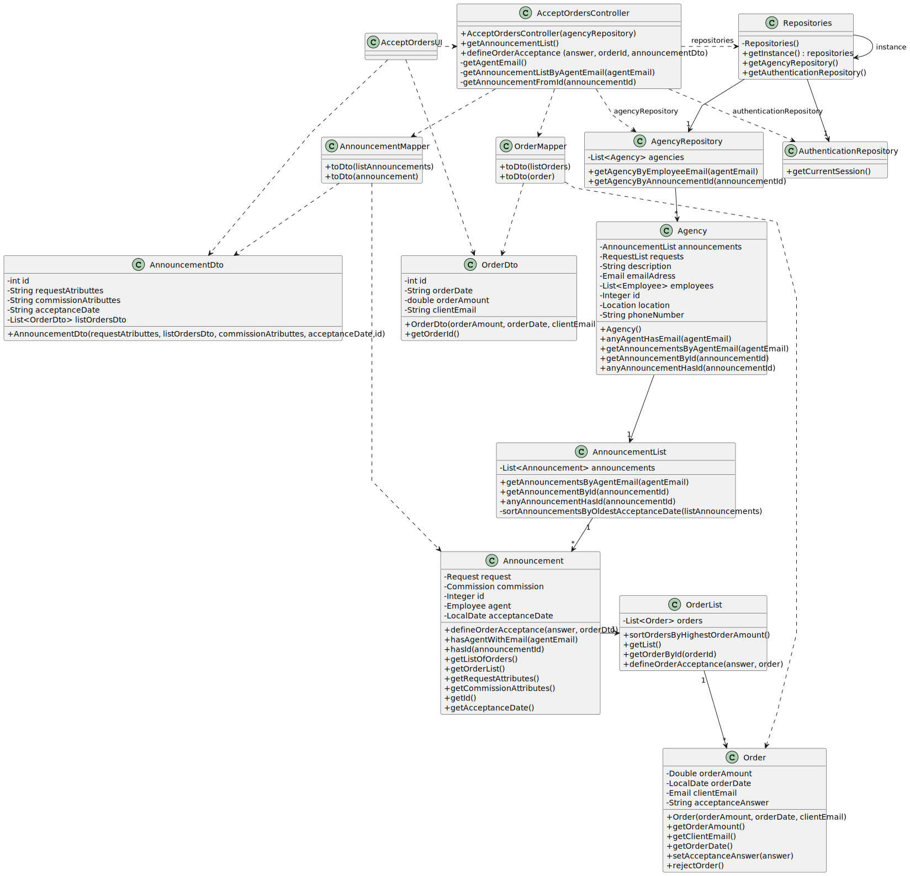

# US 011 - To accept purchase orders

## 3. Design - User Story Realization

### 3.1. Rationale

**SSD - Alternative 1 is adopted.**

| Interaction ID                                                                                                       | Question: Which class is responsible for...                                  | Answer                         | Justification (with patterns)                                                                                                                                                                      |
|:---------------------------------------------------------------------------------------------------------------------|:-----------------------------------------------------------------------------|:-------------------------------|:---------------------------------------------------------------------------------------------------------------------------------------------------------------------------------------------------|
| Step 1: asks to accept purchase orders                                                                               | ... interacting with the actor?                                              | AcceptOrderUI                  | Pure Fabrication: there is no reason to assign this responsibility to any existing class in the Domain Model.                                                                                      |
|                                                                                                                      | ... coordinating the US?                                                     | AcceptOrderController          | Controller                                                                                                                                                                                         |
|                                                                                                                      | ... obtaining the agent email?                                               | User Session                   | Information Expert: cf. User Authentication & Authorization component documentation.                                                                                                               |
|                                                                                                                      | ... obtaining the agency that has the agent with retrieved email?            | AgencyRepository               | Information Expert: contains all the agencies; Pure Fabrication.                                                                                                                                   |
|                                                                                                                      | ... evaluating if an agency has an agent with the retrieved email?           | Agency                         | Information Expert: an agency knows all its agents (employees).                                                                                                                                    |
|                                                                                                                      | ... fetching the announcements of the agent that has the specified email?    | AnnouncementList               | Low Coupling/High Cohesion/Delegation/Pure Fabrication **OR** Information Expert :  knows all of the announcements of an agency.                                                                   |
|                                                                                                                      | ... verifying if the announcement is from the specified email's agent.       | Announcement                   | Information Expert : knows their responsible agent.                                                                                                                                                |
|                                                                                                                      | ... obtaining the order list instance?                                       | Announcement                   | Information Expert : contains the order list                                                                                                                                                       |
|                                                                                                                      | ... sorting the orders by highest order amount?                              | OrderList                      | Information Expert :  knows all of the announcements of an agency.    **OR**   Delegation/Pure Fabrication: promoting Collection to specific class to ensure Low Coupling & High Cohesion. |
|                                                                                                                      | ... saving (adding to a list) the announcements that belong to the agent?    | AnnouncementList               | **CHECK WHICH PATTERN SHOULD BE APPLIED** Information Expert: knows/contains all the announcements.                                                                                                |
|                                                                                                                      | ... sorting the announcements by oldest acceptance (publishing) date?        | AnnouncementList               | Information Expert :  knows all of the announcements of an agency.    **OR**   Delegation/Pure Fabrication: promoting collection to specific class to ensure Low Coupling & High Cohesion. |
|                                                                                                                      | ... fetching the necessary data to create an AnnouncementDto?                | AnnouncementMapper             | DTO                                                                                                                                                                                                |
|                                                                                                                      | ... converting the original data of an announcement  to the DTO?             | AnnouncementMapper             | DTO                                                                                                                                                                                                |
|                                                                                                                      | ... fetching the necessary data to create an OrderDto?                       | OrderMapper                    | DTO                                                                                                                                                                                                |
|                                                                                                                      | ... converting the original data of an order to the DTO?                     | OrderMapper                    | DTO                                                                                                                                                                                                |
| Step 2: displays property by oldest and its orders by highest price\n and asks to select acceptanceAnswer for orders | ... displaying the properties and offers?                                    | AcceptOrderUI                  | Pure Fabrication: there is no reason to assign this responsibility to any existing class in the Domain Model.                                                                                      |
|                                                                                                                      | ... displaying the UI for the actor to select data?                          | AcceptOrderUI                  | Pure Fabrication: there is no reason to assign this responsibility to any existing class in the Domain Model.                                                                                      |
| Step 3: selects acceptanceAnswer                                                                                     |                                                                              |                                |                                                                                                                                                                                                    |
| Step 4: asks to confirm acceptanceAnswer and submit data                                                             |                                                                              |                                |                                                                                                                                                                                                    |
| Step 5: submits data                                                                                                 | ... obtaining the announcement ID from the announcementDto?                  | AnnouncementDto                | Information Expert: knows the id of the announcement. **OR** DTO pattern                                                                                                                           |
|                                                                                                                      | ... retrieving the agency that owns the announcement?                        | AgencyRepository               | Information Expert: contains all the agencies; Pure Fabrication.                                                                                                                                   |
|                                                                                                                      | ... verifying if the agency has an announcement with the id?                 | AnnouncementList               | Information Expert :  knows all of the announcements of an agency.    **OR**   Delegation/Pure Fabrication: promoting collection to specific class to ensure Low Coupling & High Cohesion. |
|                                                                                                                      | ... getting the announcement instance that has the specified id.             | **Agency OR AnnouncementList** |                                                                                                                                                                                                    |
|                                                                                                                      | ... verifying if the announcement has the specified id?                      | Announcement                   | Information Expert: knows its own information.                                                                                                                                                     |
|                                                                                                                      | ... converting the orderDto to object from the domain layer?                 | OrderMapper                    | DTO                                                                                                                                                                                                |
|                                                                                                                      | ... defining the order acceptance to the agent answer?                       | Order                          | Information Expert : knows its own data.                                                                                                                                                           |
|                                                                                                                      | ... sending a notification to the client informing about the agent decision? | Notification                   | **_WAITING_ Group decision: should Notification be an Interface (this is my opinion)**                                                                                                             |
| Step 6: displays operation success                                                                                   | ... informing operation success?                                             | AcceptOrderUI                  | Pure Fabrication: there is no reason to assign this responsibility to any existing class in the Domain Model.                                                                                      |              

### Systematization ##

According to the taken rationale, the conceptual classes promoted to software classes are:

* Announcement
* Agency
* Order

Other software classes (i.e. Pure Fabrication) identified:

* AcceptOrderUI
* AcceptOrderController
* AnnouncementList
* OrderList
* AnnouncementMapper/AnnouncementDto
* OrderMapper/OrderDto

## 3.2. Sequence Diagram (SD)

### Alternative 1 - Full Diagram

This diagram shows the full sequence of interactions between the classes involved in the realization of this user story.

### Alternative 2 - Split Diagram

This diagram shows the same sequence of interactions between the classes involved in the realization of this user story,
but it is split in partial diagrams to better illustrate the interactions between the classes.

It uses interaction ocurrence.

**Get Agent Email**

**Get Announcements List**

**Create AnnouncementDto**

**Get Announcement**

## 3.3. Class Diagram (CD)

