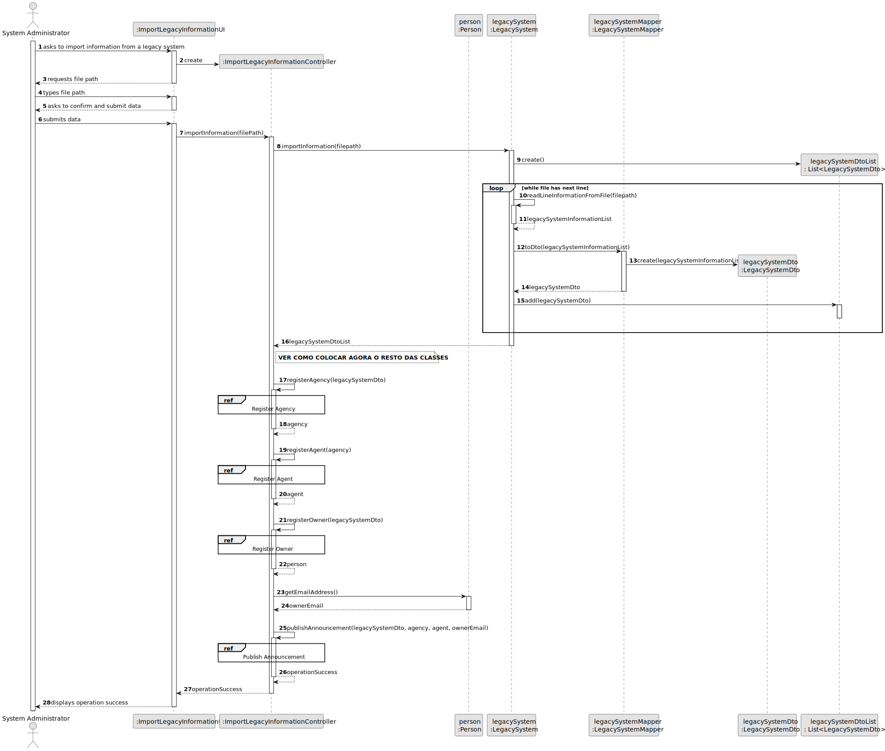
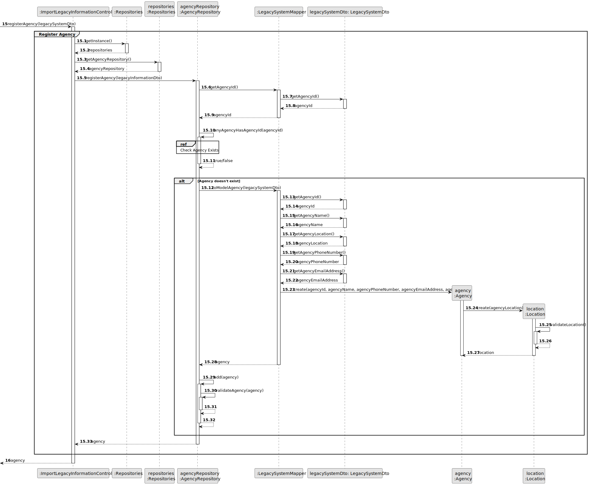
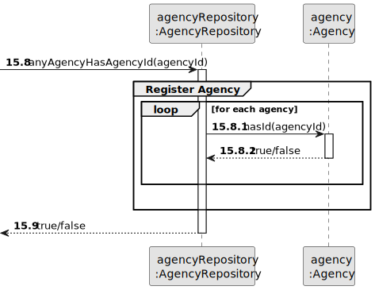
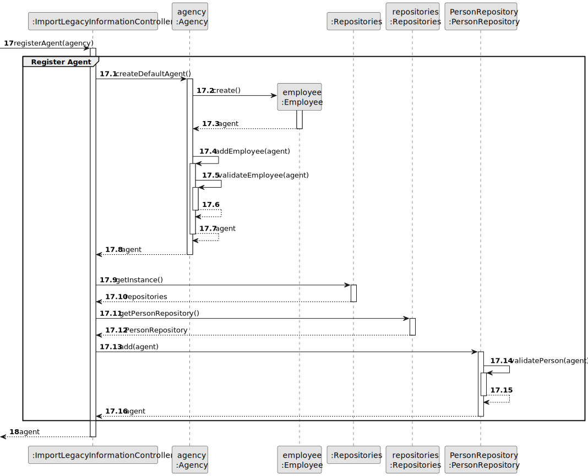
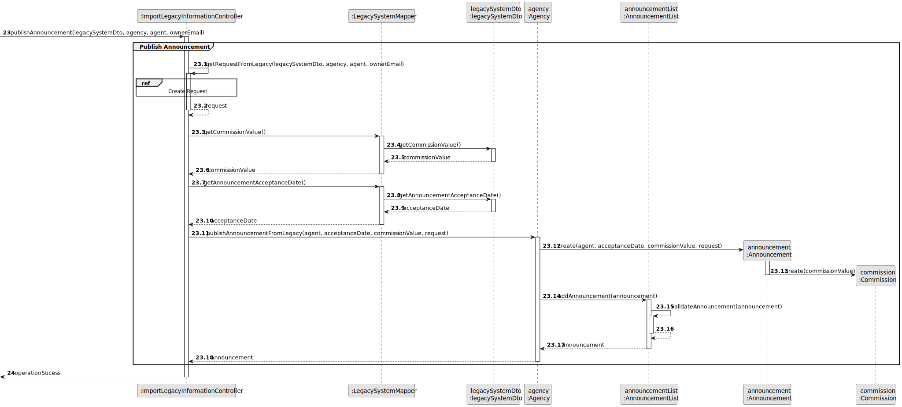
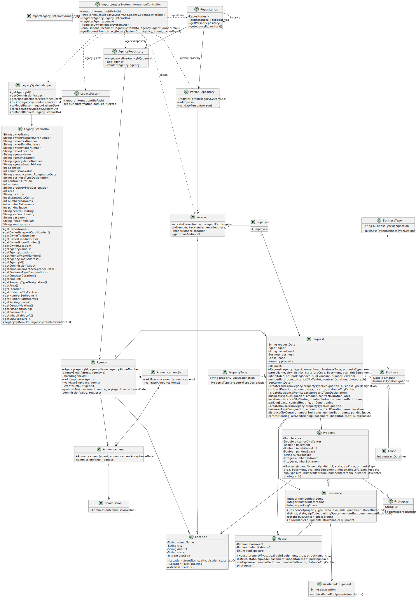

# US012 - To import legacy system information

## 3. Design - User Story Realization

### 3.1. Rationale

**SSD - Alternative 1 is adopted.**

| Interaction ID                                             | Question: Which class is responsible for...               | Answer                            | Justification (with patterns)                                                                                 |
|:-----------------------------------------------------------|:----------------------------------------------------------|:----------------------------------|:--------------------------------------------------------------------------------------------------------------|
| Step 1 : asks to import information from legacy system. 		 | 	... interacting with the actor?                          | ImportLegacyInformationUI         | Pure Fabrication: there is no reason to assign this responsibility to any existing class in the Domain Model. |
| 			  		                                                    | 	... coordinating the US?                                 | ImportLegacyInformationController | Controller                                                                                                    |
| Step 3 : requests file path		                              | ... displaying the UI for the actor to input data?							 | ImportLegacyInformationUI         | Pure Fabrication: there is no reason to assign this responsibility to any existing class in the Domain Model. |
| Step 4 : types file path		                                 | 	...saving the inputted data?                             | ImportLegacyInformationUI         | Pure Fabrication: there is no reason to assign this responsibility to any existing class in the Domain Model. |
| Step 5: asks to confirm and submit data  		                | ...displaying file path before submitting data?	          | ImportLegacyInformationUI         | Pure Fabrication: there is no reason to assign this responsibility to any existing class in the Domain Model. |
| Step 6: submits data  		                                   | ... obtaining the information from the file?              | LegacySystem                      | Information Expert                                                                                            |
| Step 26 : displays operation success  		                   | ... informing operation success? 							                  | ImportLegacyInformationUI         | Pure Fabrication: there is no reason to assign this responsibility to any existing class in the Domain Model. |        

### Systematization ##

According to the taken rationale, the conceptual classes promoted to software classes are:

* Person
* Announcement
* Request
* Agency
* AvailableEquipment
* Photograph
* Employee
* Business
* PropertyType
* Property
* Residence
* House
* Location

Other software classes (i.e. Pure Fabrication) identified:

* ImportLegacyInformationUI
* ImportLegacyInformationController
* AnnouncementList
* AgencyRepository
* PersonRepository
* LegacySystemDto
* LegacySystemMapper

## 3.2. Sequence Diagram (SD)

### Split Diagram

This diagram shows the same sequence of interactions between the classes involved in the realization of this user story,
but it is split in partial diagrams to better illustrate the interactions between the classes.

It uses interaction ocurrence.

**Register Agency**

**Check Agency Exists**

**Register Agent**

**Register Owner**

**Publish Announcement**

**Create Request**

## 3.3. Class Diagram (CD)

