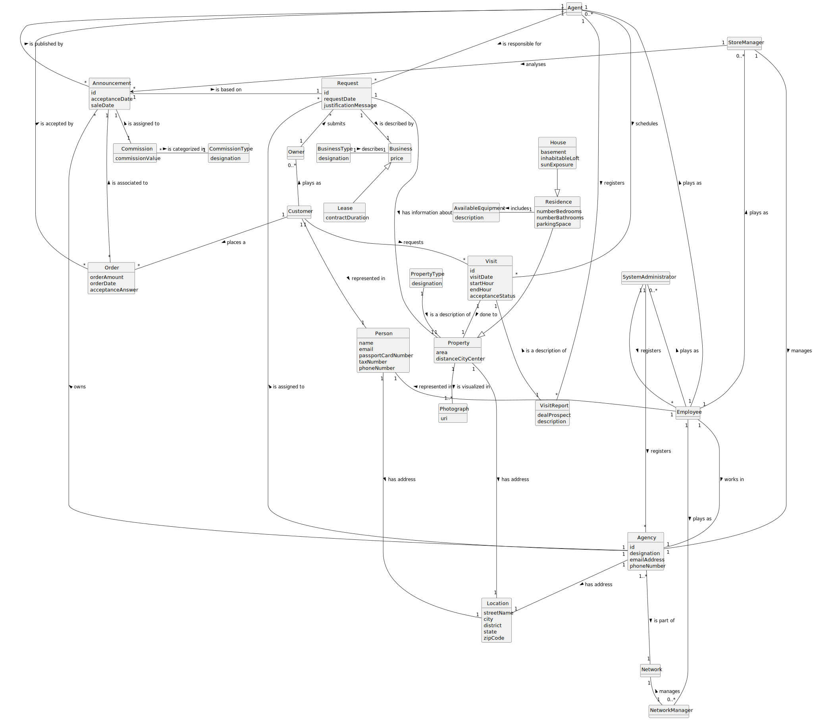

# Analysis

The construction process of the domain model is based on the client specifications, especially the nouns (for
_concepts_) and verbs (for _relations_) used.

## Rationale to identify domain conceptual classes ##

To identify domain conceptual classes, start by making a list of candidate conceptual classes inspired by the list of
categories suggested in the book "Applying UML and Patterns: An Introduction to Object-Oriented Analysis and Design and
Iterative Development".

### _Conceptual Class Category List_ ###

**Business Transactions**

* Sale
* Lease

---

**Transaction Line Items**

* Property

---

**Product/Service related to a Transaction or Transaction Line Item**

* Land
* House
* Apartment
* Announcement
* Visit
* Order
* Request

---

**Roles of People or Organizations**

* Agent
* System Administrator
* Employee
* Customer
* Owner
* Client
* Store Manager
* Network Manager

---

**Places**

* Agency

---

**Noteworthy Events**

* Announcement
* Visit
* Request
* Order

---

**Physical Objects**

* Property

---

**Descriptions of Things**

* Type of Property
* Type of Residence

---

**Containers**

* Network

---

**Elements of Containers**

* Agency

---

**Organizations**

* Company

---

**Documents mentioned/used to perform some work/**

* Visit Report

---

### **Rationale to identify associations between conceptual classes** ###

An association is a relationship between instances of objects that indicates a relevant connection, and that is worth of
remembering, or it is derivable from the List of Common Associations:

+ **_A_** is physically or logically part of **_B_**
+ **_A_** is physically or logically contained in/on **_B_**
+ **_A_** is a description for **_B_**
+ **_A_** known/logged/recorded/reported/captured in **_B_**
+ **_A_** uses or manages or owns **_B_**
+ **_A_** is related with a transaction (item) of **_B_**
+ etc.

|     Concept (A)     |      Association      |     Concept (B)      |
|:-------------------:|:---------------------:|:--------------------:|
|       Agency        |      has address      |       Location       |
|                     |     is a part of      |       Network        |
|                     |    is assigned to     |       Request        |
|                     |         owns          |     Announcement     |
|        Agent        |         is a          |       Employee       |
|                     |  is responsible for   |       Request        |
|                     |       registers       |     VisitReport      |
|                     |       schedules       |        Visit         |
|    Announcement     |       contains        |       Property       |
|                     |      is based on      |       Request        |
|                     |    is published by    |        Agent         |
|     Commission      |    is assigned to     |     Announcement     |
|      Customer       |    represented in     |        Person        |
|                     |       requests        |        Visit         |
|                     |       places a        |        Order         |
|                     |       plays as        |        Owner         |
|      Employee       |         is a          |        Person        |
|                     |       plays as        |        Agent         |
|                     |       plays as        |   Network Manager    |
|                     |       plays as        |    Store Manager     |
|                     |       plays as        | System Administrator |
|                     |    represented in     |        Person        |
|                     |       works in        |        Agency        |
|        House        |         is a          |      Residence       |
|        Lease        |         is a          |       Business       |
|   NetworkManager    |        manages        |       Network        |
|        Order        |    is accepted by     |        Agent         |
|                     |   is associated to    |     Announcement     |
|        Owner        |        submits        |       Request        |
|       Person        |      has address      |       Location       |
|      Property       |   is visualized in    |      Photograph      |
|                     |      has address      |       Location       |
|       Request       |    is described by    |       Business       |
|                     | has information about |       Property       |
|      Residence      |       includes        |  AvailableEquipment  |
|                     |         is a          |       Property       |
|    StoreManager     |       analyzes        |     Announcement     |
|                     |        manages        |        Agency        |
| SystemAdministrator |       registers       |        Agency        |
|                     |       registers       |       Employee       |
|    PropertyType     |  is a description of  |       Property       |
|        Visit        |        done to        |       Property       |
|     VisitReport     |  is a description of  |        Visit         |

## Domain Model

