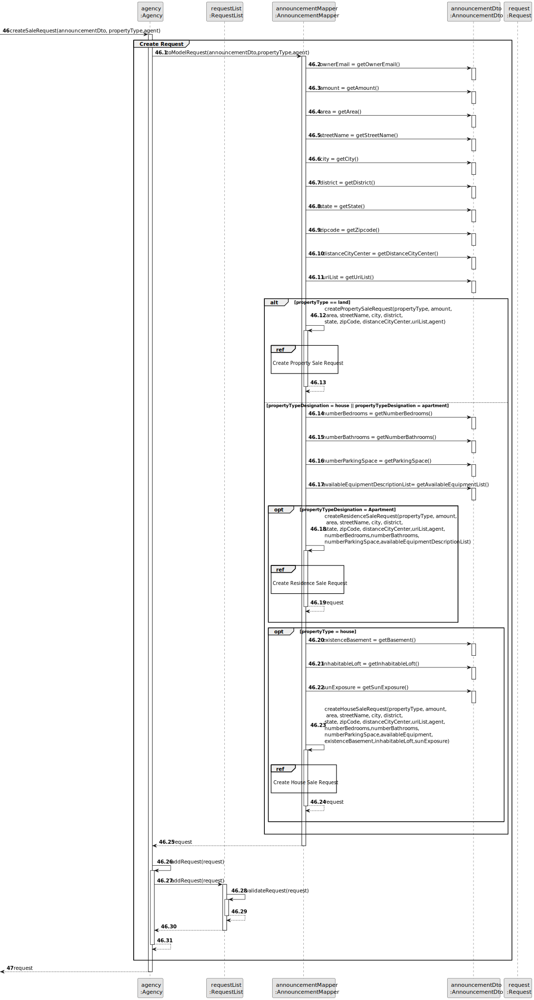

# US 002 - To publish an announcement

## 3. Design - User Story Realization

### 3.1. Rationale

| Interaction ID                                                    | Question: Which class is responsible for...                              | Answer                        | Justification (with patterns)                                                                                 |
|:------------------------------------------------------------------|:-------------------------------------------------------------------------|:------------------------------|:--------------------------------------------------------------------------------------------------------------|
| Step 1: asks to publish announcement                              | ... interacting with the actor?                                          | PublishAnnouncementUI         | Pure Fabrication: there is no reason to assign this responsibility to any existing class in the Domain Model. |
|                                                                   | ... coordinating the US?                                                 | PublishAnnouncementController | Controller.                                                                                                   |
|                                                                   | ... obtaining the type of commission list?                               | CommissionTypeRepository      | Information Expert: the types of commission are the same for all the agents; Pure Fabrication.                |
| Step 5: shows the type of commission list and asks to select one	 | ... displaying the UI for the actor to input data?                       | PublishAnnouncementUI         | Pure Fabrication: there is no reason to assign this responsibility to any existing class in the Domain Model. |
| Step 10: enters requested data (ownerEmail)                       | ... obtaining the type of property list?                                 | PropertyTypeRepository        | Information Expert: the types of properties are the same for all announcements/properties; Pure Fabrication.  |
| Step 13: shows the type of commission list and asks to select one | ... displaying the UI for the actor to input data?                       | PublishAnnouncementUI         | Pure Fabrication: there is no reason to assign this responsibility to any existing class in the Domain Model. |
| Step 32: submits data                                             | ... instantiating a new request?                                         | Agency                        | Creator (Rule 1): in the Domain Model Agency is assigned (contains) Requests.                                 |
|                                                                   | ... knowing the current user session?                                    | Application Session           | Information Expert: has the necessary data.                                                                   |
|                                                                   | ... obtaining the current user (agent) email?                            | User Session                  | Information Expert: cf. User Authentication & Authorization component documentation.                          |
|                                                                   | ... fetching the agency that has the user (agent) email?                 | AgencyRepository              | Information Expert: contains all the agencies; Pure Fabrication.                                              |
|                                                                   | ... verifying if there is any agent that has the user email in a agency? | Agency                        | Information Expert: knows all its agents (employees).                                                         |
|                                                                   | ... obtaining the agent of said agency with the user email               | Agency                        | Information Expert: knows all its agents.                                                                     |
|                                                                   | ... getting a property type object by designation                        | PropertyTypeRepository        | Information Expert: knows the property types and has its descriptions; Pure Fabrication.                      |
|                                                                   | ... creating a Property (Residence or House) object?                     | Request                       | Creator (Rule 1/4): in the Domain Model Request has information about Property.                               |
|                                                                   | ... instantiating a new Location?                                        | Property                      | Creator (Rule 1): in the Domain Model Property contains Location.                                             |
|                                                                   | ... instantiating a new Business?                                        | Request                       | Creator (Rule 1): in the Domain Model Request aggregates Business                                             |
|                                                                   | ... instantiating a new Photograph?                                      | Property                      | Creator (Rule 1): in the Domain Model Property contains Photograph.                                           |
|                                                                   | ... instantiating a new AvailableEquipment?                              | Residence                     | Creator (Rule 1): in the Domain Model Residence contains AvailableEquipment.                                  |
|                                                                   | ... saving the created request?                                          | Agency                        | Agency: owns all its requests.                                                                                |
|                                                                   | ... globally validating duplicated requests?                             | Agency                        | Information Expert: knows all requests.                                                                       |
|                                                                   | ... getting a commission type object by designation                      | CommissionRepository          | Information Expert: knows the commission types and has its descriptions; Pure Fabrication.                    |
|                                                                   | ... publishing an announcement?                                          | Agency                        | Information Expert: owns all its announcements.                                                               |
|                                                                   | ... instantiating a new announcement?                                    | Agency                        | Creator (Rule 1): in the Domain Model Agency owns Announcements.                                              |
|                                                                   | ... creating a commission instance?                                      | Announcement                  | Creator (Rule 1): in the Domain Model Announcement contains Commission.                                       |
|                                                                   | ... saving the created announcement?                                     | AnnouncementList              | Information Expert: has all announcements of an agency.                                                       |
|                                                                   | ... globally validating duplicated announcements?                        | AnnouncementList              | Information Expert: knows all announcements instances.                                                        |
|                                                                   | ... sending the sms notification?                                        | SmsNotification               | Protected variation: to ensure the system stability.                                                          |
| Step 49: displays operation success 	                             | ... informing operation success?                                         | PublishAnnouncementUI         | Pure Fabrication: there is no reason to assign this responsibility to any existing class in the Domain Model. |

### Systematization ##

According to the taken rationale, the conceptual classes promoted to software classes are:

* Agency
* Announcement
* Request
* Property

Other software classes (i.e. Pure Fabrication) identified:

* PublishAnnouncementUI
* PublishAnnouncementController
* PropertyTypeRepository
* CommissionTypeRepository
* Application Session
* User Session

## 3.2. Sequence Diagram (SD)

### Alternative 1 - Split Diagram

This diagram shows the same sequence of interactions between the classes involved in the realization of this user story,
but it is split in partial diagrams to better illustrate the interactions between the classes.

It uses interaction occurrence.

**Get Commission Type List - Partial SD**

**Get Commission Type Object - Partial SD**

**Get Property Type List - Partial SD**

**Get Property Type Object - Partial SD**

**Get Agency - Partial SD**

**Get Email - Partial SD**

**Create Sale Request - Partial SD**

**Publish Announcement - Partial SD**

## 3.3. Class Diagram (CD)

