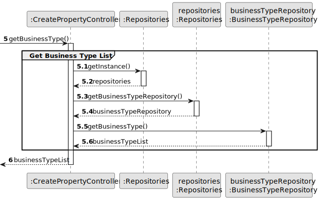
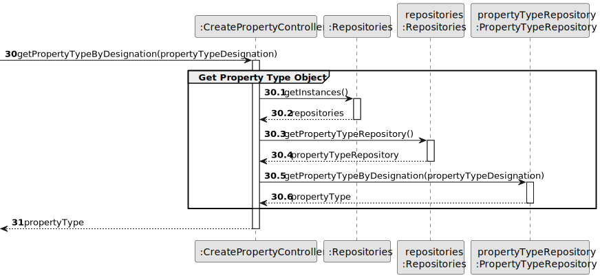
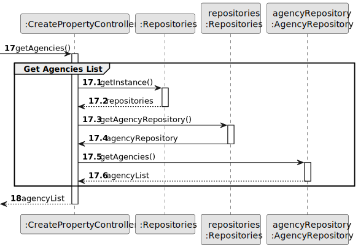
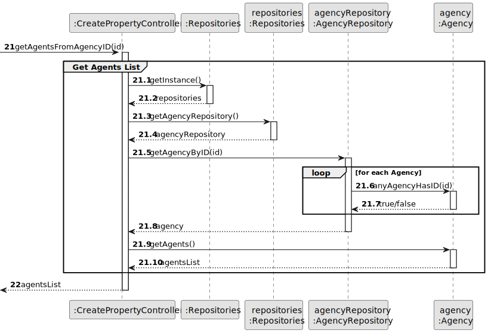
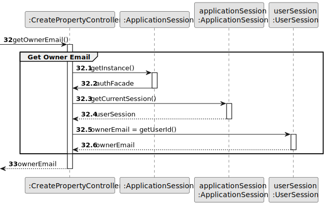
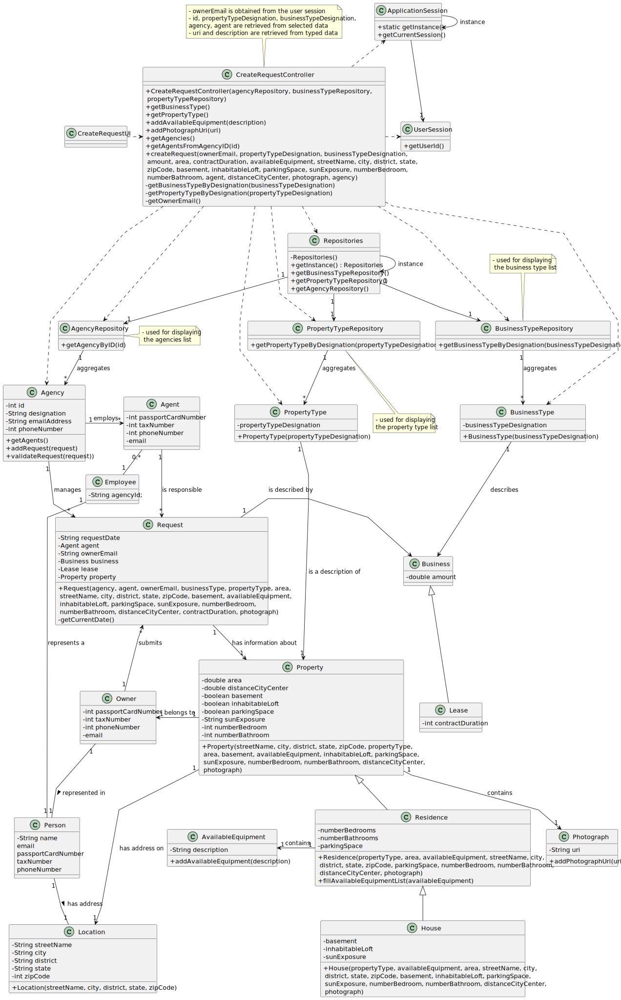

# US 004 - To submit a Request for an Announcement

## 3. Design - User Story Realization

### 3.1. Rationale

| Interaction ID                                | Question: Which class is responsible for...          | Answer                  | Justification (with patterns)                                                                                 |
|:----------------------------------------------|:-----------------------------------------------------|:------------------------|:--------------------------------------------------------------------------------------------------------------|
| Step 1 : asks to create a new Request         | ... interacting with the actor?                      | CreateRequestUI         | Pure Fabrication: there is no reason to assign this responsibility to any existing class in the Domain Model. |
|                                               | ... coordinating the US?                             | CreateRequestController | Controller.                                                                                                   |
|                                               | ... instantiating a new request?                     | Agency                  | Creator (Rule 1): in the Domain Model Agency is assigned (contains) Requests.                                 |
|                                               | ... knowing the user using the system?               | UserSession             | IE: cf. A&A component documentation.                                                                          |
|                                               |                                                      | Owner                   | IE: knows its own data (e.g. email).                                                                          |
|                                               | ... obtaining the business types?                    | BusinessTypeRepository  | IE: the types of business are the same for all requests; Pure Fabrication.                                    |
| Step 2 : shows business types                 | ... displaying the business types?                   | CreateRequestUI         | Pure Fabrication: there is no reason to assign this responsibility to any existing class in the Domain Model. |
| Step 3 : selects business type                | ... temporarily keeping input data?                  | CreateRequestUI         | IE: the types of property are the same for all requests; Pure Fabrication.                                    |
|                                               | ... validating input data?                           | CreateRequestUI         | Pure Fabrication: there is no reason to assign this responsibility to any existing class in the Domain Model. |
|                                               | ... obtaining the property types?                    | BusinessTypeRepository  | IE: the types of business are the same for all requests; Pure Fabrication.                                    |
| Step 4 : shows property types                 | ... displaying the property types?                   | PropertyTypeRepository  | Pure Fabrication: there is no reason to assign this responsibility to any existing class in the Domain Model. |
| Step 5 : selects property type                | ... temporarily keeping input data?                  | CreateRequestUI         | Pure Fabrication: there is no reason to assign this responsibility to any existing class in the Domain Model. |
|                                               | ... validating input data?                           | CreateRequestUI         | Pure Fabrication: there is no reason to assign this responsibility to any existing class in the Domain Model. |
| Step 6 : requests data                        | ... displaying the UI for the actor to input data?   | CreateRequestUI         | Pure Fabrication: there is no reason to assign this responsibility to any existing class in the Domain Model. |
| Step 7 : types requested data                 | ... validating input data?                           | CreateRequestUI         | Pure Fabrication: there is no reason to assign this responsibility to any existing class in the Domain Model. |
|                                               | ... temporarily keeping input data?                  | CreateRequestUI         | Pure Fabrication: there is no reason to assign this responsibility to any existing class in the Domain Model. |
| Step 8 : requests data                        | ... displaying the UI for the actor to input data?   | CreateRequestUI         | Pure Fabrication: there is no reason to assign this responsibility to any existing class in the Domain Model. |
| Step 9 : selects requested data               | ... validating input data?                           | CreateRequestUI         | Pure Fabrication: there is no reason to assign this responsibility to any existing class in the Domain Model. |
|                                               | ... temporarily keeping input data?                  | CreateRequestUI         | Pure Fabrication: there is no reason to assign this responsibility to any existing class in the Domain Model. |
|                                               | ... obtaining the agencies list?                     | AgencyRepository        | IE: one of all agencies can be chosen for all requests; Pure Fabrication.                                     |
| Step 10 : shows agencies                      | ... displaying the agencies list?                    | CreateRequestUI         | Pure Fabrication: there is no reason to assign this responsibility to any existing class in the Domain Model. |
| Step 11 : selects an agency                   | ... temporarily keeping input data?                  | CreateRequestUI         | Pure Fabrication: there is no reason to assign this responsibility to any existing class in the Domain Model. |
|                                               | ... validating input data?                           | CreateRequestUI         | Pure Fabrication: there is no reason to assign this responsibility to any existing class in the Domain Model. |
|                                               | ... obtaining the agents list from Agency ID?        | Agency                  | IE: knows all its agents.                                                                                     |
| Step 12 : shows agents list of choosen agency | ... displaying the property types?                   | CreateRequestUI         | Pure Fabrication: there is no reason to assign this responsibility to any existing class in the Domain Model. |
| Step 13 : selects an agent                    | ... temporarily keeping input data?                  | CreateRequestUI         | Pure Fabrication: there is no reason to assign this responsibility to any existing class in the Domain Model. |
| Step 14 : shows all data and asks to submit   | ... display all the information before submitting?   | CreateRequestUI         | Pure Fabrication: there is no reason to assign this responsibility to any existing class in the Domain Model. |
| Step 15 : submits data                        | ... creating the Request object?                     | Agency                  | Creator (Rule 1): in the DM, Agency has a Request.                                                            |
|                                               | ... knowing the current user session?                | Application Session     | Information Expert: has the necessary data.                                                                   |
|                                               | ... obtaining the current user (Owner) email?        | User Session            | Information Expert: cf. User Authentication & Authorization component documentation.                          |
|                                               | ... getting a property type object by designation    | PropertyTypeRepository  | Information Expert: knows the property types and has its descriptions; Pure Fabrication.                      |
|                                               | ... creating a Property (Residence or House) object? | Request                 | Creator (Rule 1/4): in the Domain Model Request has information about Property.                               |
|                                               | ... instantiating a new Location?                    | Property                | Creator (Rule 1): in the Domain Model Property contains Location.                                             |
|                                               | ... instantiating a new Business?                    | Request                 | Creator (Rule 1): in the Domain Model Request aggregates Business                                             |
|                                               | ... instantiating a new Photograph?                  | Property                | Creator (Rule 1): in the Domain Model Property contains Photograph.                                           |
|                                               | ... instantiating a new AvailableEquipment?          | Residence               | Creator (Rule 1): in the Domain Model Residence contains AvailableEquipment.                                  |
|                                               | ... saving the created request?                      | Agency                  | Information Expert: Agency owns all its requests.                                                             |
|                                               | ... globally validating duplicated requests?         | Agency                  | Information Expert: knows all requests.                                                                       |
| Step 16: displays operation success           | ... informing operation success?                     | CreateRequestUI         | Pure Fabrication: there is no reason to assign this responsibility to any existing class in the Domain Model. |

### Systematization ##

According to the taken rationale, the conceptual classes promoted to software classes are:

* Request
* Agency
* Property
* Location
* Residence

Other software classes (i.e. Pure Fabrication) identified:

* CreateRequestUI
* CreateRequestController

## 3.2. Sequence Diagram (SD)

### Split Diagram

This diagram shows the sequence of interactions between the classes involved in the realization of this user story. It
is split in partial diagrams to better illustrate the interactions between the classes.

It uses interaction ocurrence.

**Get Business Type List - Partial SD**

**Get Business Type Object - Partial SD**

**Get Property Type List - Partial SD**

**Get Property Type Object - Partial SD**

**Get Agencies List - Partial SD**

**Get Agents List - Partial SD**

**Get Owner Email - Partial SD**

**Create Request - Partial SD**

## 3.3. Class Diagram (CD)

