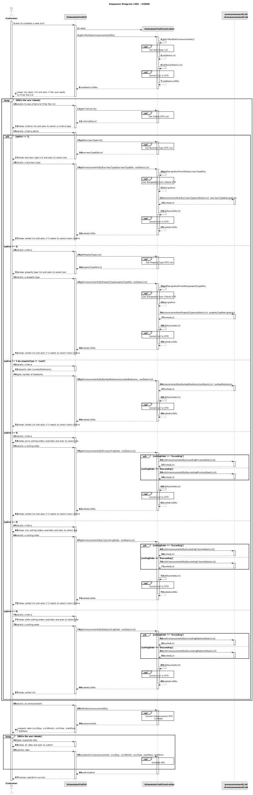
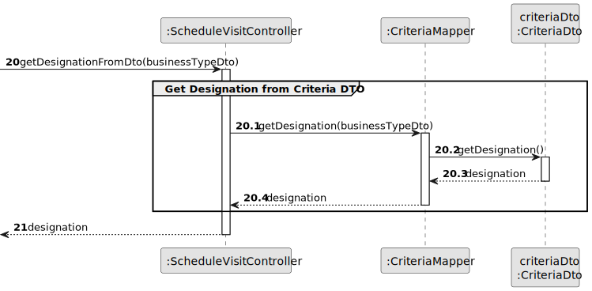
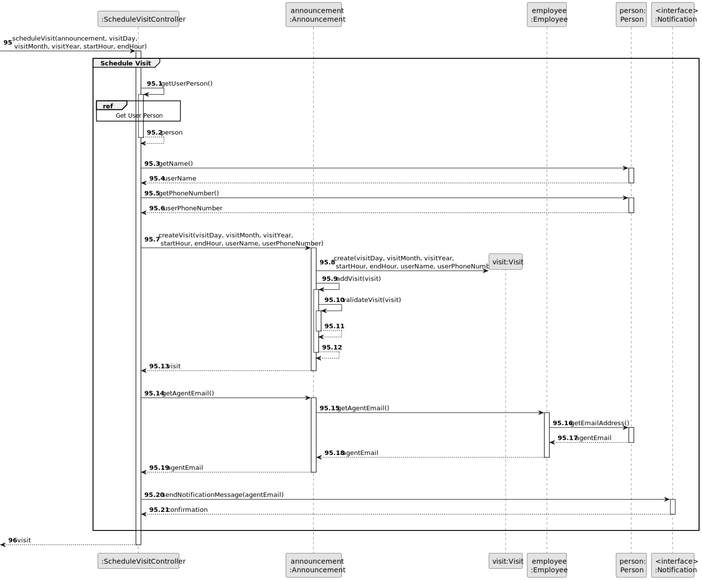
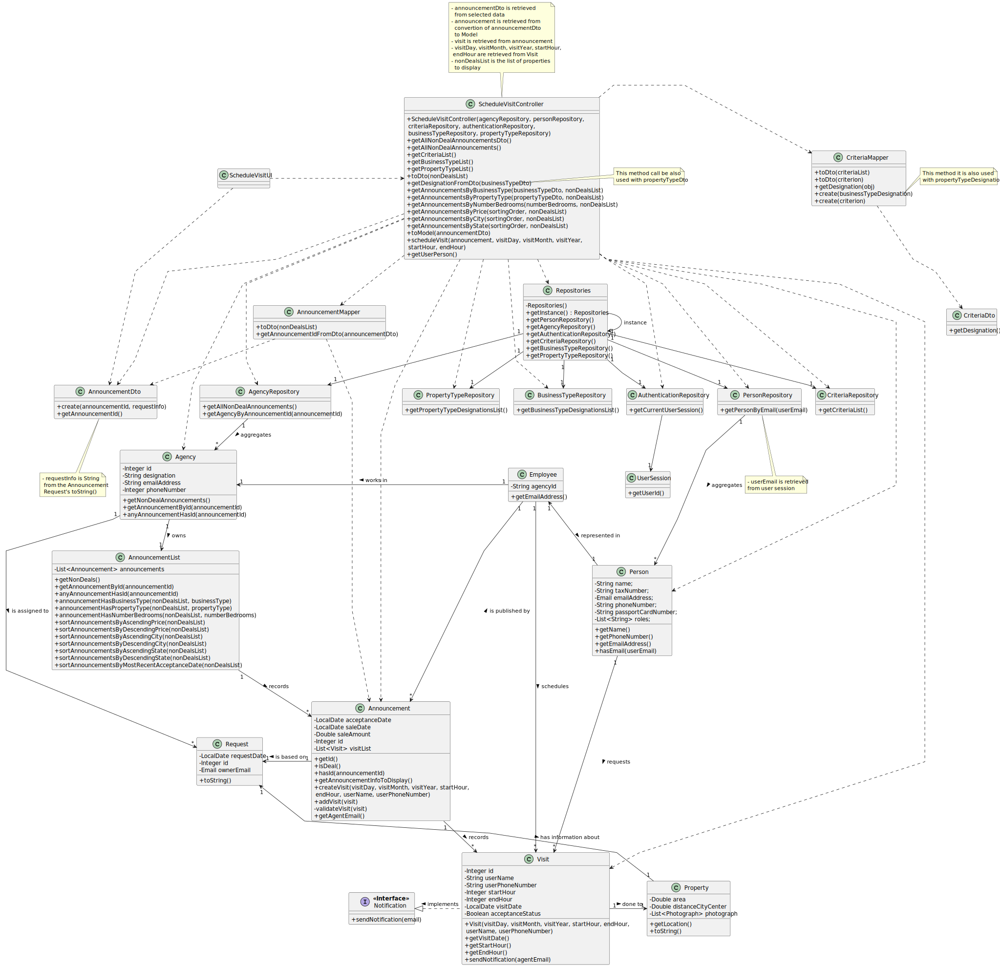

# US 009 - Schedule a visit to a property

## 3. Design - User Story Realization

### 3.1. Rationale

| Interaction ID                                           | Question: Which class is responsible for...                                | Answer                   | Justification (with patterns)                                                                                                            |
|:---------------------------------------------------------|:---------------------------------------------------------------------------|:-------------------------|:-----------------------------------------------------------------------------------------------------------------------------------------|
| Step 1: asks to schedule a new visit                     | ... interacting with the actor?                                            | ScheduleVisitUI          | Pure Fabrication: there is no reason to assign this responsibility to any existing class in the Domain Model.                            |
|                                                          | ... coordinating the US?                                                   | ScheduleVisitController  | Controller                                                                                                                               |
|                                                          | ... instantiating a new Announcement List?                                 | Agency                   | Creator: The Agency class is responsible for creating new Announcement List objects.                                                     |
|                                                          | ... retrieving the agencies that own the announcement's list?              | AgencyRepository         | Information Expert: contains all the agencies; Pure Fabrication.                                                                         |
|                                                          | ... fetching the non-deal announcements to display?                        | AnnouncementList         | Delegation/Pure Fabrication: promoting collection from Announcement to specific class to ensure Low Coupling & High Cohesion.            |
|                                                          | ... obtaining the announcement list instance?                              | Agency                   | Information Expert: knows its own Announcement List.                                                                                     |
|                                                          | ... saving (adding to a list) announcements?                               | AnnouncementList         | Delegation/Pure Fabrication: promoting collection from Announcement to specific class to ensure Low Coupling & High Cohesion.            |
|                                                          | ... sorting the announcements by most recent acceptance (publishing) date? | AnnouncementList         | Delegation/Pure Fabrication: promoting collection from Announcement to specific class to ensure Low Coupling & High Cohesion.            |
| Step 2: convert list to DTO                              | ... fetching the necessary data to create an AnnouncementDto?              | AnnouncementMapper       | DTO                                                                                                                                      |
|                                                          | ... converting the original data of an announcement to the DTO?            | AnnouncementMapper       | DTO                                                                                                                                      |
|                                                          | ... creating an instance of AnnouncementDto?                               | AnnouncementMapper       | DTO                                                                                                                                      |
| Step 3: display list                                     | ... displaying the non-deals list?                                         | ScheduleVisitUI          | Pure Fabrication: there is no reason to assign this responsibility to any existing class in the Domain Model.                            |
|                                                          | ... obtaining the possible criteria to select?                             | CriteriaRepository       | Pure Fabrication: there is no reason to assign this responsibility to any existing class in the Domain Model.                            |
|                                                          | ... fetching the necessary data to create a CriteriaDto?                   | CriteriaMapper           | DTO                                                                                                                                      |
|                                                          | ... converting the original data of a criterion to the DTO?                | CriteriaMapper           | DTO                                                                                                                                      |
|                                                          | ... creating an instance of CriteriaDto?                                   | CriteriaMapper           | DTO                                                                                                                                      |                                                                                                 
| Step 4: shows criteria available and asks to select one  | ... displaying the criteria list?                                          | ScheduleVisitUI          | Pure Fabrication: there is no reason to assign this responsibility to any existing class in the Domain Model.                            |
|                                                          | ... obtaining the business types designations to select?                   | BusinessTypeRepository   | Pure Fabrication: there is no reason to assign this responsibility to any existing class in the Domain Model.                            |
|                                                          | ... fetching the necessary data to create a CriteriaDto?                   | CriteriaMapper           | DTO                                                                                                                                      |
|                                                          | ... converting the original data of a criterion to the DTO?                | CriteriaMapper           | DTO                                                                                                                                      |
|                                                          | ... creating an instance of CriteriaDto?                                   | CriteriaMapper           | DTO                                                                                                                                      |                                                                                                 
|                                                          | ... obtaining the property types designations to select?                   | PropertyTypeRepository   | Pure Fabrication: there is no reason to assign this responsibility to any existing class in the Domain Model.                            |
|                                                          | ... fetching the necessary data to create a CriteriaDto?                   | CriteriaMapper           | DTO                                                                                                                                      |
|                                                          | ... converting the original data of a criterion to the DTO?                | CriteriaMapper           | DTO                                                                                                                                      |
|                                                          | ... creating an instance of CriteriaDto?                                   | CriteriaMapper           | DTO                                                                                                                                      |                                                                                                 
| Step 5: display sub-criteria list and asks to select one | ... displaying the sub-criteria list?                                      | ScheduleVisitUI          | Pure Fabrication: there is no reason to assign this responsibility to any existing class in the Domain Model.                            |
|                                                          | ... get designation of dto (when applicable)                               | CriteriaMapper           | DTO                                                                                                                                      |
|                                                          | ... sorting the announcements by choosen criteria?                         | AnnouncementList         | Delegation/Pure Fabrication: promoting Collection from Announcement to specific class to ensure Low Coupling & High Cohesion.            |
| Step 6: convert sorted list to DTO                       | ... fetching the necessary data to create an AnnouncementDto?              | AnnouncementMapper       | DTO                                                                                                                                      |
| Step 7: convert Announcement (DTO) to Object             | ... converting the original data of an announcement to the DTO?            | AnnouncementMapper       | DTO                                                                                                                                      |
|                                                          | ... retrieving the agency that owns the announcement?                      | AgencyRepository         | Information Expert: contains all the agencies; Pure Fabrication.                                                                         |
|                                                          | ... verifying if the agency has an announcement with the id?               | AnnouncementList         | Delegation/Pure Fabrication: promoting collection from Announcement to specific class to ensure Low Coupling & High Cohesion.            |
|                                                          | ... obtaining the announcement instance that has the specified id.         | AnnouncementList         | Delegation/Pure Fabrication: promoting collection from Announcement to specific class to ensure Low Coupling & High Cohesion.            |
| Step 8: request data                                     | ... displaying the UI for the actor to input data?                         | ScheduleVisitUI          | Pure Fabrication: there is no reason to assign this responsibility to any existing class in the Domain Model.                            |
| Step 9: type requested data                              | ... validating input data?                                                 | ScheduleVisitUI          | Pure Fabrication: there is no reason to assign this responsibility to any existing class in the Domain Model.                            |
|                                                          | ... temporarily keeping input data?                                        | ScheduleVisitUI          | Pure Fabrication: there is no reason to assign this responsibility to any existing class in the Domain Model.                            |
| Step 10: submit data                                     | ... obtaining the announcement ID from the announcementDto?                | AnnouncementDto          | DTO                                                                                                                                      |
|                                                          | ... verifying if the announcement has the specified id?                    | Announcement             | Information Expert: knows its own information.                                                                                           |
| Step 11: schedule visit                                  | ... creating a new instance of visit?                                      | Announcement             | Creator: The Announcement class is responsible for creating new Visit objects.                                                           |
|                                                          | ... retriving the user's email?                                            | AuthenticationRepository | Information Expert: contains all users; Pure Fabrication.                                                                                |
|                                                          | ... retrieving the person that represents the user?                        | PersonRepository         | Information Expert: contains all people; Pure Fabrication.                                                                               |
|                                                          | ... obtaining the user's data?                                             | Person                   | Information Expert: knows its own information.                                                                                           |
| Step 12: send notification message                       | ... obtaining the agent's email?                                           | Announcement             | Information Expert: knows its own information.                                                                                           |
|                                                          | ... sending a notification to the agent informing about the visit request? | Visit                    | Information Expert: The Visit class, which implements the Notification interface, is responsible for sending notifications to the agent. |
| Step 13: display operation success                       | ... informing operation success?                                           | ScheduleVisitUI          | Pure Fabrication: there is no reason to assign this responsibility to any existing class in the Domain Model.                            |

### Systematization ##

According to the taken rationale, the conceptual classes promoted to software classes are:

* Agency
* Employee
* Person
* Announcement
* Visit

Other software classes (i.e. Pure Fabrication) identified:

* ScheduleVisitUI
* ScheduleVisitController
* AnnouncementMapper
* AnnouncementListDto
* AnnouncementDto
* AuthenticationRepository
* AgencyRepository
* PersonRepository
* CriteriaRepository
* BusinessTypeRepository
* PropertyTypeRepository
* AnnouncementList
* CriteriaMapper
* CriteriaDto

## 3.2. Sequence Diagram (SD)

### Split Diagram

This diagram shows a sequence of interactions between the classes involved in the realization of this user story, but it
is split in partial diagrams to better illustrate the interactions between the classes.

It uses interaction ocurrence.

**Get Non Deals List Partial SD**

**Convert List to DTO Partial SD**

**Get Criteria DTO List Partial SD**

**Get Business Type DTO List Partial SD**

**Get Designation from Criteria DTO Partial SD**

**Get Property Type DTO List Partial SD**

**Convert Announcement DTO to Model Partial SD**

**Schedule Visit Partial SD**

**Get User Person Partial SD**

## 3.3. Class Diagram (CD)

