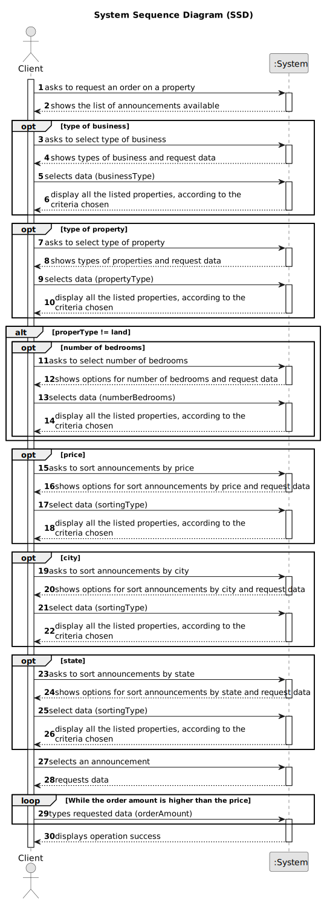

# US 010 - To submit a purchase order

## 1. Requirements Engineering

### 1.1. User Story Description

As a client, I place an order to purchase the property, submitting the order amount.

### 1.2. Customer Specifications and Clarifications 

**From the specifications document:**

>	When the client decides to buy/rent the property, he sends a request for the purchase/lease of the property to the agent. After being appreciated by the agent, he accepts or rejects the order. If the request is accepted, the offer will not be shown again to clients using the application.

**From the client clarifications:**

> **Question:** Should this User Story be implemented as an addition to US001 (Users can display properties, and select one to make an order), or should it be completely separate, with a separate section of the app dedicated to it?
>  
> **Answer:** To place an order the actor should be registered in the system.

> **Question:** What data is required, in addition to the order value, so that a client can place an order to purchase a property?
>
> **Answer:** Only the order amount.

> **Question:** In US10, can the client remove an offer they made at any point, in order to replace it with a different one?
>
> **Answer:** No.

> **Question:** When the client intends to place a purchase order, should the list of properties (announcements) be presented initially and then asked to select a property?
> 
> **Answer:** The system should show a list of properties to the client.

### 1.3. Acceptance Criteria

* **AC1:** The order amount submitted by the client must be equal to or lower than the price set by the owner for the property.
* **AC2:** The order amount submitted by the client must be equal to or lower than the price set by the owner for the property.
* **AC3:** A client can only submit a new order to purchase the same property after the previous one is declined.

### 1.4. Found out Dependencies

* To place an order, the client must be registered in the system.
* In order to submit a purchase order, there must be some property announcement.

### 1.5 Input and Output Data

**Input Data:**

* Typed data:
	* Order amount

**Output Data:**

* (In)Success of the operation

### 1.6. System Sequence Diagram (SSD)

###

* 