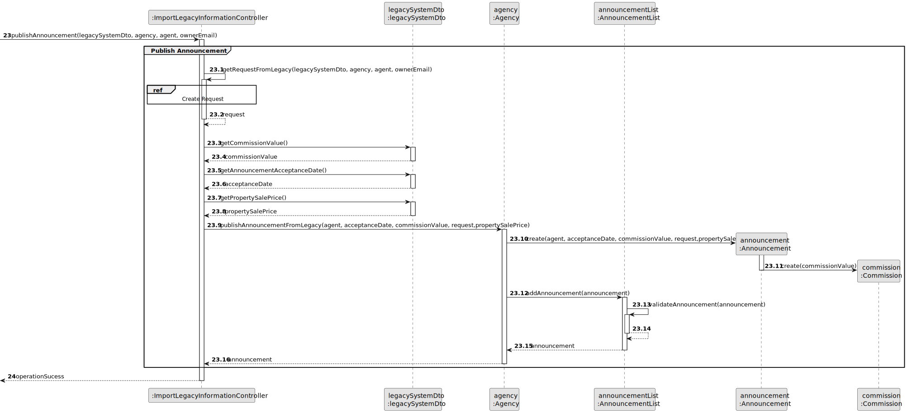
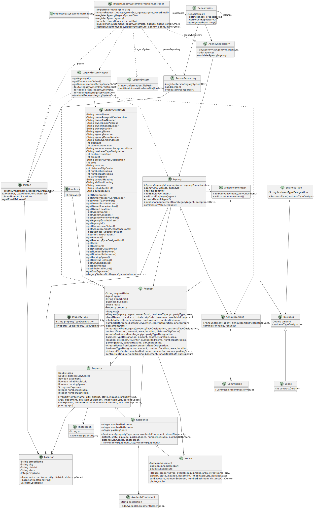

# US012 - To import legacy system information

## 3. Design - User Story Realization

### 3.1. Rationale

**SSD - Alternative 1 is adopted.**

| Interaction ID                                             | Question: Which class is responsible for...                             | Answer                            | Justification (with patterns)                                                                                 |
|:-----------------------------------------------------------|:------------------------------------------------------------------------|:----------------------------------|:--------------------------------------------------------------------------------------------------------------|
| Step 1 : asks to import information from legacy system. 		 | 	... interacting with the actor?                                        | ImportLegacyInformationUI         | Pure Fabrication: there is no reason to assign this responsibility to any existing class in the Domain Model. |
| 			  		                                                    | 	... coordinating the US?                                               | ImportLegacyInformationController | Controller                                                                                                    |
| Step 3 : requests file path		                              | ... displaying the UI for the actor to input data?							               | ImportLegacyInformationUI         | Pure Fabrication: there is no reason to assign this responsibility to any existing class in the Domain Model. |
| Step 4 : types file path		                                 | 	...saving the inputted data?                                           | ImportLegacyInformationUI         | Pure Fabrication: there is no reason to assign this responsibility to any existing class in the Domain Model. |
| Step 5: asks to confirm and submit data  		                | ...displaying file path before submitting data?	                        | ImportLegacyInformationUI         | Pure Fabrication: there is no reason to assign this responsibility to any existing class in the Domain Model. |
| Step 6: submits data  		                                   | ... obtaining the information from the file?                            | LegacySystem                      | Information Expert                                                                                            |
|                                                            | ... creating an dto with the line information?                          | LegacySystemMapper                | DTO pattern                                                                                                   |
|                                                            | ... registering a new agency?                                           | AgencyRepository                  | Information Expert: knows/has Agency instances.                                                               |
|                                                            | ... obtaining the agencies id?                                          | LegacySystemDto                   | Information Expert: knows its own data.                                                                       |
|                                                            | ... checking there already is a agency with the specified id?           | AgencyRepository                  | Information Expert: knows all the agencies.                                                                   |
|                                                            | ... instantiating a new Agency instance?                                | LegacySystemMapper                | DTO pattern                                                                                                   |
|                                                            | ... obtaining the necessary information for the new Agency instance?    | LegacySystemDto                   | DTO pattern                                                                                                   |
|                                                            | ... instantiating new Location?                                         | Agency                            | Creator (Rule 1): in the Domain Model Agency contains Location.                                               |
|                                                            | ... validating the agency Location?                                     | Location                          | Information Expert : knows its own data?                                                                      |
|                                                            | ... registering a new default Agent (employee)?                         | Agency                            | Creator (Rule 1): in the Domain Model Agency aggregates Employee (Agent).                                     |
|                                                            | ... globally validating the agent?                                      | Agency                            | Information Expert: knows all its employees.                                                                  |
|                                                            | ... register a new Owner (Person)?                                      | PersonRepository                  | Information Expert: knows/has Person instances.                                                               |
|                                                            | ... instantiating a new Person instance?                                | LegacySystemMapper                | DTO Pattern                                                                                                   |
|                                                            | ... obtaining the necessary information for the new Person instance?    | LegacySystemDto                   | DTO pattern                                                                                                   |
|                                                            | ... globally validating Person duplicated records?                      | PersonRepository                  | Information Expert: knows/has Person instances.                                                               |
|                                                            | ... fetching the owner email address?                                   | Person                            | Information Expert: knows its own data.                                                                       |
|                                                            | ... instantiating a new Request instance?                               | LegacySystemMapper                | DTO pattern                                                                                                   |
|                                                            | ... getting the necessary information to create a new Request?          | LegacySystemDto                   | DTO pattern                                                                                                   |
|                                                            | ... creating a new Location instance?                                   | Property                          | Creator (Rule 1): in the Domain Model Property contains Location.                                             |
|                                                            | ... creating a new Property instance?                                   | Request                           | Creator (Rule 1): in the Domain Model Request contains Property.                                              |
|                                                            | ... creating a new Business instance?                                   | Request                           | Creator (Rule 1): in the Domain Model Request contains Business.                                              |
|                                                            | ... creating a new AvailableEquipment instance?                         | Residence                         | Creator (Rule 1): in the Domain Model Residence contains AvailableEquipment.                                  |
|                                                            | ... getting the final information necessary to publish an announcement? | LegacySystemDto                   | DTO pattern                                                                                                   |
|                                                            | ... publishing a new announcement?                                      | Agency                            | Information Expert: owns all its announcements.                                                               |
|                                                            | ... creating a new Announcement instance?                               | Agency                            | Creator (Rule 1): in the Domain Model Agency owns Announcements.                                              |
|                                                            | ... saving the created announcement?                                    | AnnouncementList                  | Information Expert: has all announcements of an agency.                                                       |
|                                                            | ... globally validating duplicated announcements?                       | AnnouncementList                  | Information Expert: knows all announcements instances.                                                        |
| Step 26 : displays operation success                       | ... informing operation success? 							                                | ImportLegacyInformationUI         | Pure Fabrication: there is no reason to assign this responsibility to any existing class in the Domain Model. |        

### Systematization ##

According to the taken rationale, the conceptual classes promoted to software classes are:

* Person
* Announcement
* Request
* Agency
* AvailableEquipment
* Photograph
* Employee
* Business
* PropertyType
* Property
* Residence
* House
* Location

Other software classes (i.e. Pure Fabrication) identified:

* ImportLegacyInformationUI
* ImportLegacyInformationController
* AnnouncementList
* AgencyRepository
* PersonRepository
* LegacySystemDto
* LegacySystemMapper

## 3.2. Sequence Diagram (SD)

### Split Diagram

This diagram shows the same sequence of interactions between the classes involved in the realization of this user story,
but it is split in partial diagrams to better illustrate the interactions between the classes.

It uses interaction ocurrence.

**Register Agency**

**Check Agency Exists**

**Register Agent**

**Register Owner**

**Publish Announcement**

**Create Request**

## 3.3. Class Diagram (CD)

