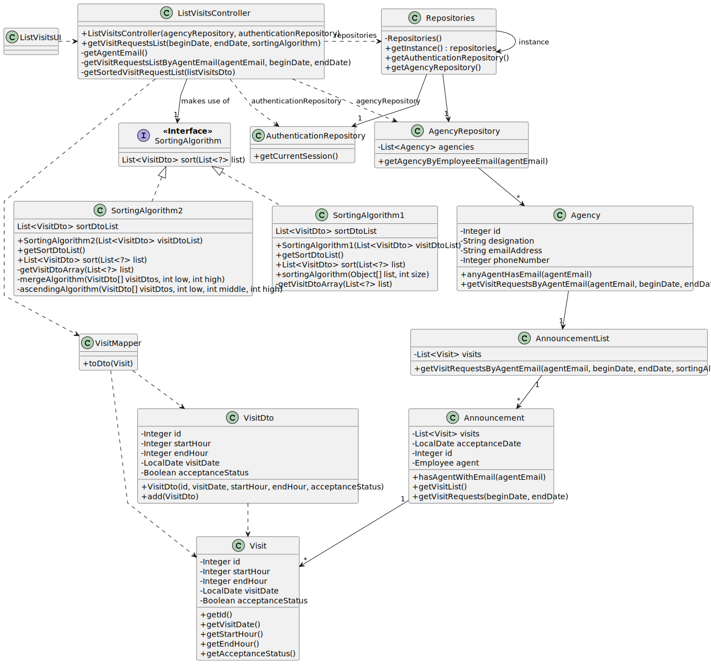

# US 015 - List all booking requests for properties

## 3. Design - User Story Realization 

### 3.1. Rationale

| Interaction ID                                                                     | Question: Which class is responsible for...                                              | Answer                       | Justification (with patterns)                                                                                                 |
|:-----------------------------------------------------------------------------------|:-----------------------------------------------------------------------------------------|:-----------------------------|:------------------------------------------------------------------------------------------------------------------------------|
| Step 1 : asks to see all the booking requests made to properties manage by himself | ... interacting with the actor?                                                          | ListVisitsUI                 | Pure Fabrication: there is no reason to assign this responsibility to any existing class in the Domain Model.                 |
|                                                                                    | ... coordinating the US?                                                                 | ListVisitsController         | Controller                                                                                                                    |
| Step 2 : requests data                                                             | ... displaying the UI for the actor to select data?                                      | ListVisitsUI                 | Pure Fabrication: there is no reason to assign this responsibility to any existing class in the Domain Model.                 |
| Step 3 : selects requested data (begin date, end date)                             | ... validating selected data?                                                            | ListVisitsUI                 | Pure Fabrication: there is no reason to assign this responsibility to any existing class in the Domain Model.                 |
|                                                                                    | ... obtaining the agent email?                                                           | User Session                 | Information Expert: cf. User Authentication & Authorization component documentation.                                          |
|                                                                                    | ... obtaining the agency that has the agent with retrieved email?                        | AgencyRepository             | Information Expert: contains all the agencies; Pure Fabrication.                                                              |
|                                                                                    | ... evaluating if an agency has an agent with the retrieved email?                       | Agency                       | Information Expert: an agency knows all its agents (employees).                                                               |
|                                                                                    | ... fetching the visit requests/announcements of the agent that has the specified email? | AnnouncementList??           | Delegation/Pure Fabrication: promoting collection from Announcement to specific class to ensure Low Coupling & High Cohesion. |
|                                                                                    | ... verifying if the visit requests/announcements is from the specified email's agent.   | Announcement                 | Information Expert : knows their responsible agent.                                                                           |
|                                                                                    | ... obtaining the visit requests instance/list?                                          | Announcement                 | Information Expert : contains the OrderList.                                                                                  |
|                                                                                    | ... adding to a list the visits?                                                         | AnnouncementList??           | Delegation/Pure Fabrication: promoting collection from Announcement to specific class to ensure Low Coupling & High Cohesion. |
|                                                                                    | ... sorting the visits according to sorting algorithm?                                   | AnnouncementList??           | Delegation/Pure Fabrication: promoting collection from Announcement to specific class to ensure Low Coupling & High Cohesion. |
|                                                                                    | ... fetching the necessary data to create an VisitDto?                                   | VisitMapper                  | DTO pattern                                                                                                                   |
|                                                                                    | ... converting the original data of a visit to the DTO?                                  | VisitMapper                  | DTO pattern                                                                                                                   |
| Step 4 : display all booking requests according to the dates and algorithm chosen  | ... displaying the visit requests                                                        | ListVisitsUI                 | Pure Fabrication: there is no reason to assign this responsibility to any existing class in the Domain Model.                 |

### Systematization ##

According to the taken rationale, the conceptual classes promoted to software classes are: 

[//]: # ( * Algorithm)
 * Agency
 * Announcement
 * Visit

[//]: # ( * Property)

[//]: # ( * Request)

[//]: # ( * Location)

Other software classes (i.e. Pure Fabrication) identified: 

 * ListVisitsUI 
 * ListVisitsController
 * AnnouncementList
 * VisitMapper
 * VisitDto
 * AgencyRepository

[//]: # ( * Algorithm)

[//]: # ( * AlgorithmMapper)

[//]: # ( * AlgorithmDto)

## 3.2. Sequence Diagram (SD)

### Alternative 1 - Full Diagram

This diagram shows the full sequence of interactions between the classes involved in the realization of this user story.

### Alternative 2 - Split Diagram

This diagram shows the same sequence of interactions between the classes involved in the realization of this user story, but it is split in partial diagrams to better illustrate the interactions between the classes.

It uses interaction ocurrence.

**Get Agent Email**

**Get Visit Requests by Agent Email**

**Convert Visits List to Dto**

## 3.3. Class Diagram (CD)

