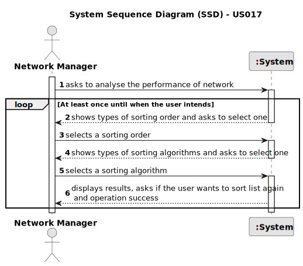

# US 017 - To list all deals made

## 1. Requirements Engineering

### 1.1. User Story Description

>As a network manager, I want to list all deals made.

### 1.2. Customer Specifications and Clarifications

**From the specifications document:**

> The manager of the network intends to analyse the performance of each of the branches and the global behaviour of the
> network on a daily basis.

**From the client clarifications:**

> **Question:** According to the project description "The manager of the network intends to analyze the performance of
> each of the branches and the global behavior of the network daily." With this sentence, it is implied that the Network
> manager has access to all data regarding the deals made in each agency. Now, in the requirements document that was
> provided the US017's description is "As a network manager, I want to list all deals made.". Can you confirm that we
> are analyzing the deals made in all the branches all together?
>
> **Answer:** Yes, we are analyzing the deals made in all the branches all together.

> **Question:** In this User Story it is requested that "All deals made" are listed. Are these deals just accepted
> purchase requests, or are declined purchase requests also included?
>
> **Answer:** A deal takes place when the proposed purchase/renting is accepted.

> **Question:** What should be the default order of the deals when displaying them to the network manager?
>
> **Answer:** The default is to sort deals from the most recent ones to the oldest ones.

### 1.3. Acceptance Criteria

* **AC1:** The actor should be able to sort all properties by property area (square feet) in descending/ascending order.
* **AC2:** Two sorting algorithms should be implemented (to be chosen manually by the network manager).
* **AC3:** When the deal's sorting deals is finnished, a success message is displayed.
* **AC4:** Worst-case time complexity of each algorithm should be documented in the application user manual that must be
  delivered with the application (in the annexes, where algorithms should be written in pseudocode).
* **AC5:** The Network Manager should do the login within the application.

### 1.4. Found out Dependencies

* There is a dependency to "US002 Publish an announcement" since at least an announcement must be published for a deal
  to be made.
* There is a dependency to "US010 To submit a purchase order" since at least a purchase request must be done for a deal
  to be made.
* There is a dependency to "US011 Accept purchase orders" since at least a purchase request must be accepted for a deal
  to be made.

### 1.5 Input and Output Data

**Input Data:**

* Typed data:
    * no typed data

* Selected data:
    * Sorting order (Ascending / Descending)
    * Sorting algorithm (ADD ALGORITHMS)

**Output Data:**

* List of sorting order
* List of sorting algorithm
* (In)Success of the operation

### 1.6. System Sequence Diagram (SSD)

**Other alternatives might exist.**

#### Alternative One

### 1.7 Other Relevant Remarks

* No relevant remarks.