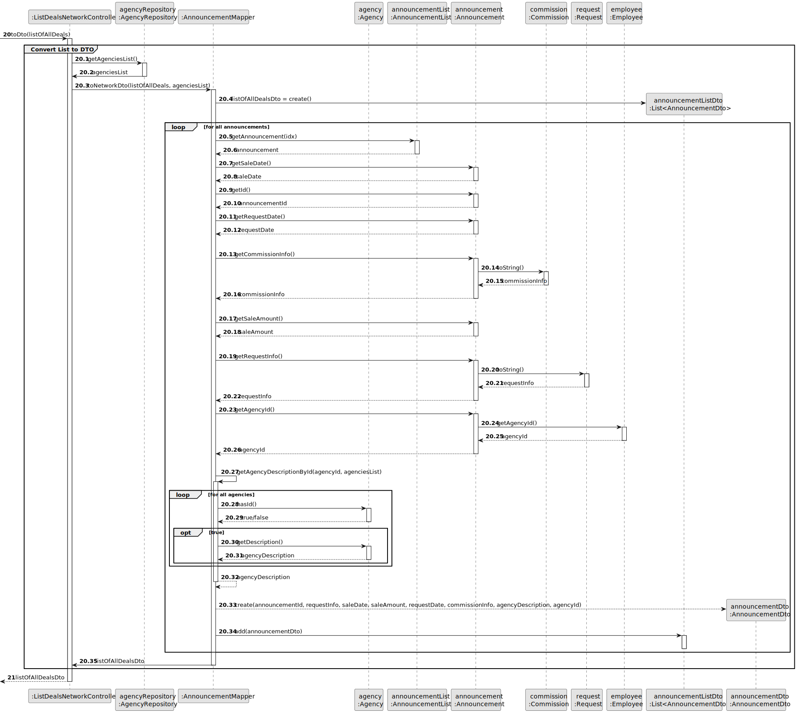
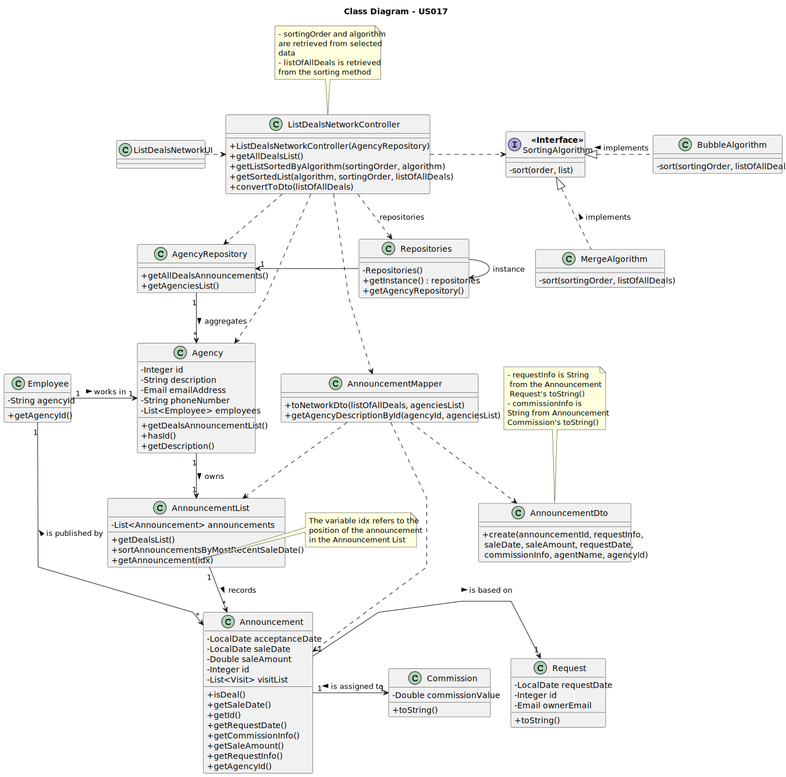

# US 017 - To list all deals made

## 3. Design - User Story Realization

### 3.1. Rationale

| Interaction ID                                                                | Question: Which class is responsible for...                   | Answer                     | Justification (with patterns)                                                                                                 |
|:------------------------------------------------------------------------------|:--------------------------------------------------------------|:---------------------------|:------------------------------------------------------------------------------------------------------------------------------|
| Step 1 : asks to analyse the performance of network                           | ... interacting with the actor?                               | ListDealsNetworkUI         | Pure Fabrication: there is no reason to assign this responsibility to any existing class in the Domain Model.                 |
|                                                                               | ... coordinating the US?                                      | ListDealsNetworkController | Controller                                                                                                                    |
| Step 2 : get announcement deals list                                          | ... obtaining the list of agencies?                           | AgencyRepository           | IE: The AgencyRepository knows all its agencies.                                                                              |                                                                                                               |            
|                                                                               | ... instantiating a new Announcement List?                    | AgencyRepository           | IE: The AgencyRepository knows all announcements of all its agencies.                                                         |     
|                                                                               | ... obtaining an announcement deal?                           | Agency                     | IE: The Agency knows all its announcements.                                                                                   |
|                                                                               | ... know if an announcement is a deal?                        | Annoucement                | IE: The Announcement knows its own status.                                                                                    |
|                                                                               | ... sorting the list by most recent sale date?                | AnnouncementList           | Delegation/Pure Fabrication: promoting Collection from Announcement to specific class to ensure Low Coupling & High Cohesion. |
| Step 3 : convert list to DTO                                                  | ... converting the list to DTO?                               | AnnouncementMapper         | DTO                                                                                                                           |
|                                                                               | ... fetching the necessary data to create an AnnouncementDto? | AnnouncementMapper         | DTO                                                                                                                           |
|                                                                               | ... temporarily saving the created announcementDto?           | List\<AnnouncementDto>     | DTO                                                                                                                           |
|                                                                               | ... obtaining the sorting order types?                        | ListDealsNetworkUI         | Pure Fabrication: there is no reason to assign this responsibility to any existing class in the Domain Model.                 |
| Step 4 : show DTO of deals list, types of sorting order and ask to select one | ... displaying the list of AnnouncementDtos'?                 | ListDealsNetworkUI         | Pure Fabrication: there is no reason to assign this responsibility to any existing class in the Domain Model.                 |
|                                                                               | ... displaying the sorting order types?                       | ListDealsNetworkUI         | Pure Fabrication: there is no reason to assign this responsibility to any existing class in the Domain Model.                 |
| Step 5 : select a sorting order                                               | ... validating input data?                                    | ListDealsNetworkUI         | Pure Fabrication: there is no reason to assign this responsibility to any existing class in the Domain Model.                 |
|                                                                               | ... temporarily keeping input data?                           | ListDealsNetworkUI         | Pure Fabrication: there is no reason to assign this responsibility to any existing class in the Domain Model.                 |
|                                                                               | ... obtaining the sorting algorithms?                         | ListDealsNetworkUI         | Pure Fabrication: there is no reason to assign this responsibility to any existing class in the Domain Model.                 |
| Step 6 : show sorting algorithms available and ask to select one              | ... displaying the sorting algorithm?                         | ListDealsNetworkUI         | Pure Fabrication: there is no reason to assign this responsibility to any existing class in the Domain Model.                 |
| Step 7 : select a sorting algorithm                                           | ... validating input data?                                    | ListDealsNetworkUI         | Pure Fabrication: there is no reason to assign this responsibility to any existing class in the Domain Model.                 |
|                                                                               | ... temporarily keeping input data?                           | ListDealsNetworkUI         | Pure Fabrication: there is no reason to assign this responsibility to any existing class in the Domain Model.                 |
| Step 8 : sort list by choosen order and algorithm                             | ... sorting the list by the chosen algorithm and order?       | AnnouncementList           | Delegation/Pure Fabrication: promoting Collection from Announcement to specific class to ensure Low Coupling & High Cohesion. |
| Step 9 : convert list to DTO                                                  | ... converting the list to DTO?                               | AnnouncementMapper         | DTO                                                                                                                           |
|                                                                               | ... fetching the necessary data to create an AnnouncementDto? | AnnouncementMapper         | DTO                                                                                                                           |
|                                                                               | ... temporarily saving the created announcementDto?           | List\<AnnouncementDto>     | DTO                                                                                                                           |
| Step 10 : display results and operation success                               | ... displaying the list of AnnouncementDtos'?                 | ListDealsNetworkUI         | Pure Fabrication: there is no reason to assign this responsibility to any existing class in the Domain Model.                 |            
|                                                                               | ... informing operation success?                              | ListDealsNetworkUI         | Pure Fabrication: there is no reason to assign this responsibility to any existing class in the Domain Model.                 |

### Systematization ##

According to the taken rationale, the conceptual classes promoted to software classes are:

* Announcement
* Agency
* Employee

Other software classes (i.e. Pure Fabrication) identified:

* ListDealsNetworkUI
* ListDealsNetworkController
* AgencyRepository
* AnnouncementList
* List\<Announcement>
* AnnouncementMapper
* AnnouncementListDto
* AnnouncementDto

## 3.2. Sequence Diagram (SD)

### Alternative 1 - Full Diagram

This diagram shows the full sequence of interactions between the classes involved in the realization of this user story.

**Get Task Category List Partial SD**

## 3.3. Class Diagram (CD)

