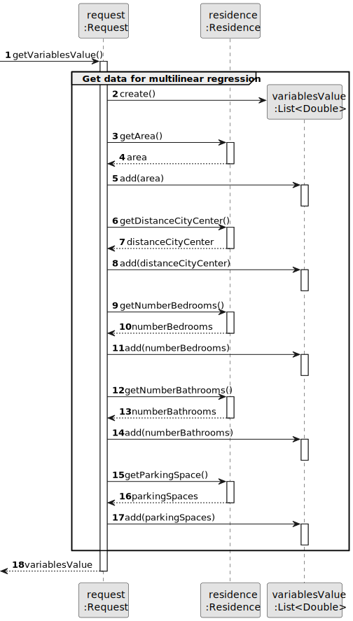
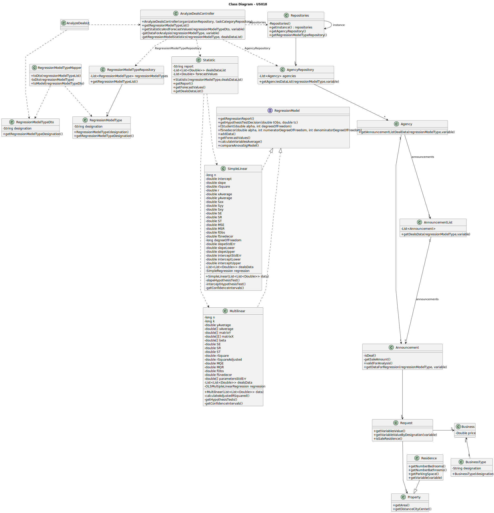

# US 018 - To analyze sale deals of houses and apartments

## 3. Design - User Story Realization

### 3.1. Rationale

**SSD - Alternative 1 is adopted.**

| Interaction ID                                                                                                 | Question: Which class is responsible for...                                             | Answer                                     | Justification (with patterns)                                                                                                 |
|:---------------------------------------------------------------------------------------------------------------|:----------------------------------------------------------------------------------------|:-------------------------------------------|:------------------------------------------------------------------------------------------------------------------------------|
| Step 1: asks to analyze property deals.                                                                        | ... interacting with the actor?                                                         | AnalyzeDealsUI                             | Pure Fabrication: there is no reason to assign this responsibility to any existing class in the Domain Model.                 |
|                                                                                                                | ... coordinating the US?                                                                | AnalyzeDealsController                     | Controller                                                                                                                    |
|                                                                                                                | ... obtaining the type of regression models list?                                       | RegressionModelsTypeRepository             | Information Expert: the types of regression models are always the same; Pure Fabrication.                                     |
|                                                                                                                | ... fetching the necessary data to create an AnnouncementDto?                           | RegressionModelTypeMapper                  | DTO pattern                                                                                                                   |
|                                                                                                                | ... converting the original data of an announcement to the DTO?                         | RegressionModelTypeMapper                  | DTO pattern                                                                                                                   |
| Step 2: shows regression models available and asks to select one.                                              | ... displaying the regression model types?                                              | AnalyzeDealsUI                             | Pure Fabrication: there is no reason to assign this responsibility to any existing class in the Domain Model.                 |
| Step 3: selects regression model.                                                                              | ... saving the selected data?                                                           | AnalyzeDealsUI                             | Pure Fabrication: there is no reason to assign this responsibility to any existing class in the Domain Model.                 |
| Step 4: shows the parameters available for regression models and asks to select one.                           | ... displaying the parameters available?                                                | AnalyzeDealsUI                             | Pure Fabrication: there is no reason to assign this responsibility to any existing class in the Domain Model.                 |
| Step 5: selects independent variable.                                                                          | ... saving the selected parameter?                                                      | AnalyzeDealsUI                             | Pure Fabrication: there is no reason to assign this responsibility to any existing class in the Domain Model.                 |
|                                                                                                                | ... obtaining the RegressionModelType instance from the selected RegressionModelTypeDto | RegressionModelTypeMapper                  | DTO pattern                                                                                                                   |
|                                                                                                                | ... getting the designation of the RegressionModelTypeDto?                              | RegressionModelTypeDto                     | Information Expert: knows its own data; Dto pattern                                                                           |
|                                                                                                                | ... fetching all the necessary data present in the system?                              | AgencyRepository                           | Information Expert: knows all the registered agencies.                                                                        |
|                                                                                                                | ... obtaining data of each agency announcements?                                        | AnnouncementList                           | Information Expert: knows all the announcement instances of an agency.                                                        |
|                                                                                                                | ... verifying if the announcement is a deal?                                            | Announcement                               | Information Expert: has the necessary information to validate this criteria.                                                  |
|                                                                                                                | ... verifying if its a sale of a house or apartment announcement?                       | Request                                    | **CHECK THIS STEP**                                                                                                           |
|                                                                                                                | ... retrieving the sale amount of the deal?                                             | Announcement                               | Information Expert: knows its own data, therefore knows the sale amount.                                                      |
|                                                                                                                | ... getting the data for the regression variables after the announcement validation?    | Request                                    | Information Expert: knows the property instance.                                                                              |
|                                                                                                                | ... creating a RegressionModel instance?                                                | Statistics                                 | Pure Fabrication: there is no reason to assign this responsibility to any existing class in the Domain Model; Java Reflection |
|                                                                                                                | ... calculating all the necessary regression model statistics?                          | **CLASSES THAT IMPLEMENT RegressionModel** | Protected Variation                                                                                                           |
|                                                                                                                | ... determining the forecast value of each deal?                                        | **CLASSES THAT IMPLEMENT RegressionModel** | Information Expert: has the necessary information to do such task.                                                            |
|                                                                                                                | ... converting the statistic instance to a Dto?                                         | StatisticsMapper                           | Dto pattern                                                                                                                   |
| Step 6: shows the estimated price for each house and apartment deal, and the selected regression model report. | ... displaying the data for the user?                                                   | AnalyzeDealsUI                             | Pure Fabrication: there is no reason to assign this responsibility to any existing class in the Domain Model.                 |              

### Systematization ##

According to the taken rationale, the conceptual classes promoted to software classes are:

* Announcement
* Request

Other software classes (i.e. Pure Fabrication) identified:

* AnalyzeDealsUI
* AnalyzeDealsController
* Statistics
* AnnouncementList
* AgencyRepository
* RegressionModelTypeDto
* RegressionModelTypeMapper
* RegressionModelsTypeRepository

## 3.2. Sequence Diagram (SD)

### Split Diagram

This diagram shows the same sequence of interactions between the classes involved in the realization of this user story,
but it is split in partial diagrams to better illustrate the interactions between the classes.

It uses interaction occurrence.

**Get Regression Model Type List**

**Convert Regression Model Type To Dto**

**Get All Data For Analysis**

**Get Data Of Announcements**

**Get Data For Multilinear Regression**

**Convert Statistic To Dto**

## 3.3. Class Diagram (CD)

