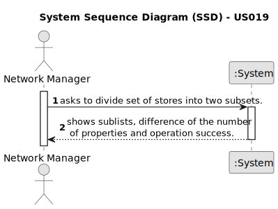

# US 019 - To divide the set of all stores into two subsets

## 1. Requirements Engineering

### 1.1. User Story Description

As a network manager, I want to divide the set of all stores into two subsets,
so that the total number of properties of the stores between the two subsets is
the closest possible.

### 1.2. Customer Specifications and Clarifications

**From the specifications document:**

> The manager of the network intends to analyse the performance of each of the branches and the
> global behaviour of the network on a daily basis.

**From the client clarifications:**

> **Question:** Does it include only properties that are announced or does it also include properties that are pending
> agent approval for an announcement.
>
> **Answer:** Please consider properties whose purchase order was accepted. In other words, deals that were done/made.

> **Question:** What should we do with the list? Is it only for display or are we supposed to save it?
>
> **Answer:** The system should display the lists to the network manager.

> **Question:** According to many MDISC teachers, we are only supposed to process the information within a CSV file
> chosen by the network manager. However, in the US description and acceptance criteria there isn't any mention of this,
> implying that we need to use all the information that's registered in our system. Additionally, if it is only supposed
> to be the CSV file information, can we ask for the file path of it?
>
> **Answer:** In USs 17, 18 and 19, the network manager and the store manager should be able to explore/analyze ALL
> deals that are registered in the system.
> To develop the work required by MATCP and MDISC courses, you should have a clean/empty system and you should load the
> CSV file that is already available in moodle (please the link "CSV file generated by the legacy system to be explored
> in US17, US18 and US19" available in moodle).

### 1.3. Acceptance Criteria

* **AC1:** The application should implement a brute-force algorithm, an algorithm
  which consists of calculating all the partitions of cardinal 2 and finding out which
  one is the minimum for the difference of the sum of the elements of each sublist.

* **AC2:** The algorithm should return the sublists of the partition (each sublist should
  contain a set of tuples with two elements each, the storeID and the number of
  properties managed by the store) that satisfies the stated condition and also the
  difference between the sums of the elements of the sublists. In the user manual,
  this algorithm must be written in pseudocode.

* **AC3:** Runtime tests for variable length n input lists, with com n = 3, 6, 9, …, 30
  (asymptotic behavior) should be performed. In each run the number of stores
  should be chosen sequentially. In the user manual, the results of measuring the
  time of each algorithm for one/several inputs of the same size, as also the graphic
  of the asymptotic behavior of the execution time should be presented (use a unit
  of time that allows you to distinguish the running times of all tested examples).
  Also, it should be presented the input list, the two sublists that make up the
  partition and difference of sums, for at least one example of each input size.

* **AC4:** Worst-case time complexity of the algorithm should be documented in the
  application user manual (in the annexes, where algorithms should be written in
  pseudocode) that must be delivered with the application.

* **AC5:** The system must clean/empty, it should be only loaded the information from the CSV file in moodle.

* **AC6:** The network manager should be able to analyze all deals that are registered in the system.

### 1.4. Found out Dependencies

* There is a dependency to "US012 To import legacy system information" since the information from the legacy system must
  be loaded in our system.

### 1.5 Input and Output Data

**Input Data:**

* None

**Output Data:**

* Sublists of the partition that contains a set of tuples with the storeID and the number of properties managed by the
  store.
* Difference of the sum of the number of properties of each sublist.

### 1.6. System Sequence Diagram (SSD)

**Other alternatives might exist.**

#### Alternative One

### 1.7 Other Relevant Remarks

* _None_