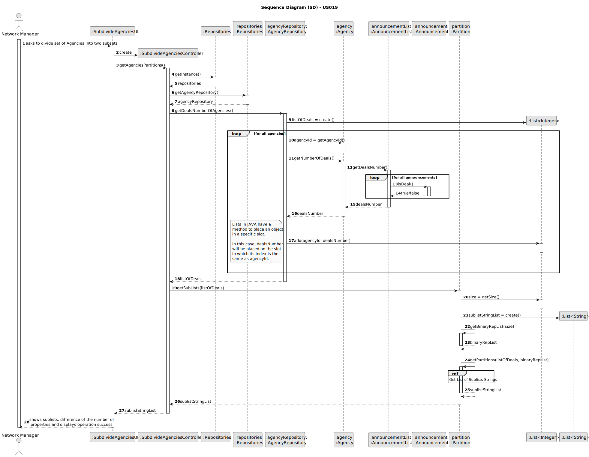
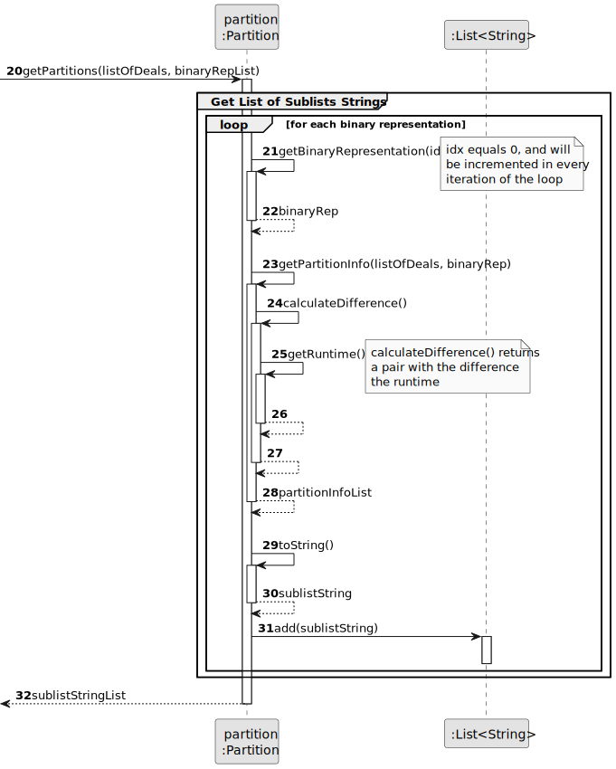
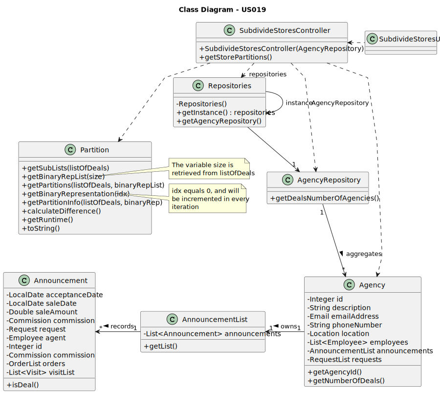

# US 019 - To divide the set of all stores into two subsets

## 3. Design - User Story Realization 

### 3.1. Rationale

| Interaction ID                                                                                  | Question: Which class is responsible for...                        | Answer                      | Justification (with patterns)                                                                                 |
|:------------------------------------------------------------------------------------------------|:-------------------------------------------------------------------|:----------------------------|:--------------------------------------------------------------------------------------------------------------|
| Step 1 : asks to divide set of Agencies into two subsets                                        | ... interacting with the actor?                                    | SubdivideAgenciesUI         | Pure Fabrication: there is no reason to assign this responsibility to any existing class in the Domain Model. |
|                                                                                                 | ... coordinating the US?                                           | SubdivideAgenciesController | Controller                                                                                                    |
|                                                                                                 | ... obtaining data of each agency?                                 | AgencyRepository            | Information Expert: knows all the registered agencies.                                                        |
|                                                                                                 | ... getting the agency id?                                         | Agency                      | Information Expert: an agency knows its own data.                                                             |
|                                                                                                 | ... verifying if the announcement is a deal?                       | Announcement                | Information Expert: an announcement knows its own data.                                                       |
|                                                                                                 | ... adding to a list the agency id and the deal number? **CHECK**  | AgencyRepository            |                                                                                                               |
|                                                                                                 | ... getting the size of the list?                                  | List<Integer>               | Information Expert: knows its own data.                                                                       |
|                                                                                                 | ... getting the binary Rep List?     **CHECK**                     | Partition                   | Information Expert: knows its own data.                                                                       |
|                                                                                                 | ... getting the Partition Information?   **CHECK**                 | Partition                   | Information Expert: knows its own data.                                                                       |
|                                                                                                 | ... getting the Runtime difference?       **CHECK**                | Partition                   | Information Expert: knows its own data.                                                                       |
|                                                                                                 | ... adding to a list the sublist information?   **CHECK**          | Partition                   | Information Expert: knows its own data.                                                                       |
| Step 2 : shows sublists, difference of the number of properties and displays operation success  | ... displaying the sublists?                                       | SubdivideAgenciesUI         | Pure Fabrication: there is no reason to assign this responsibility to any existing class in the Domain Model. |
|                                                                                                 | ... displaying the difference of the number of properties?         | SubdivideAgenciesUI         | Pure Fabrication: there is no reason to assign this responsibility to any existing class in the Domain Model. |
|                                                                                                 | ... informing operation success?                                   | SubdivideAgenciesUI         | Pure Fabrication: there is no reason to assign this responsibility to any existing class in the Domain Model. |

### Systematization ##

According to the taken rationale, the conceptual classes promoted to software classes are: 

 * Agency
 * Announcement

Other software classes (i.e. Pure Fabrication) identified: 

 * SubdivideStoresUI  
 * SubdivideStoresController
 * AnnouncementList
 * Partition
 * AgencyRepository

## 3.2. Sequence Diagram (SD)

### Split Diagram

This diagram shows the same sequence of interactions between the classes involved in the realization of this user story,
but it is split in partial diagrams to better illustrate the interactions between the classes.

It uses interaction occurrence.

**Get List of Sublists Strings**

## 3.3. Class Diagram (CD)

