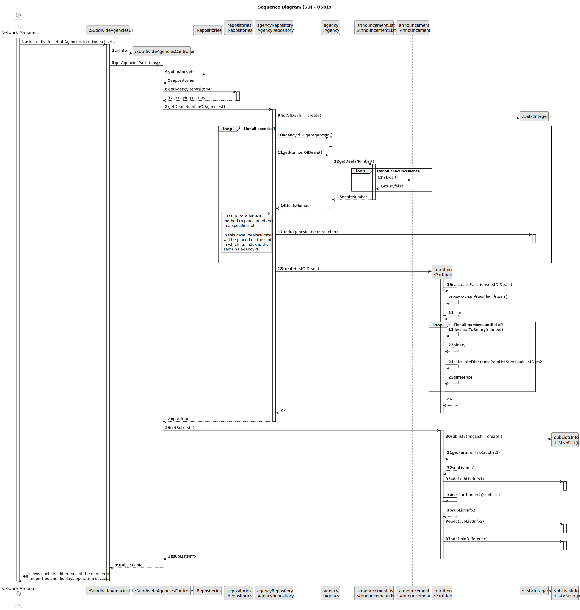
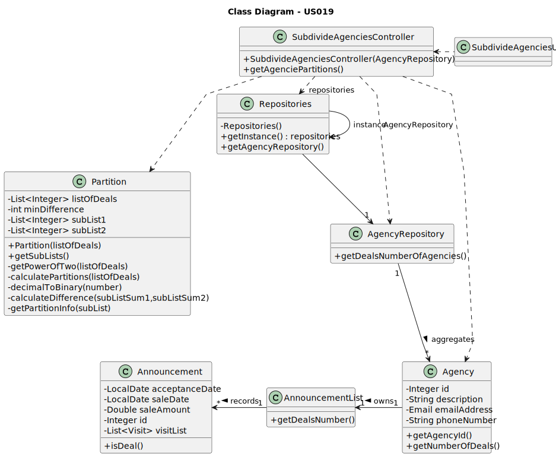

# US 019 - To divide the set of all stores into two subsets

## 3. Design - User Story Realization

### 3.1. Rationale

| Interaction ID                                                                                 | Question: Which class is responsible for...                | Answer                      | Justification (with patterns)                                                                                 |
|:-----------------------------------------------------------------------------------------------|:-----------------------------------------------------------|:----------------------------|:--------------------------------------------------------------------------------------------------------------|
| Step 1 : asks to divide set of Agencies into two subsets                                       | ... interacting with the actor?                            | SubdivideAgenciesUI         | Pure Fabrication: there is no reason to assign this responsibility to any existing class in the Domain Model. |
|                                                                                                | ... coordinating the US?                                   | SubdivideAgenciesController | Controller                                                                                                    |
|                                                                                                | ... obtaining data of each agency?                         | AgencyRepository            | Information Expert: knows all the registered agencies.                                                        |
|                                                                                                | ... getting the agency id?                                 | Agency                      | Information Expert: an agency knows its own data.                                                             |
|                                                                                                | ... verifying if the announcement is a deal?               | Announcement                | Information Expert: an announcement knows its own data.                                                       |
|                                                                                                | ... instantiating a new Partition instance?                | AgencyRepository            | Creator (Rule 4): the AgencyRepository has the necessary data to instantiate Partition.                       |
|                                                                                                | ... calculating the partitions of the agencies (subsets)?  | Partition                   | Information Expert: has the necessary data for such operation.                                                |
|                                                                                                | ... obtaining the sublists of the agencies?                | Partition                   | Information Expert: knows its own data.                                                                       |
|                                                                                                | ... adding the necessary information to a list ?           | Partition                   | Information Expert: knows its own data.                                                                       |
| Step 2 : shows sublists, difference of the number of properties and displays operation success | ... displaying all the necessary information?              | SubdivideAgenciesUI         | Pure Fabrication: there is no reason to assign this responsibility to any existing class in the Domain Model. |
|                                                                                                | ... informing operation success?                           | SubdivideAgenciesUI         | Pure Fabrication: there is no reason to assign this responsibility to any existing class in the Domain Model. |

### Systematization ##

According to the taken rationale, the conceptual classes promoted to software classes are:

* Agency
* Announcement

Other software classes (i.e. Pure Fabrication) identified:

* SubdivideStoresUI
* SubdivideStoresController
* AnnouncementList
* Partition
* AgencyRepository

## 3.2. Sequence Diagram (SD)

### Split Diagram

This diagram shows the same sequence of interactions between the classes involved in the realization of this user story,
but it is split in partial diagrams to better illustrate the interactions between the classes.

It uses interaction occurrence.

## 3.3. Class Diagram (CD)

